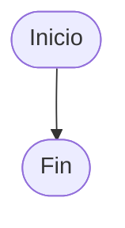
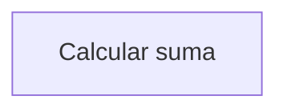
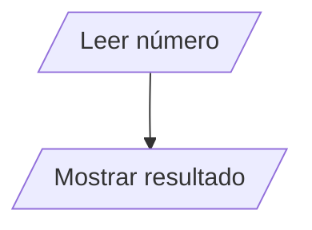
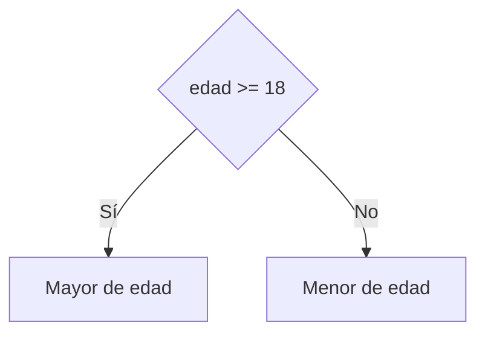
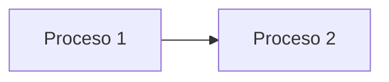
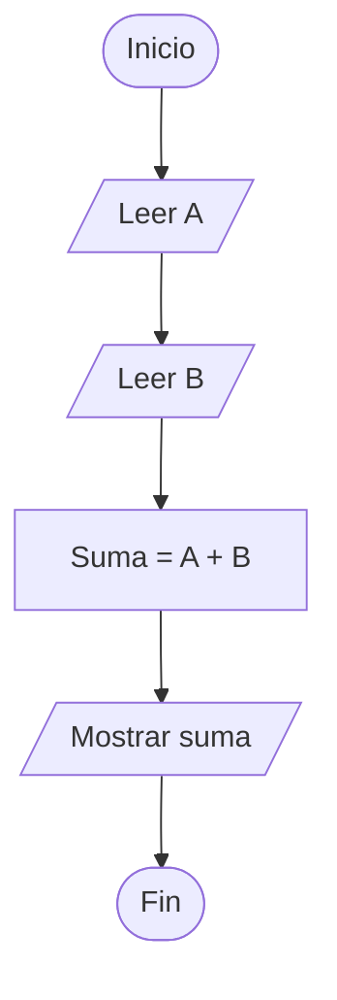
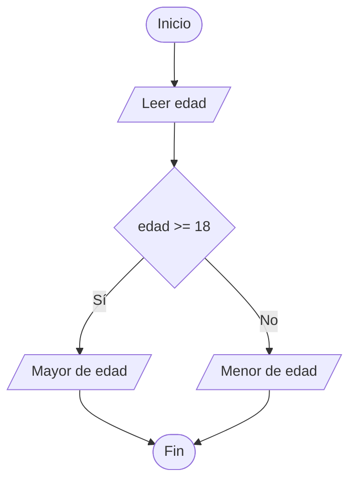
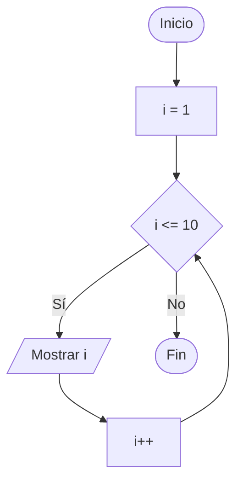

# Diagramas de Flujo

## ¿Qué es un diagrama de flujo?

Un **diagrama de flujo** es una representación gráfica de un algoritmo o proceso mediante símbolos conectados por flechas que indican la secuencia de ejecución.

Permite visualizar de forma clara y ordenada los pasos necesarios para resolver un problema.

---

# Importancia

Los diagramas de flujo permiten:

- Comprender mejor un algoritmo.
- Detectar errores lógicos antes de programar.
- Facilitar la comunicación entre personas.
- Documentar procesos y soluciones.
- Servir como guía durante la implementación.

---

# Elementos básicos

Todo diagrama de flujo está compuesto por:

- Símbolos.
- Flechas.
- Texto descriptivo.
- Secuencia lógica.

---

# Convenciones utilizadas

Para mantener uniformidad en los diagramas de flujo presentados se utilizarán las siguientes convenciones:

- Inicio y Fin mediante terminadores.
- Lectura y escritura mediante símbolos de entrada/salida.
- Procesos mediante rectángulos.
- Decisiones mediante rombos.
- Flujo de arriba hacia abajo siempre que sea posible.
- Texto breve y descriptivo dentro de cada símbolo.

---

# Estructuras representadas en diagramas de flujo

Los diagramas de flujo permiten representar las tres estructuras fundamentales de los algoritmos.

| Estructura | Descripción |
|------------|-------------|
| Secuencial | Las instrucciones se ejecutan una después de otra. |
| Condicional | Permite tomar decisiones según una condición. |
| Repetitiva | Permite ejecutar acciones varias veces. |

Estas estructuras constituyen la base de la mayoría de los algoritmos.

---

# Símbolos principales

## 1. Inicio / Fin

Representa el comienzo o final del algoritmo.

### Uso

- Comenzar un algoritmo.
- Finalizar un algoritmo.

---

## 2. Proceso

Representa una operación o instrucción.

### Uso

- Realizar cálculos.
- Asignar valores.
- Ejecutar operaciones.

---

## 3. Entrada / Salida

Representa la lectura o escritura de datos.

### Uso

- Leer datos.
- Mostrar resultados.

---

## 4. Decisión

Representa una condición que puede generar distintos caminos.

### Uso

- Tomar decisiones.
- Validar condiciones.
- Comparar valores.

---

## 5. Línea de flujo

Indica la dirección de ejecución.

### Uso

- Conectar símbolos.
- Indicar secuencia lógica.

---

# Representación de estructuras básicas

## Estructura secuencial

---

## Estructura condicional

---

## Estructura repetitiva

---

# Ejemplo completo

## Problema

Leer dos números y mostrar su suma.

---

# Reglas para elaborar diagramas

| Regla | Descripción |
|---------|------------|
| Tener un único inicio | El algoritmo debe comenzar en un solo punto. |
| Tener un único fin | El algoritmo debe finalizar correctamente. |
| Utilizar símbolos adecuados | Cada acción debe representarse correctamente. |
| Mantener una secuencia lógica | El flujo debe ser claro y ordenado. |
| Evitar cruces innecesarios | Mejora la legibilidad. |
| Utilizar texto breve | Facilita la comprensión del diagrama. |

---

# Ventajas

| Ventaja | Descripción |
|----------|------------|
| Claridad | Facilita la comprensión del algoritmo. |
| Organización | Permite visualizar el proceso completo. |
| Comunicación | Facilita explicar una solución. |
| Detección de errores | Ayuda a identificar fallos lógicos. |
| Documentación | Sirve como apoyo para futuros desarrollos. |

---

# Desventajas

| Desventaja | Descripción |
|------------|------------|
| Espacio | Los diagramas complejos ocupan más espacio. |
| Mantenimiento | Deben actualizarse cuando cambia el algoritmo. |
| Complejidad | Diagramas muy grandes pueden ser difíciles de interpretar. |

---

# Aplicaciones

Los diagramas de flujo se utilizan en:

- Diseño de algoritmos.
- Desarrollo de software.
- Automatización de procesos.
- Documentación técnica.
- Modelado de sistemas.
- Resolución de problemas.

---

# Errores comunes

| Error | Descripción |
|---------|------------|
| Utilizar símbolos incorrectos | Dificulta la interpretación. |
| Omitir flechas | Genera ambigüedad. |
| Múltiples inicios o finales | Reduce la claridad del algoritmo. |
| Diagramas excesivamente complejos | Dificultan la comprensión. |
| Saltar pasos importantes | Produce errores lógicos. |

---

# Buenas prácticas

Al elaborar diagramas de flujo se recomienda:

- Mantener un flujo de arriba hacia abajo.
- Utilizar nombres claros y descriptivos.
- Evitar cruces innecesarios entre líneas.
- Utilizar un único inicio y un único fin.
- Mantener una distribución ordenada de los símbolos.
- Verificar que todas las decisiones tengan salidas claramente identificadas.
- Utilizar símbolos estandarizados.
- Mantener la simplicidad y claridad del diagrama.

---

# Conclusión

Los diagramas de flujo constituyen una herramienta gráfica fundamental para representar algoritmos y procesos. Su utilización facilita la comprensión, análisis y diseño de soluciones antes de realizar cualquier implementación.

---

# Resumen

| Concepto | Idea principal |
|-----------|---------------|
| Diagrama de flujo | Representación gráfica de un algoritmo. |
| Símbolos | Elementos utilizados para representar acciones. |
| Flujo | Secuencia de ejecución del algoritmo. |
| Decisión | Permite evaluar condiciones. |
| Repetición | Permite representar ciclos. |
| Aplicación | Diseño y documentación de soluciones. |
