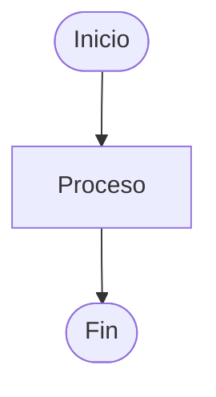

# Plantilla de Resolución de Ejercicios

Esta plantilla puede utilizarse para analizar, diseñar, validar e implementar soluciones a problemas de programación.

---

# 1. Enunciado

Descripción completa del problema.

---

# 2. Análisis

## Entradas

Datos que recibe el algoritmo.

### Ejemplo

```text
numero
edad
base
altura
```

---

## Proceso

Operaciones o transformaciones necesarias para resolver el problema.

### Ejemplo

```text
Calcular el área.
Verificar si un número es primo.
Obtener el promedio.
```

---

## Salidas

Resultados que debe producir el algoritmo.

### Ejemplo

```text
Área calculada.
Promedio final.
Mensaje de aprobación.
```

---

## Restricciones

Condiciones que deben cumplirse.

### Ejemplo

```text
edad >= 0
nota >= 0 y nota <= 100
```

---

# 3. Casos de prueba

Casos utilizados para validar la solución.

| Entrada | Resultado esperado |
|----------|-------------------|
| ... | ... |

---

# 4. Estrategia de solución

Descripción general de la idea utilizada para resolver el problema.

### Ejemplo

```text
Leer los datos necesarios.
Realizar los cálculos correspondientes.
Mostrar el resultado.
```

---

# 5. Variables

| Variable | Descripción |
|-----------|------------|
| ... | ... |

---

# 6. Operadores (Opcional)

| Operador | Uso |
|-----------|-----|
| + | Suma |
| - | Resta |
| * | Multiplicación |
| / | División |
| % | Módulo o residuo |

---

# 7. Estructuras utilizadas

Indicar las estructuras necesarias para resolver el problema.

### Ejemplo

```text
Secuencial
Condicional
Repetitiva
```

---

# 8. Fórmulas (Si aplica)

```text
resultado = ...
```

---

# 9. Secuencia lógica

1. ...
2. ...
3. ...
4. ...

---

# 10. Pseudocódigo

```text
Inicio

    ...

Fin
```

---

# 11. Diagrama de flujo (Opcional)



---

# 12. Prueba de escritorio

## Variables identificadas

```text
...
```

### Tabla de seguimiento

| Paso | Variable 1 | Variable 2 |
|--------|------------|------------|
| ... | ... | ... |

### Resultado

```text
...
```

---

# 13. Implementación

## Código

```cpp
// Implementación
```

---

# Verificación final

Antes de considerar resuelto el ejercicio, comprobar:

- [ ] El análisis es correcto.
- [ ] Las entradas y salidas están identificadas.
- [ ] Existen casos de prueba.
- [ ] La estrategia de solución es adecuada.
- [ ] Las variables están correctamente identificadas.
- [ ] El pseudocódigo es válido.
- [ ] La prueba de escritorio produce el resultado esperado.
- [ ] La implementación funciona correctamente.
