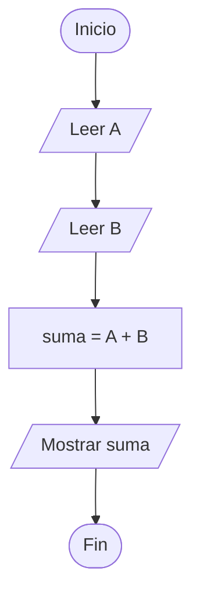
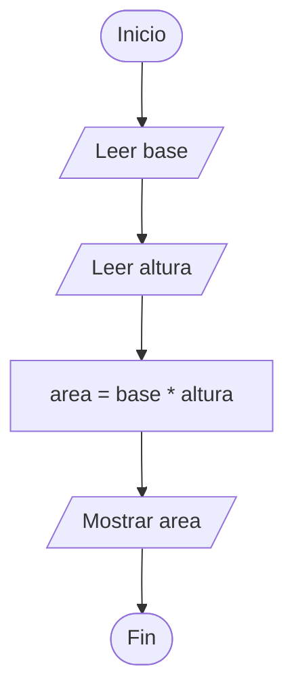

# Estructuras Secuenciales

## ¿Qué es una estructura secuencial?

Una **estructura secuencial** es aquella en la que las instrucciones se ejecutan una tras otra en el mismo orden en que fueron escritas.

Es la forma más simple de control de flujo y constituye la base de todos los algoritmos y programas.

---

# Importancia

Las estructuras secuenciales permiten:

* Organizar acciones paso a paso.
* Resolver problemas simples.
* Construir algoritmos básicos.
* Comprender el flujo de ejecución de un programa.
* Servir como base para estructuras más complejas.

---

# Características

| Característica | Descripción                                    |
| -------------- | ---------------------------------------------- |
| Ordenada       | Las instrucciones siguen una secuencia lógica. |
| Lineal         | No existen decisiones ni repeticiones.         |
| Simple         | Cada instrucción se ejecuta una sola vez.      |
| Predecible     | El flujo siempre sigue el mismo camino.        |

---

# Flujo de ejecución

Las instrucciones se ejecutan de arriba hacia abajo siguiendo el orden establecido.

```text
Instrucción 1
      ↓
Instrucción 2
      ↓
Instrucción 3
      ↓
Instrucción 4
```

Cada instrucción comienza cuando la anterior ha finalizado.

---

# Modelo Entrada → Proceso → Salida

La mayoría de los algoritmos secuenciales siguen el modelo:

```text
Entrada
   ↓
Proceso
   ↓
Salida
```

## Entrada

Son los datos que recibe el algoritmo.

Ejemplos:

```text
Nombre
Edad
Base
Altura
```

---

## Proceso

Son las operaciones realizadas sobre los datos de entrada.

Ejemplos:

```text
Suma
Resta
Promedio
Área
```

---

## Salida

Son los resultados obtenidos después del procesamiento.

Ejemplos:

```text
Resultado de una suma
Promedio final
Área calculada
```

---

# Operaciones comunes en estructuras secuenciales

Las estructuras secuenciales suelen utilizar:

## Lectura de datos

Permite obtener información de entrada.

```text
Leer edad
Leer nombre
Leer numero
```

---

## Escritura de datos

Permite mostrar resultados.

```text
Escribir promedio
Escribir area
Escribir mensaje
```

---

## Asignación

Permite almacenar valores en variables.

```text
edad = 20
suma = A + B
area = base * altura
```

---

## Operaciones aritméticas

Permiten realizar cálculos.

```text
+
-
*
/
%
```

---

# Ejemplo 1

## Problema

Leer dos números y mostrar su suma.

### Pseudocódigo

```text
Inicio

    Leer A
    Leer B

    suma = A + B

    Escribir suma

Fin
```

### Diagrama de flujo



### Prueba de escritorio

#### Datos de entrada

```text
A = 10
B = 5
```

#### Tabla de prueba de escritorio

| Paso          | A  | B | suma |
| ------------- | -- | - | ---- |
| Leer A        | 10 | - | -    |
| Leer B        | 10 | 5 | -    |
| suma = A + B  | 10 | 5 | 15   |
| Escribir suma | 10 | 5 | 15   |

#### Resultado

```text
15
```

#### Análisis

La variable `suma` almacena el resultado de la operación:

```text
suma = 10 + 5
suma = 15
```

Al finalizar la ejecución, el algoritmo muestra correctamente el valor `15`.

---

# Ejemplo 2

## Problema

Calcular el área de un rectángulo.

### Pseudocódigo

```text
Inicio

    Leer base
    Leer altura

    area = base * altura

    Escribir area

Fin
```

### Diagrama de flujo



### Prueba de escritorio

#### Datos de entrada

```text
base = 8
altura = 4
```

#### Tabla de prueba de escritorio

| Paso                 | base | altura | area |
| -------------------- | ---- | ------ | ---- |
| Leer base            | 8    | -      | -    |
| Leer altura          | 8    | 4      | -    |
| area = base * altura | 8    | 4      | 32   |
| Escribir area        | 8    | 4      | 32   |

#### Resultado

```text
32
```

#### Análisis

La variable `area` almacena el resultado de multiplicar la base por la altura.

```text
area = 8 * 4
area = 32
```

Al finalizar la ejecución, el algoritmo muestra correctamente el área del rectángulo.

---

# Aplicaciones

Las estructuras secuenciales se utilizan en:

* Operaciones matemáticas.
* Conversión de unidades.
* Cálculo de áreas.
* Cálculo de promedios.
* Procesamiento simple de datos.
* Generación de reportes.

---

# Ventajas

| Ventaja                     | Descripción                            |
| --------------------------- | -------------------------------------- |
| Simplicidad                 | Fácil de comprender y construir.       |
| Claridad                    | El flujo es único y predecible.        |
| Facilidad de implementación | Requiere poca lógica.                  |
| Base de aprendizaje         | Introduce los conceptos fundamentales. |

---

# Limitaciones

| Limitación         | Descripción                         |
| ------------------ | ----------------------------------- |
| No toma decisiones | No puede elegir entre alternativas. |
| No repite acciones | No permite ciclos.                  |
| Poca flexibilidad  | Siempre sigue el mismo camino.      |

---

# Relación con otras estructuras

Las estructuras secuenciales forman parte de las tres estructuras fundamentales de la programación estructurada.

```text
Programación Estructurada
│
├── Secuencia
├── Selección
└── Repetición
```

Las estructuras de selección y repetición están construidas internamente a partir de bloques secuenciales.

---

# Errores comunes

| Error                           | Descripción                                |
| ------------------------------- | ------------------------------------------ |
| Alterar el orden lógico         | Produce resultados incorrectos.            |
| Omitir instrucciones            | El algoritmo queda incompleto.             |
| No definir variables necesarias | Produce errores durante la implementación. |
| Confundir entrada y salida      | Dificulta la comprensión del algoritmo.    |

---

# Buenas prácticas

* Mantener una secuencia lógica clara.
* Utilizar nombres descriptivos para las variables.
* Separar claramente entrada, proceso y salida.
* Verificar los resultados mediante pruebas de escritorio.
* Documentar adecuadamente el algoritmo.

---

# Conclusión

Las estructuras secuenciales representan la forma más básica de control de flujo en programación. Permiten ejecutar instrucciones en un orden determinado y constituyen la base sobre la cual se construyen las estructuras condicionales y repetitivas.

Comprender su funcionamiento es fundamental para desarrollar algoritmos correctos y organizados.

---

# Resumen

| Concepto              | Idea principal                        |
| --------------------- | ------------------------------------- |
| Estructura secuencial | Ejecuta instrucciones en orden.       |
| Flujo                 | Sigue un único camino.                |
| Entrada               | Datos recibidos.                      |
| Proceso               | Operaciones realizadas.               |
| Salida                | Resultados obtenidos.                 |
| Importancia           | Base de la programación estructurada. |
