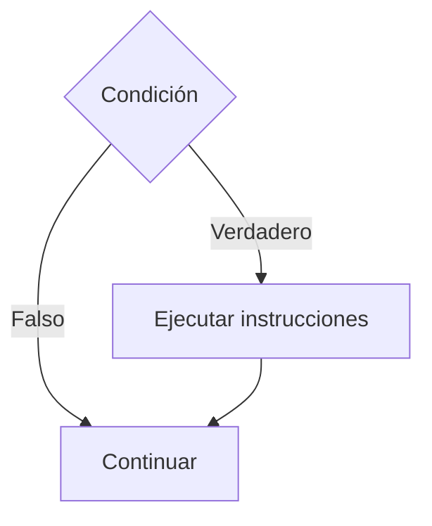

# If Simple

## ¿Qué es el If Simple?

El **If Simple** es una estructura condicional que permite ejecutar un conjunto de instrucciones únicamente cuando una condición es verdadera.

Si la condición es falsa, las instrucciones contenidas dentro del bloque no se ejecutan y el algoritmo continúa con la siguiente instrucción.

Es la estructura condicional más básica y constituye el punto de partida para la toma de decisiones dentro de los algoritmos.

---

# Importancia

El If Simple permite:

- Tomar decisiones básicas.
- Validar datos.
- Ejecutar acciones bajo ciertas condiciones.
- Controlar el flujo de ejecución de un algoritmo.
- Construir soluciones más flexibles.

---

# Funcionamiento

El If Simple sigue la siguiente lógica:

1. Evaluar una condición.
2. Si la condición es verdadera, ejecutar las instrucciones del bloque.
3. Si la condición es falsa, ignorar el bloque.
4. Continuar con la ejecución normal del algoritmo.

---

# Sintaxis general

## Pseudocódigo

```text
Inicio

    if (condicion) then

        instrucciones

    endif

Fin
```

---

# Diagrama de flujo



---

# Ejemplo 1

## Problema

Determinar si una persona es mayor de edad.

### Pseudocódigo

```text
Inicio

    Leer edad

    if (edad >= 18) then

        Escribir "Mayor de edad"

    endif

Fin
```

### Diagrama de flujo

```mermaid
flowchart TD

A([Inicio])

B[/Leer edad/]

C{edad >= 18}

D[Escribir "Mayor de edad"]

E([Fin])

A --> B
B --> C

C -->|Verdadero| D
C -->|Falso| E

D --> E
```

### Prueba de escritorio

#### Caso 1

##### Datos de entrada

```text
edad = 20
```

##### Tabla de prueba de escritorio

| Paso | edad | Resultado |
|------|------|-----------|
| Leer edad | 20 | - |
| edad >= 18 | 20 | Verdadero |
| Escribir mensaje | 20 | Mayor de edad |

##### Salida

```text
Mayor de edad
```

---

#### Caso 2

##### Datos de entrada

```text
edad = 15
```

##### Tabla de prueba de escritorio

| Paso | edad | Resultado |
|------|------|-----------|
| Leer edad | 15 | - |
| edad >= 18 | 15 | Falso |
| Escribir mensaje | 15 | No se ejecuta |

##### Salida

```text
Sin salida
```

---

# Ejemplo 2

## Problema

Determinar si un número es positivo.

### Pseudocódigo

```text
Inicio

    Leer numero

    if (numero > 0) then

        Escribir "Número positivo"

    endif

Fin
```

### Diagrama de flujo

```mermaid
flowchart TD

A([Inicio])

B[/Leer numero/]

C{numero > 0}

D[Escribir "Número positivo"]

E([Fin])

A --> B
B --> C

C -->|Verdadero| D
C -->|Falso| E

D --> E
```

### Prueba de escritorio

#### Caso 1

##### Datos de entrada

```text
numero = 8
```

##### Tabla de prueba de escritorio

| Paso | numero | Resultado |
|------|--------|-----------|
| Leer numero | 8 | - |
| numero > 0 | 8 | Verdadero |
| Escribir mensaje | 8 | Número positivo |

##### Salida

```text
Número positivo
```

---

#### Caso 2

##### Datos de entrada

```text
numero = -5
```

##### Tabla de prueba de escritorio

| Paso | numero | Resultado |
|------|--------|-----------|
| Leer numero | -5 | - |
| numero > 0 | -5 | Falso |
| Escribir mensaje | -5 | No se ejecuta |

##### Salida

```text
Sin salida
```

---

# Aplicaciones

El If Simple se utiliza para:

- Verificar edades.
- Validar contraseñas.
- Comprobar límites.
- Detectar errores.
- Controlar permisos.
- Verificar condiciones específicas.

---

# Ventajas

| Ventaja | Descripción |
|----------|------------|
| Simplicidad | Fácil de comprender y utilizar. |
| Claridad | Permite expresar decisiones simples. |
| Flexibilidad | Puede combinarse con otras estructuras. |
| Utilidad | Se adapta a numerosos problemas. |

---

# Limitaciones

| Limitación | Descripción |
|------------|------------|
| Solo actúa cuando la condición es verdadera | Si la condición es falsa no ejecuta ninguna acción. |
| No ofrece una alternativa | No permite especificar qué hacer cuando la condición es falsa. |

Para estos casos se utiliza la estructura **If Else**.

---

# Errores comunes

| Error | Descripción |
|--------|------------|
| Condiciones incorrectas | Generan resultados inesperados. |
| Operadores equivocados | Alteran la lógica de la decisión. |
| No probar ambos escenarios | Puede ocultar errores lógicos. |
| Olvidar el bloque endif | Produce estructuras incompletas. |

---

# Buenas prácticas

- Utilizar condiciones claras y fáciles de entender.
- Probar casos donde la condición sea verdadera y falsa.
- Mantener el bloque de instrucciones organizado.
- Evitar condiciones innecesariamente complejas.
- Utilizar nombres descriptivos para las variables.

---

# Conclusión

El If Simple es la estructura condicional más básica de la programación estructurada. Permite ejecutar instrucciones únicamente cuando una condición se cumple, proporcionando la capacidad de tomar decisiones dentro de un algoritmo.

Su comprensión es fundamental antes de estudiar estructuras más avanzadas como If Else, If Anidado y Switch.

---

# Resumen

| Concepto | Idea principal |
|-----------|---------------|
| If Simple | Ejecuta instrucciones cuando una condición es verdadera. |
| Condición | Expresión que puede ser verdadera o falsa. |
| Flujo | Evalúa una condición antes de ejecutar acciones. |
| Aplicación | Toma de decisiones simples. |
| Importancia | Base de las estructuras condicionales. |
