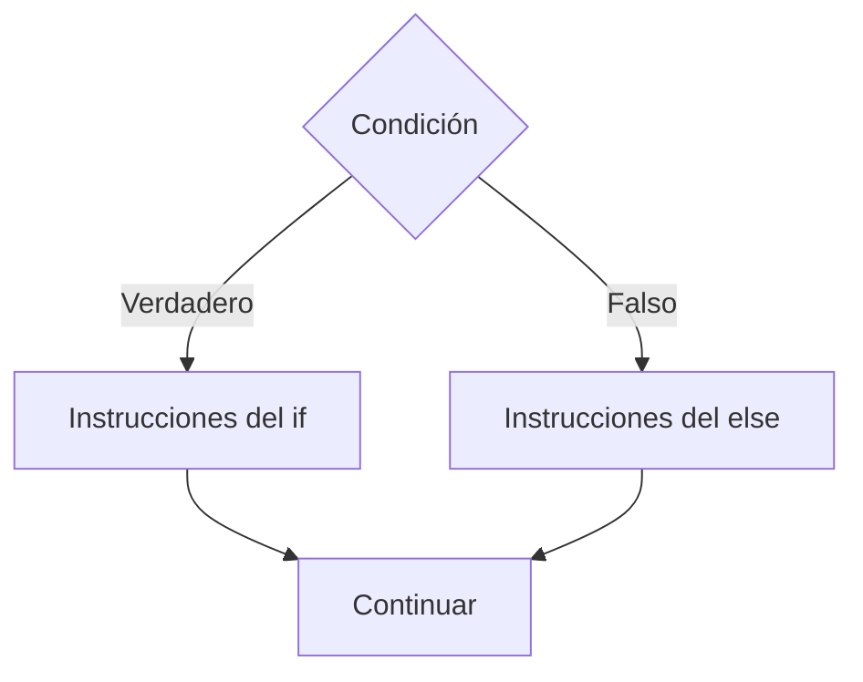

# If Else

## ¿Qué es el If Else?

El **If Else** es una estructura condicional que permite elegir entre dos caminos de ejecución dependiendo del resultado de una condición.

- Si la condición es verdadera, se ejecuta un bloque de instrucciones.
- Si la condición es falsa, se ejecuta un bloque alternativo.

A diferencia del **If Simple**, esta estructura garantiza que siempre se ejecutará uno de los dos bloques.

---

# Importancia

El If Else permite:

- Tomar decisiones con dos posibles resultados.
- Controlar el flujo de ejecución de un algoritmo.
- Resolver problemas que requieren alternativas.
- Mejorar la lógica y flexibilidad de las soluciones.
- Construir programas capaces de responder a diferentes situaciones.

---

# Funcionamiento

El proceso sigue la siguiente lógica:

1. Evaluar una condición.
2. Si la condición es verdadera, ejecutar el bloque `if`.
3. Si la condición es falsa, ejecutar el bloque `else`.
4. Continuar con el flujo normal del algoritmo.

---

# Sintaxis general

## Pseudocódigo

```text
Inicio

    if (condicion) then

        instrucciones_verdaderas

    else

        instrucciones_falsas

    endif

Fin
```

---

# Diagrama de flujo



---

# Ejemplo 1

## Problema

Determinar si un estudiante aprobó o reprobó.

### Pseudocódigo

```text
Inicio

    Leer nota

    if (nota >= 51) then

        Escribir "Aprobado"

    else

        Escribir "Reprobado"

    endif

Fin
```

### Diagrama de flujo

```mermaid
flowchart TD

A([Inicio])

B[/Leer nota/]

C{nota >= 51}

D[Escribir "Aprobado"]

E[Escribir "Reprobado"]

F([Fin])

A --> B
B --> C

C -->|Verdadero| D
C -->|Falso| E

D --> F
E --> F
```

### Prueba de escritorio

#### Caso 1

##### Datos de entrada

```text
nota = 75
```

##### Tabla de prueba de escritorio

| Paso | nota | Resultado |
|------|------|-----------|
| Leer nota | 75 | - |
| nota >= 51 | 75 | Verdadero |
| Escribir mensaje | 75 | Aprobado |

##### Salida

```text
Aprobado
```

---

#### Caso 2

##### Datos de entrada

```text
nota = 40
```

##### Tabla de prueba de escritorio

| Paso | nota | Resultado |
|------|------|-----------|
| Leer nota | 40 | - |
| nota >= 51 | 40 | Falso |
| Escribir mensaje | 40 | Reprobado |

##### Salida

```text
Reprobado
```

---

# Ejemplo 2

## Problema

Determinar si un número es par o impar.

### Pseudocódigo

```text
Inicio

    Leer numero

    if (numero % 2 == 0) then

        Escribir "Par"

    else

        Escribir "Impar"

    endif

Fin
```

### Diagrama de flujo

```mermaid
flowchart TD

A([Inicio])

B[/Leer numero/]

C{numero % 2 == 0}

D[Escribir "Par"]

E[Escribir "Impar"]

F([Fin])

A --> B
B --> C

C -->|Verdadero| D
C -->|Falso| E

D --> F
E --> F
```

### Prueba de escritorio

#### Caso 1

##### Datos de entrada

```text
numero = 8
```

##### Tabla de prueba de escritorio

| Paso | numero | Resultado |
|------|--------|-----------|
| Leer numero | 8 | - |
| numero % 2 == 0 | 8 | Verdadero |
| Escribir mensaje | 8 | Par |

##### Salida

```text
Par
```

---

#### Caso 2

##### Datos de entrada

```text
numero = 7
```

##### Tabla de prueba de escritorio

| Paso | numero | Resultado |
|------|--------|-----------|
| Leer numero | 7 | - |
| numero % 2 == 0 | 7 | Falso |
| Escribir mensaje | 7 | Impar |

##### Salida

```text
Impar
```

---

# Comparación con If Simple

| Característica | If Simple | If Else |
|----------------|-----------|---------|
| Evalúa una condición | Sí | Sí |
| Ejecuta acciones cuando es verdadera | Sí | Sí |
| Ejecuta acciones cuando es falsa | No | Sí |
| Número de caminos posibles | 1 | 2 |
| Complejidad | Menor | Mayor |

---

# Aplicaciones

El If Else se utiliza para:

- Validar usuarios.
- Verificar aprobaciones.
- Determinar descuentos.
- Clasificar resultados.
- Controlar acceso a sistemas.
- Diferenciar situaciones opuestas.

---

# Ventajas

| Ventaja | Descripción |
|----------|------------|
| Flexibilidad | Permite dos caminos de ejecución. |
| Claridad | Hace explícitas ambas alternativas. |
| Organización | Mejora la estructura lógica del algoritmo. |
| Utilidad | Resuelve una gran variedad de problemas. |

---

# Limitaciones

| Limitación | Descripción |
|------------|------------|
| Solo permite dos alternativas directas | No es adecuado para muchas opciones. |
| Puede volverse complejo | Varias condiciones pueden dificultar la lectura. |

Cuando existen múltiples alternativas suelen utilizarse estructuras como:

```text
If Anidado
Switch
```

---

# Errores comunes

| Error | Descripción |
|--------|------------|
| Condiciones incorrectas | Generan resultados inesperados. |
| Invertir la lógica | Produce decisiones equivocadas. |
| No probar ambos caminos | Puede ocultar errores. |
| Anidar excesivamente | Reduce la legibilidad. |

---

# Buenas prácticas

- Utilizar condiciones claras y fáciles de interpretar.
- Probar casos verdaderos y falsos.
- Mantener los bloques bien organizados.
- Evitar condiciones innecesariamente complejas.
- Utilizar nombres descriptivos para las variables.

---

# Conclusión

El If Else permite seleccionar entre dos caminos de ejecución dependiendo del resultado de una condición. Es una de las estructuras más utilizadas en programación y constituye la base para la construcción de decisiones más complejas.

Comprender su funcionamiento es fundamental antes de estudiar estructuras como If Anidado y Switch.

---

# Resumen

| Concepto | Idea principal |
|-----------|---------------|
| If Else | Permite elegir entre dos alternativas. |
| Condición | Determina qué bloque se ejecuta. |
| If | Se ejecuta cuando la condición es verdadera. |
| Else | Se ejecuta cuando la condición es falsa. |
| Aplicación | Toma de decisiones con dos posibles resultados. |
| Importancia | Base de las decisiones binarias en programación. |
