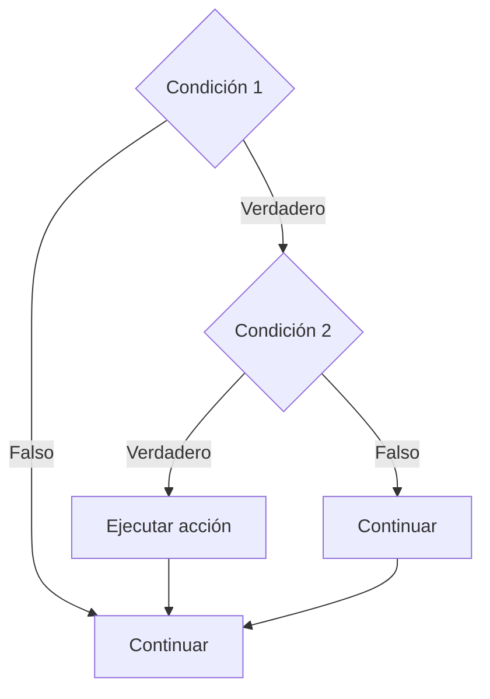

# If Anidado

## ¿Qué es el If Anidado?

Un **If Anidado** es una estructura condicional que contiene una o más instrucciones `if` dentro de otro `if`.

Permite evaluar múltiples condiciones de manera jerárquica para resolver problemas que requieren varios niveles de decisión.

---

# Importancia

El If Anidado permite:

* Evaluar múltiples condiciones.
* Tomar decisiones complejas.
* Clasificar información.
* Resolver problemas con varios escenarios posibles.
* Construir soluciones más flexibles.

---

# Funcionamiento

El proceso sigue la siguiente lógica:

1. Evaluar una primera condición.
2. Si se cumple, evaluar una segunda condición.
3. Continuar evaluando condiciones según sea necesario.
4. Ejecutar la acción correspondiente.
5. Continuar con el flujo normal del algoritmo.

---

# ¿Cuándo utilizar If Anidado?

El If Anidado se utiliza cuando una decisión depende del resultado de una decisión anterior.

Si una condición debe evaluarse únicamente después de que otra condición se haya cumplido, el uso de estructuras anidadas suele ser una solución adecuada.

### Ejemplos

* Clasificación de notas.
* Control de acceso a sistemas.
* Validación de usuarios.
* Evaluación de permisos.
* Procesos con múltiples niveles de decisión.

---

# Sintaxis general

## Pseudocódigo

```text
Inicio

    if (condicion_1) then

        if (condicion_2) then

            instrucciones

        endif

    endif

Fin
```

---

# Diagrama de flujo



---

# Ejemplo 1

## Problema

Clasificar una nota.

### Reglas

* Si la nota es menor a 51 → Reprobado.
* Si la nota es mayor o igual a 51 y menor a 80 → Aprobado.
* Si la nota es mayor o igual a 80 → Excelente.

### Pseudocódigo

```text
Inicio

    Leer nota

    if (nota >= 51) then

        if (nota >= 80) then

            Escribir "Excelente"

        else

            Escribir "Aprobado"

        endif

    else

        Escribir "Reprobado"

    endif

Fin
```

### Diagrama de flujo

```mermaid
flowchart TD

A([Inicio])

B[/Leer nota/]

C{nota >= 51}

D{nota >= 80}

E[Escribir "Excelente"]

F[Escribir "Aprobado"]

G[Escribir "Reprobado"]

H([Fin])

A --> B
B --> C

C -->|Verdadero| D
C -->|Falso| G

D -->|Verdadero| E
D -->|Falso| F

E --> H
F --> H
G --> H
```

### Prueba de escritorio

#### Caso 1

##### Datos de entrada

```text
nota = 90
```

##### Tabla de prueba de escritorio

| Paso             | nota | Resultado |
| ---------------- | ---- | --------- |
| Leer nota        | 90   | -         |
| nota >= 51       | 90   | Verdadero |
| nota >= 80       | 90   | Verdadero |
| Escribir mensaje | 90   | Excelente |

##### Salida

```text
Excelente
```

---

#### Caso 2

##### Datos de entrada

```text
nota = 65
```

##### Tabla de prueba de escritorio

| Paso             | nota | Resultado |
| ---------------- | ---- | --------- |
| Leer nota        | 65   | -         |
| nota >= 51       | 65   | Verdadero |
| nota >= 80       | 65   | Falso     |
| Escribir mensaje | 65   | Aprobado  |

##### Salida

```text
Aprobado
```

---

#### Caso 3

##### Datos de entrada

```text
nota = 40
```

##### Tabla de prueba de escritorio

| Paso             | nota | Resultado |
| ---------------- | ---- | --------- |
| Leer nota        | 40   | -         |
| nota >= 51       | 40   | Falso     |
| Escribir mensaje | 40   | Reprobado |

##### Salida

```text
Reprobado
```

---

# Ejemplo 2

## Problema

Determinar si un usuario puede acceder a un sistema.

### Requisitos

* Debe estar registrado.
* Debe tener una contraseña válida.

### Pseudocódigo

```text
Inicio

    Leer registrado
    Leer clave_correcta

    if (registrado) then

        if (clave_correcta) then

            Escribir "Acceso permitido"

        else

            Escribir "Contraseña incorrecta"

        endif

    else

        Escribir "Usuario no registrado"

    endif

Fin
```

### Prueba de escritorio

#### Caso 1

##### Datos de entrada

```text
registrado = Verdadero
clave_correcta = Verdadero
```

##### Tabla de prueba de escritorio

| Paso           | Resultado        |
| -------------- | ---------------- |
| registrado     | Verdadero        |
| clave_correcta | Verdadero        |
| Mensaje        | Acceso permitido |

##### Salida

```text
Acceso permitido
```

---

#### Caso 2

##### Datos de entrada

```text
registrado = Verdadero
clave_correcta = Falso
```

##### Tabla de prueba de escritorio

| Paso           | Resultado             |
| -------------- | --------------------- |
| registrado     | Verdadero             |
| clave_correcta | Falso                 |
| Mensaje        | Contraseña incorrecta |

##### Salida

```text
Contraseña incorrecta
```

---

#### Caso 3

##### Datos de entrada

```text
registrado = Falso
clave_correcta = Verdadero
```

##### Tabla de prueba de escritorio

| Paso              | Resultado             |
| ----------------- | --------------------- |
| registrado        | Falso                 |
| Segunda condición | No se evalúa          |
| Mensaje           | Usuario no registrado |

##### Salida

```text
Usuario no registrado
```

---

# Comparación con If Else

| Característica        | If Else | If Anidado |
| --------------------- | ------- | ---------- |
| Número de condiciones | Una     | Varias     |
| Niveles de decisión   | Uno     | Múltiples  |
| Complejidad           | Menor   | Mayor      |
| Flexibilidad          | Media   | Alta       |

---

# Ventajas

| Ventaja       | Descripción                            |
| ------------- | -------------------------------------- |
| Flexibilidad  | Permite evaluar múltiples condiciones. |
| Organización  | Facilita decisiones jerárquicas.       |
| Potencia      | Permite resolver problemas complejos.  |
| Adaptabilidad | Se ajusta a diferentes escenarios.     |

---

# Limitaciones

| Limitación      | Descripción                                 |
| --------------- | ------------------------------------------- |
| Complejidad     | Muchos niveles dificultan la lectura.       |
| Mantenimiento   | Puede ser difícil de modificar.             |
| Errores lógicos | Aumentan cuando existen muchas condiciones. |

Cuando existen demasiadas alternativas, puede ser recomendable utilizar estructuras como:

```text
Switch
```

---

# Errores comunes

| Error                          | Descripción                             |
| ------------------------------ | --------------------------------------- |
| Anidar demasiados niveles      | Reduce la legibilidad.                  |
| Condiciones redundantes        | Complican innecesariamente la solución. |
| No probar todos los escenarios | Puede ocultar errores.                  |
| Diseñar mal la jerarquía       | Produce resultados incorrectos.         |

---

# Buenas prácticas

* Mantener pocos niveles de anidamiento.
* Utilizar condiciones claras.
* Probar todos los escenarios posibles.
* Documentar la lógica cuando sea compleja.
* Considerar otras estructuras cuando existan muchas alternativas.

---

# Conclusión

El If Anidado permite construir decisiones complejas mediante la combinación de múltiples condiciones. Es una herramienta poderosa para resolver problemas que requieren varios niveles de validación o clasificación.

Sin embargo, debe utilizarse con moderación para mantener la claridad y legibilidad de los algoritmos.

---

# Resumen

| Concepto      | Idea principal                            |
| ------------- | ----------------------------------------- |
| If Anidado    | Condicional dentro de otro condicional.   |
| Uso principal | Evaluar múltiples condiciones.            |
| Ventaja       | Permite decisiones jerárquicas.           |
| Riesgo        | Puede dificultar la lectura.              |
| Aplicación    | Clasificaciones y validaciones complejas. |

```
```
