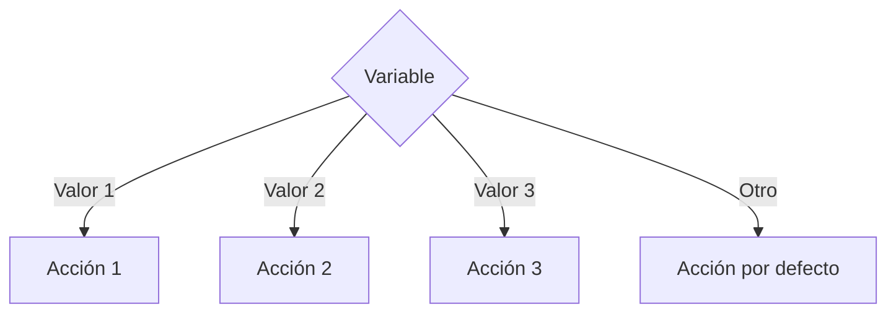

# Switch

## ¿Qué es Switch?

La estructura **Switch** permite seleccionar una acción entre múltiples alternativas a partir del valor de una variable o expresión.

Es una alternativa más organizada y legible que utilizar múltiples estructuras `if else` cuando se evalúa una misma variable.

---

# Importancia

La estructura Switch permite:

- Simplificar decisiones múltiples.
- Mejorar la legibilidad de los algoritmos.
- Facilitar la construcción de menús.
- Reducir el uso excesivo de if anidados.
- Organizar mejor las alternativas posibles.

---

# Funcionamiento

El proceso sigue la siguiente lógica:

1. Evaluar una variable o expresión.
2. Comparar su valor con diferentes casos.
3. Ejecutar las instrucciones del caso coincidente.
4. Si ningún caso coincide, ejecutar el caso por defecto.
5. Continuar con el flujo normal del algoritmo.

---

# ¿Cuándo utilizar Switch?

Se recomienda utilizar Switch cuando:

- Existen muchas alternativas posibles.
- Se evalúa una misma variable.
- Se construyen menús.
- Se seleccionan acciones según valores específicos.
- Un conjunto de opciones puede representarse mediante números o códigos.

### Ejemplos

- Menús de sistemas.
- Días de la semana.
- Meses del año.
- Calculadoras simples.
- Selección de opciones.

---

# Sintaxis general

## Pseudocódigo

```text
Inicio

    switch (variable)

        case valor_1:

            instrucciones

        case valor_2:

            instrucciones

        case valor_3:

            instrucciones

        default:

            instrucciones

    endswitch

Fin
```

---

# Diagrama de flujo



---

# Ejemplo 1

## Problema

Mostrar el día de la semana según un número.

### Reglas

- 1 → Lunes
- 2 → Martes
- 3 → Miércoles
- Cualquier otro valor → Día inválido

### Pseudocódigo

```text
Inicio

    Leer dia

    switch (dia)

        case 1:

            Escribir "Lunes"

        case 2:

            Escribir "Martes"

        case 3:

            Escribir "Miércoles"

        default:

            Escribir "Día inválido"

    endswitch

Fin
```

### Diagrama de flujo

```mermaid
flowchart TD

A([Inicio])

B[/Leer dia/]

C{dia}

D[Escribir "Lunes"]
E[Escribir "Martes"]
F[Escribir "Miércoles"]
G[Escribir "Día inválido"]

H([Fin])

A --> B
B --> C

C -->|1| D
C -->|2| E
C -->|3| F
C -->|Otro| G

D --> H
E --> H
F --> H
G --> H
```

### Prueba de escritorio

#### Caso 1

##### Datos de entrada

```text
dia = 2
```

##### Tabla de prueba de escritorio

| Paso | Resultado |
|--------|-----------|
| Evaluar dia | 2 |
| Coincide con case 2 | Sí |
| Acción ejecutada | Martes |

##### Salida

```text
Martes
```

---

#### Caso 2

##### Datos de entrada

```text
dia = 8
```

##### Tabla de prueba de escritorio

| Paso | Resultado |
|--------|-----------|
| Evaluar dia | 8 |
| Coincide con algún caso | No |
| Acción ejecutada | Día inválido |

##### Salida

```text
Día inválido
```

---

# Ejemplo 2

## Problema

Mostrar una operación matemática seleccionada desde un menú.

### Opciones

- 1 → Suma
- 2 → Resta
- 3 → Multiplicación
- 4 → División

### Pseudocódigo

```text
Inicio

    Leer opcion

    switch (opcion)

        case 1:

            Escribir "Suma"

        case 2:

            Escribir "Resta"

        case 3:

            Escribir "Multiplicación"

        case 4:

            Escribir "División"

        default:

            Escribir "Opción inválida"

    endswitch

Fin
```

### Prueba de escritorio

#### Caso 1

##### Datos de entrada

```text
opcion = 3
```

##### Tabla de prueba de escritorio

| Paso | Resultado |
|--------|-----------|
| Evaluar opcion | 3 |
| Coincide con case 3 | Sí |
| Acción ejecutada | Multiplicación |

##### Salida

```text
Multiplicación
```

---

#### Caso 2

##### Datos de entrada

```text
opcion = 7
```

##### Tabla de prueba de escritorio

| Paso | Resultado |
|--------|-----------|
| Evaluar opcion | 7 |
| Coincide con algún caso | No |
| Acción ejecutada | Opción inválida |

##### Salida

```text
Opción inválida
```

---

# Comparación con If Else

| Característica | If Else | Switch |
|----------------|----------|---------|
| Dos alternativas | Excelente | Posible |
| Muchas alternativas | Menos legible | Más legible |
| Comparaciones complejas | Sí | No |
| Comparación de valores específicos | Sí | Excelente |
| Menús | Posible | Muy recomendado |

---

# Ventajas

| Ventaja | Descripción |
|----------|------------|
| Legibilidad | Facilita la comprensión del algoritmo. |
| Organización | Agrupa múltiples alternativas. |
| Claridad | Hace más sencillo seguir el flujo. |
| Mantenimiento | Facilita futuras modificaciones. |

---

# Limitaciones

| Limitación | Descripción |
|------------|------------|
| Solo compara valores específicos | No evalúa condiciones complejas. |
| Menor flexibilidad | No reemplaza todos los casos de If Else. |
| Requiere valores definidos | Funciona mejor con opciones concretas. |

---

# Errores comunes

| Error | Descripción |
|--------|------------|
| Duplicar valores de casos | Genera ambigüedad en la selección. |
| Omitir el caso por defecto | Reduce el control de errores. |
| Utilizarlo para condiciones complejas | No es su propósito principal. |
| Definir demasiadas opciones sin organización | Dificulta la lectura. |

---

# Buenas prácticas

- Utilizar Switch cuando existan múltiples alternativas.
- Mantener los casos organizados.
- Utilizar valores representativos.
- Incluir siempre un caso por defecto.
- Evitar utilizar Switch cuando se necesiten condiciones complejas.

---

# Conclusión

La estructura Switch permite seleccionar una acción entre múltiples alternativas de forma clara y organizada. Es especialmente útil cuando se trabaja con menús o con valores específicos que requieren diferentes comportamientos.

Su principal ventaja es mejorar la legibilidad de los algoritmos cuando existen numerosas opciones posibles.

---

# Resumen

| Concepto | Idea principal |
|-----------|---------------|
| Switch | Selección múltiple basada en una variable. |
| Case | Representa una alternativa posible. |
| Default | Se ejecuta cuando no existe coincidencia. |
| Aplicación | Menús y selección de opciones. |
| Ventaja principal | Mayor claridad en decisiones múltiples. |
