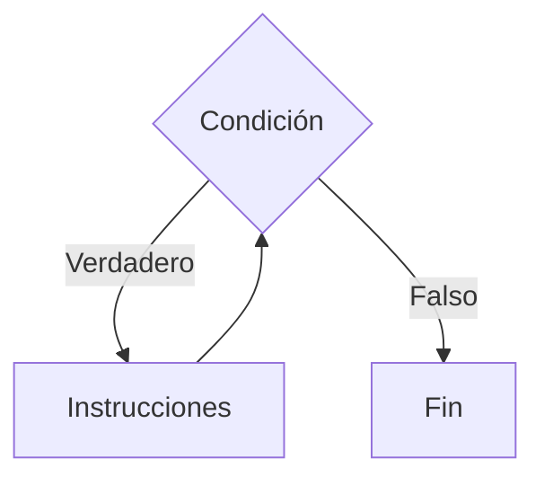
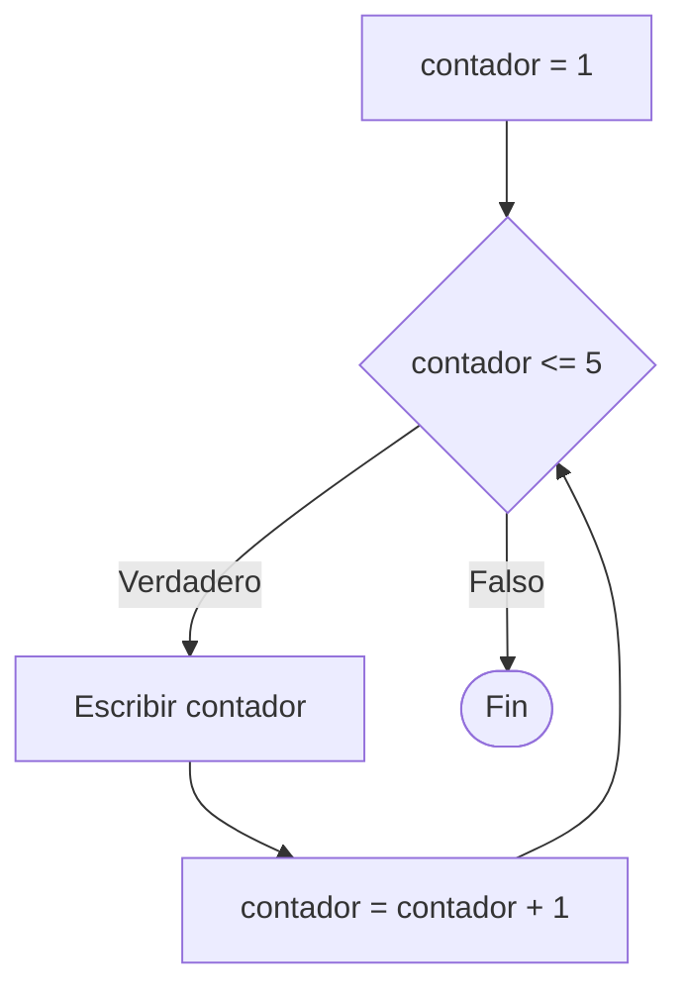
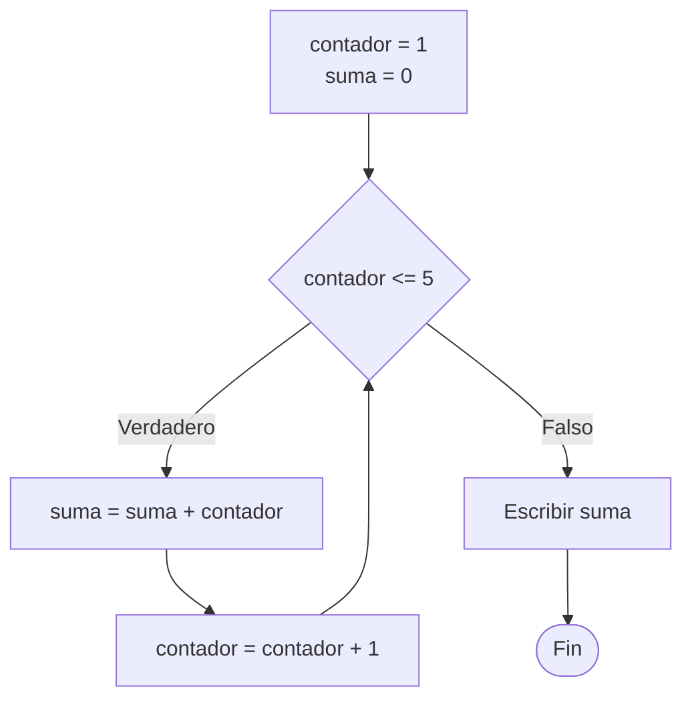

# While

## ¿Qué es While?

La estructura **While** es un ciclo que ejecuta un conjunto de instrucciones mientras una condición sea verdadera.

La condición se evalúa antes de cada iteración.

Si la condición es falsa desde el inicio, el ciclo no se ejecuta ninguna vez.

---

# Importancia

El ciclo While permite:

- Repetir procesos desconocidos.
- Validar datos.
- Construir menús.
- Automatizar tareas repetitivas.
- Controlar iteraciones mediante condiciones.

---

# Funcionamiento

El proceso sigue la siguiente lógica:

1. Evaluar una condición.
2. Si la condición es verdadera, ejecutar las instrucciones.
3. Actualizar los datos necesarios.
4. Volver a evaluar la condición.
5. Repetir hasta que la condición sea falsa.

---

# Condición de entrada

El ciclo While es una estructura de **condición de entrada**.

Esto significa que la condición se evalúa antes de ejecutar el bloque de instrucciones.

```text
while (condicion) do

    instrucciones

endwhile
```

Si la condición es falsa desde el principio:

```text
while (5 < 3) do

    Escribir "Hola"

endwhile
```

El bloque nunca se ejecutará porque la condición es falsa desde la primera evaluación.

---

# ¿Cuándo utilizar While?

Se recomienda utilizar While cuando:

- No se conoce la cantidad exacta de repeticiones.
- Se requiere validar datos.
- Se trabaja con menús.
- La repetición depende de una condición.
- El proceso debe continuar hasta que ocurra un evento específico.

### Ejemplos

- Validar una contraseña.
- Mostrar un menú.
- Leer datos hasta ingresar un valor específico.
- Procesar registros.
- Simulaciones.

---

# Sintaxis general

## Pseudocódigo

```text
Inicio

    while (condicion) do

        instrucciones

    endwhile

Fin
```

---

# Diagrama de flujo



---

# Componentes del ciclo

Todo ciclo While posee cuatro elementos fundamentales.

| Elemento | Función |
|-----------|----------|
| Inicialización | Valor inicial de control. |
| Condición | Determina si continúa el ciclo. |
| Actualización | Modifica la variable de control. |
| Cuerpo | Instrucciones que se repiten. |

---

# Ejemplo 1

## Problema

Mostrar los números del 1 al 5.

### Pseudocódigo

```text
Inicio

    contador = 1

    while (contador <= 5) do

        Escribir contador

        contador = contador + 1

    endwhile

Fin
```

### Diagrama de flujo



### Prueba de escritorio

#### Tabla de prueba de escritorio

| Iteración | contador | contador <= 5 | Salida |
|------------|----------|---------------|--------|
| Inicial | 1 | Verdadero | - |
| 1 | 1 | Verdadero | 1 |
| 2 | 2 | Verdadero | 2 |
| 3 | 3 | Verdadero | 3 |
| 4 | 4 | Verdadero | 4 |
| 5 | 5 | Verdadero | 5 |
| Fin | 6 | Falso | Sale del ciclo |

### Salida

```text
1
2
3
4
5
```

---

# Ejemplo 2

## Problema

Calcular la suma de los números del 1 al 5.

### Pseudocódigo

```text
Inicio

    contador = 1
    suma = 0

    while (contador <= 5) do

        suma = suma + contador

        contador = contador + 1

    endwhile

    Escribir suma

Fin
```

### Diagrama de flujo



### Prueba de escritorio

#### Tabla de prueba de escritorio

| Iteración | contador | suma |
|------------|----------|------|
| Inicial | 1 | 0 |
| 1 | 1 | 1 |
| 2 | 2 | 3 |
| 3 | 3 | 6 |
| 4 | 4 | 10 |
| 5 | 5 | 15 |
| Fin | 6 | 15 |

### Salida

```text
15
```

---

# Contadores y acumuladores

Los ciclos suelen trabajar con variables especiales.

## Contador

Un contador controla la cantidad de repeticiones.

### Ejemplo

```text
contador = contador + 1
```

Cada iteración aumenta el valor del contador.

---

## Acumulador

Un acumulador almacena resultados parciales.

### Ejemplo

```text
suma = suma + numero
```

Cada iteración agrega un nuevo valor al acumulador.

---

# Ventajas

| Ventaja | Descripción |
|----------|------------|
| Flexibilidad | No requiere conocer el número de iteraciones. |
| Simplicidad | Fácil de comprender e implementar. |
| Adaptabilidad | Se ajusta a distintas condiciones. |
| Utilidad | Adecuado para validaciones y menús. |

---

# Limitaciones

| Limitación | Descripción |
|------------|------------|
| Puede generar ciclos infinitos | Si la condición nunca se vuelve falsa. |
| Requiere actualización correcta | Las variables de control deben modificarse adecuadamente. |
| Menor comodidad | Cuando se conoce el número de repeticiones suele ser mejor utilizar For. |

---

# Ciclo infinito

Un ciclo infinito ocurre cuando la condición nunca se vuelve falsa.

### Ejemplo

```text
contador = 1

while (contador > 0) do

    Escribir contador

endwhile
```

En este caso el contador nunca cambia, por lo que la condición siempre será verdadera.

---

# Errores comunes

| Error | Descripción |
|--------|------------|
| Olvidar actualizar variables | Produce ciclos infinitos. |
| Condición incorrecta | Genera resultados inesperados. |
| Inicialización incorrecta | El ciclo puede no ejecutarse. |
| Actualizar la variable equivocada | Impide finalizar correctamente el ciclo. |

---

# Buenas prácticas

- Inicializar correctamente las variables.
- Verificar que la condición pueda volverse falsa.
- Actualizar las variables de control dentro del ciclo.
- Utilizar nombres descriptivos.
- Realizar pruebas de escritorio para verificar la lógica.

---

# Conclusión

El ciclo While permite repetir instrucciones mientras una condición sea verdadera. Es una herramienta fundamental para resolver problemas donde no se conoce de antemano la cantidad exacta de repeticiones necesarias.

Su principal característica es que evalúa la condición antes de cada iteración, por lo que puede ejecutarse cero o más veces.

---

# Resumen

| Concepto | Idea principal |
|-----------|---------------|
| While | Repite mientras la condición sea verdadera. |
| Condición de entrada | Se evalúa antes de ejecutar el ciclo. |
| Contador | Controla las repeticiones. |
| Acumulador | Almacena resultados parciales. |
| Riesgo principal | Ciclos infinitos. |
| Aplicación | Procesos con repeticiones desconocidas. |
