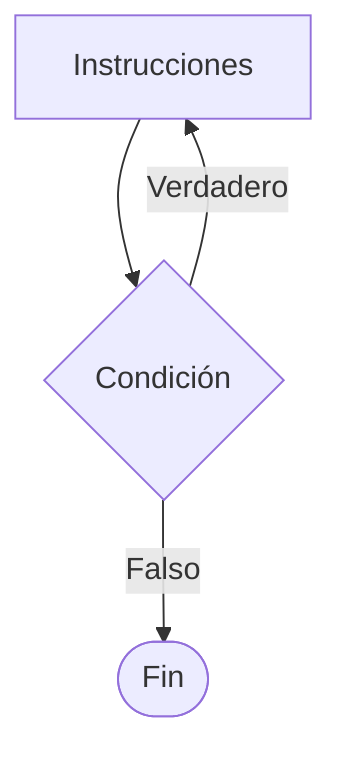
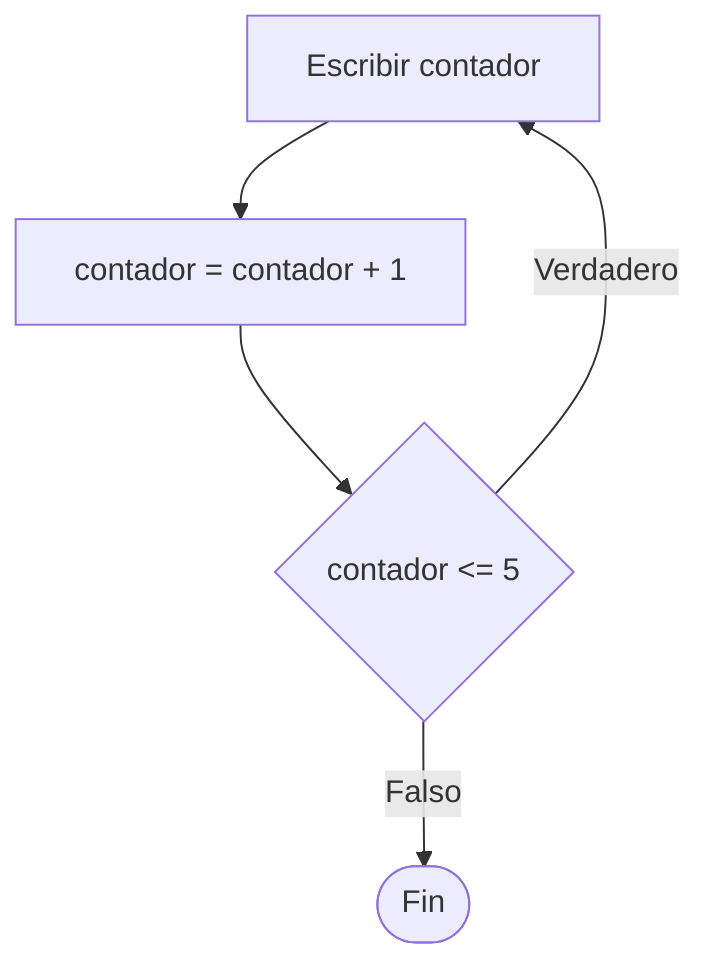

# Do While

## ¿Qué es Do While?

La estructura **Do While** es un ciclo que ejecuta un conjunto de instrucciones y posteriormente evalúa una condición para decidir si debe continuar repitiéndose.

A diferencia de While, la condición se evalúa al final del ciclo.

Por este motivo, el bloque de instrucciones se ejecuta al menos una vez.

---

# Importancia

El ciclo Do While permite:

- Garantizar una ejecución inicial.
- Construir menús interactivos.
- Validar entradas de usuario.
- Repetir procesos hasta cumplir una condición.
- Resolver problemas donde la primera ejecución es obligatoria.

---

# Funcionamiento

El proceso sigue la siguiente lógica:

1. Ejecutar las instrucciones.
2. Evaluar la condición.
3. Si la condición es verdadera, repetir el ciclo.
4. Si la condición es falsa, finalizar.

---

# Condición de salida

El ciclo Do While es una estructura de **condición de salida**.

Esto significa que la condición se evalúa después de ejecutar el bloque de instrucciones.

```text
do

    instrucciones

while (condicion)
```

Por esta razón, el bloque siempre se ejecuta al menos una vez.

---

# ¿Cuándo utilizar Do While?

Se recomienda utilizar Do While cuando:

- El proceso debe ejecutarse al menos una vez.
- Se construyen menús interactivos.
- Se validan contraseñas o datos.
- La condición de repetición se conoce después de ejecutar el proceso.

### Ejemplos

- Menús de opciones.
- Validación de contraseñas.
- Solicitud de datos obligatoria.
- Juegos.
- Confirmaciones de usuario.

---

# Sintaxis general

## Pseudocódigo

```text
Inicio

    do

        instrucciones

    while (condicion)

Fin
```

---

# Diagrama de flujo



---

# Diferencia con While

| Característica | While | Do While |
|---------------|--------|-----------|
| Evalúa condición al inicio | Sí | No |
| Evalúa condición al final | No | Sí |
| Puede ejecutarse cero veces | Sí | No |
| Se ejecuta al menos una vez | No | Sí |

---

# Ejemplo 1

## Problema

Mostrar los números del 1 al 5.

### Pseudocódigo

```text
Inicio

    contador = 1

    do

        Escribir contador

        contador = contador + 1

    while (contador <= 5)

Fin
```

### Diagrama de flujo



### Prueba de escritorio

| Iteración | contador | contador <= 5 | Salida |
|------------|----------|---------------|--------|
| 1 | 1 | Verdadero | 1 |
| 2 | 2 | Verdadero | 2 |
| 3 | 3 | Verdadero | 3 |
| 4 | 4 | Verdadero | 4 |
| 5 | 5 | Verdadero | 5 |
| Fin | 6 | Falso | Sale del ciclo |

### Salida

```text
1
2
3
4
5
```

---

# Ejemplo 2

## Problema

Solicitar una contraseña hasta que sea correcta.

### Pseudocódigo

```text
Inicio

    do

        Leer clave

    while (clave != 1234)

    Escribir "Acceso permitido"

Fin
```

### Diagrama de flujo

```mermaid
flowchart TD

A[/Leer clave/]

B{clave == 1234}

C[Escribir "Acceso permitido"]

A --> B

B -->|Falso| A
B -->|Verdadero| C
```

### Prueba de escritorio

#### Caso 1

##### Datos de entrada

```text
1111
2222
1234
```

##### Tabla de prueba de escritorio

| Intento | clave | ¿Correcta? |
|----------|--------|------------|
| 1 | 1111 | No |
| 2 | 2222 | No |
| 3 | 1234 | Sí |

##### Salida

```text
Acceso permitido
```

---

#### Caso 2

##### Datos de entrada

```text
1234
```

##### Tabla de prueba de escritorio

| Intento | clave | ¿Correcta? |
|----------|--------|------------|
| 1 | 1234 | Sí |

##### Salida

```text
Acceso permitido
```

---

# Contadores y acumuladores

Al igual que While, el ciclo Do While suele utilizar variables de control.

## Contador

Controla la cantidad de repeticiones.

### Ejemplo

```text
contador = contador + 1
```

---

## Acumulador

Almacena resultados parciales.

### Ejemplo

```text
suma = suma + numero
```

---

# Ventajas

| Ventaja | Descripción |
|----------|------------|
| Garantiza ejecución inicial | Siempre se ejecuta una vez. |
| Ideal para menús | Permite mostrar opciones antes de evaluar. |
| Fácil de implementar | Su lógica es sencilla. |
| Útil para validaciones | Facilita la comprobación de datos. |

---

# Limitaciones

| Limitación | Descripción |
|------------|------------|
| Puede generar ciclos infinitos | Si la condición nunca se vuelve falsa. |
| No siempre es adecuado | Algunas situaciones requieren evaluar antes de ejecutar. |
| Menos utilizado | While y For suelen ser más frecuentes. |

---

# Ciclo infinito

Un ciclo infinito ocurre cuando la condición nunca llega a ser falsa.

### Ejemplo

```text
do

    Escribir "Hola"

while (verdadero)
```

Este ciclo nunca finalizará.

---

# Errores comunes

| Error | Descripción |
|--------|------------|
| Olvidar actualizar variables | Produce ciclos infinitos. |
| Condición incorrecta | Resultados inesperados. |
| Utilizar Do While cuando debería ser While | Puede ejecutar acciones no deseadas. |
| No probar distintos escenarios | Puede ocultar errores lógicos. |

---

# Buenas prácticas

- Verificar que la condición pueda volverse falsa.
- Actualizar correctamente las variables de control.
- Utilizar nombres descriptivos.
- Aplicar pruebas de escritorio.
- Utilizar Do While solo cuando la primera ejecución sea obligatoria.

---

# Conclusión

El ciclo Do While permite repetir instrucciones garantizando al menos una ejecución. Su principal característica es que evalúa la condición después de ejecutar el bloque, convirtiéndolo en una excelente opción para menús, validaciones y procesos que deben ejecutarse inicialmente.

---

# Resumen

| Concepto | Idea principal |
|-----------|---------------|
| Do While | Evalúa la condición al final. |
| Condición de salida | Se verifica después de ejecutar. |
| Característica principal | Se ejecuta al menos una vez. |
| Aplicación común | Menús y validaciones. |
| Riesgo principal | Ciclos infinitos. |
| Diferencia con While | La evaluación ocurre después de ejecutar. |
