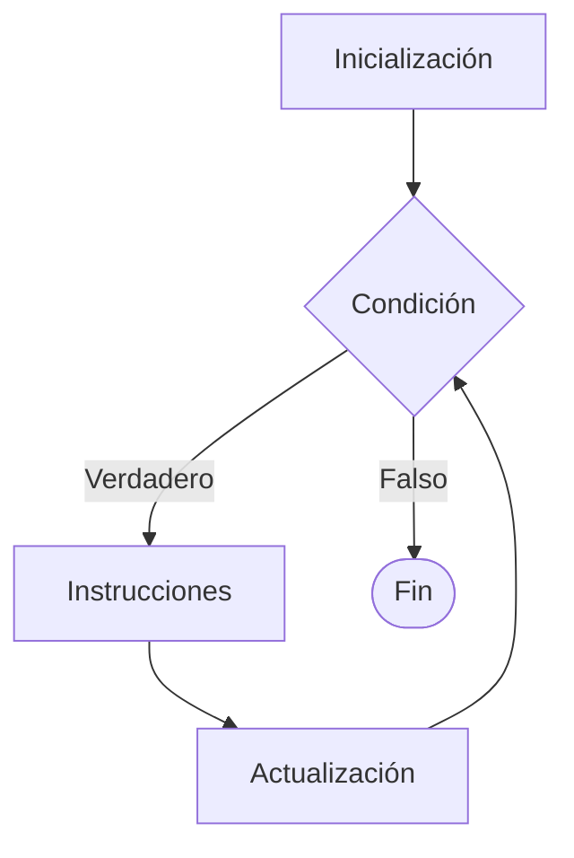

# For

## ¿Qué es For?

La estructura **For** es un ciclo repetitivo que permite ejecutar un conjunto de instrucciones una cantidad determinada de veces.

Se utiliza principalmente cuando se conoce de antemano el número de repeticiones que debe realizar el ciclo.

---

# Importancia

El ciclo For permite:

- Controlar repeticiones mediante un contador.
- Reducir código repetitivo.
- Generar secuencias numéricas.
- Automatizar procesos iterativos.
- Resolver problemas con una cantidad conocida de repeticiones.

Es uno de los ciclos más utilizados en programación.

---

# Funcionamiento

El proceso sigue la siguiente lógica:

1. Inicializar una variable de control.
2. Evaluar una condición.
3. Ejecutar las instrucciones.
4. Actualizar la variable de control.
5. Repetir hasta que la condición sea falsa.

---

# ¿Cuándo utilizar For?

Se recomienda utilizar For cuando:

- Se conoce la cantidad de repeticiones.
- Se necesita realizar conteos.
- Se generan secuencias numéricas.
- Se utilizan contadores.
- Se desea recorrer una colección de elementos.

### Ejemplos

- Mostrar números del 1 al 100.
- Calcular sumas repetitivas.
- Generar tablas de multiplicar.
- Recorrer arreglos.
- Procesar listas de datos.

---

# Componentes del ciclo

Todo ciclo For posee cuatro elementos fundamentales.

| Componente | Función |
|------------|----------|
| Inicialización | Define el valor inicial del contador. |
| Condición | Determina si el ciclo continúa. |
| Actualización | Modifica el contador en cada iteración. |
| Cuerpo | Instrucciones que se repiten. |

---

# Sintaxis general

## Pseudocódigo

```text
Inicio

    for (i = inicio; condicion; actualizacion) do

        instrucciones

    endfor

Fin
```

---

# Diagrama de flujo



---

# Ejemplo 1

## Problema

Mostrar los números del 1 al 5.

### Pseudocódigo

```text
Inicio

    for (i = 1; i <= 5; i++) do

        Escribir i

    endfor

Fin
```

### Prueba de escritorio

| Iteración | i | i <= 5 | Salida |
|------------|---|---------|--------|
| 1 | 1 | Verdadero | 1 |
| 2 | 2 | Verdadero | 2 |
| 3 | 3 | Verdadero | 3 |
| 4 | 4 | Verdadero | 4 |
| 5 | 5 | Verdadero | 5 |
| Fin | 6 | Falso | Sale del ciclo |

### Salida

```text
1
2
3
4
5
```

---

# Ejemplo 2

## Problema

Calcular la suma de los números del 1 al 5.

### Pseudocódigo

```text
Inicio

    suma = 0

    for (i = 1; i <= 5; i++) do

        suma = suma + i

    endfor

    Escribir suma

Fin
```

### Prueba de escritorio

| Iteración | i | suma |
|------------|---|------|
| Inicial | 1 | 0 |
| 1 | 1 | 1 |
| 2 | 2 | 3 |
| 3 | 3 | 6 |
| 4 | 4 | 10 |
| 5 | 5 | 15 |
| Fin | 6 | 15 |

### Salida

```text
15
```

---

# Conteo descendente

El contador también puede disminuir.

### Pseudocódigo

```text
Inicio

    for (i = 5; i >= 1; i--) do

        Escribir i

    endfor

Fin
```

### Salida

```text
5
4
3
2
1
```

---

# Incrementos personalizados

No es obligatorio incrementar de uno en uno.

### Pseudocódigo

```text
Inicio

    for (i = 0; i <= 10; i = i + 2) do

        Escribir i

    endfor

Fin
```

### Salida

```text
0
2
4
6
8
10
```

---

# Ciclos For Anidados

## ¿Qué son los ciclos For anidados?

Un ciclo For anidado es un ciclo For que contiene otro ciclo For en su interior.

El ciclo externo controla las repeticiones generales, mientras que el ciclo interno se ejecuta completamente en cada iteración del ciclo externo.

---

## Ejemplo 1

### Problema

Mostrar una cuadrícula de números.

### Pseudocódigo

```text
Inicio

    for (i = 1; i <= 3; i++) do

        for (j = 1; j <= 3; j++) do

            Escribir j

        endfor

    endfor

Fin
```

### Prueba de escritorio

| i | j | Salida |
|---|---|---------|
| 1 | 1 | 1 |
| 1 | 2 | 2 |
| 1 | 3 | 3 |
| 2 | 1 | 1 |
| 2 | 2 | 2 |
| 2 | 3 | 3 |
| 3 | 1 | 1 |
| 3 | 2 | 2 |
| 3 | 3 | 3 |

### Salida

```text
1 2 3
1 2 3
1 2 3
```

---

## Ejemplo 2

### Problema

Generar una tabla de multiplicar.

### Pseudocódigo

```text
Inicio

    for (i = 1; i <= 3; i++) do

        for (j = 1; j <= 3; j++) do

            Escribir i * j

        endfor

    endfor

Fin
```

### Prueba de escritorio

| i | j | Resultado |
|---|---|-----------|
| 1 | 1 | 1 |
| 1 | 2 | 2 |
| 1 | 3 | 3 |
| 2 | 1 | 2 |
| 2 | 2 | 4 |
| 2 | 3 | 6 |
| 3 | 1 | 3 |
| 3 | 2 | 6 |
| 3 | 3 | 9 |

### Salida

```text
1 2 3
2 4 6
3 6 9
```

---

# Contadores y acumuladores

## Contador

Un contador controla la cantidad de repeticiones.

### Ejemplo

```text
i++
```

Equivale a:

```text
i = i + 1
```

---

## Acumulador

Un acumulador almacena resultados parciales.

### Ejemplo

```text
suma = suma + numero
```

---

# Comparación con While y Do While

| Característica | While | Do While | For |
|---------------|--------|-----------|-----|
| Evalúa al inicio | Sí | No | Sí |
| Evalúa al final | No | Sí | No |
| Puede ejecutarse cero veces | Sí | No | Sí |
| Control por contador | Manual | Manual | Integrado |
| Repeticiones conocidas | Posible | Posible | Ideal |
| Repeticiones desconocidas | Ideal | Ideal | Menos común |

---

# Ventajas

| Ventaja | Descripción |
|----------|------------|
| Claridad | Integra el control del ciclo en una sola estructura. |
| Organización | Facilita la lectura del algoritmo. |
| Eficiencia | Ideal para repeticiones conocidas. |
| Versatilidad | Permite distintos tipos de recorridos. |

---

# Limitaciones

| Limitación | Descripción |
|------------|------------|
| Menos conveniente para repeticiones desconocidas | While suele ser mejor opción. |
| Puede volverse complejo | Cuando existen múltiples condiciones. |
| Los ciclos anidados aumentan la complejidad | Requieren mayor cuidado al diseñarlos. |

---

# Ciclo infinito

Un ciclo infinito ocurre cuando la condición nunca se vuelve falsa.

### Ejemplo

```text
for (i = 1; i > 0; i++) do

    Escribir i

endfor
```

---

# Errores comunes

| Error | Descripción |
|--------|------------|
| Condición incorrecta | Puede omitir o agregar iteraciones. |
| Actualización incorrecta | Puede producir ciclos infinitos. |
| Confundir < con <= | Cambia la cantidad de repeticiones. |
| Modificar incorrectamente el contador | Produce resultados inesperados. |
| Confundir i y j en ciclos anidados | Genera resultados incorrectos. |

---

# Buenas prácticas

- Utilizar For cuando se conoce el número de repeticiones.
- Mantener condiciones simples y claras.
- Verificar correctamente el valor inicial y final.
- Utilizar nombres descriptivos para los contadores.
- Realizar pruebas de escritorio.
- Mantener pocos niveles de anidamiento.

---

# Conclusión

El ciclo For es una estructura repetitiva diseñada para controlar iteraciones mediante un contador. Su claridad y facilidad de uso lo convierten en una de las herramientas más importantes para resolver problemas que requieren una cantidad conocida de repeticiones.

Los ciclos For anidados amplían esta capacidad permitiendo realizar repeticiones dentro de otras repeticiones, siendo fundamentales para resolver problemas más complejos.

---

# Resumen

| Concepto | Idea principal |
|-----------|---------------|
| For | Ciclo controlado por contador. |
| Inicialización | Define el punto de partida. |
| Condición | Determina la continuidad del ciclo. |
| Actualización | Modifica el contador. |
| For Anidado | Un ciclo For dentro de otro ciclo For. |
| Aplicación principal | Repeticiones conocidas y recorridos múltiples. |
