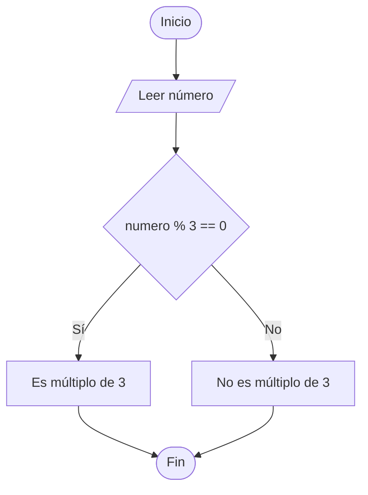

# Múltiplo de 3

## Enunciado

Construir un algoritmo que permita leer un número entero y verificar si es múltiplo de 3.

---

# Análisis

## Entradas

| Dato   | Tipo   |
| ------ | ------ |
| numero | Entero |

---

## Proceso

1. Leer un número entero.
2. Calcular el residuo de dividir el número entre 3.
3. Verificar si el residuo es igual a 0.
4. Mostrar el resultado correspondiente.

---

## Salidas

| Salida                                     |
| ------------------------------------------ |
| Indicar si el número es múltiplo de 3 o no |

---

## Restricciones

* El valor ingresado debe ser un número entero.

---

# Casos de Prueba

| Entrada | Salida Esperada               |
| ------- | ----------------------------- |
| 9       | El número es múltiplo de 3    |
| 12      | El número es múltiplo de 3    |
| 10      | El número no es múltiplo de 3 |
| 14      | El número no es múltiplo de 3 |

---

# Estrategia de Solución

Se utilizará una estructura condicional para verificar si el residuo de dividir el número entre 3 es igual a cero.

Si el residuo es cero, el número será múltiplo de 3; en caso contrario, no será múltiplo de 3.

---

# Variables

| Variable | Tipo   | Descripción                     |
| -------- | ------ | ------------------------------- |
| numero   | Entero | Número ingresado por el usuario |

---

# Operadores

| Operador | Tipo       | Uso                |
| -------- | ---------- | ------------------ |
| %        | Aritmético | Obtener el residuo |
| ==       | Relacional | Comparar igualdad  |

---

# Estructuras Utilizadas

```text
If Else
```

---

# Secuencia Lógica

1. Inicio.
2. Solicitar un número entero.
3. Leer el número entero.
4. Verificar si el residuo de dividir el número entre 3 es igual a 0.
5. Si se cumple la condición, mostrar que es múltiplo de 3.
6. Caso contrario, mostrar que no es múltiplo de 3.
7. Fin.

---

# Pseudocódigo

```text
Inicio

    Escribir "Ingrese un numero: "
    Leer numero

    if (numero % 3 == 0) then

        Escribir "El número es múltiplo de 3"

    else

        Escribir "El número no es múltiplo de 3"

    endif

Fin
```

---

# Diagrama de Flujo



---

# Prueba de Escritorio

## Caso 1

### Entrada

```text
numero = 9
```

| Paso        | numero | residuo |
| ----------- | ------ | ------- |
| Leer numero | 9      | -       |
| numero % 3  | 9      | 0       |

### Salida

```text
El número es múltiplo de 3
```

---

## Caso 2

### Entrada

```text
numero = 10
```

| Paso        | numero | residuo |
| ----------- | ------ | ------- |
| Leer numero | 10     | -       |
| numero % 3  | 10     | 1       |

### Salida

```text
El número no es múltiplo de 3
```

---

# Implementación

```cpp
#include <iostream>

using namespace std;

int main() {

    int numero;

    cout << "Ingrese un numero: ";
    cin >> numero;

    if (numero % 3 == 0) {

        cout << "El numero es multiplo de 3" << endl;

    } else {

        cout << "El numero no es multiplo de 3" << endl;

    }

    return 0;
}
```
