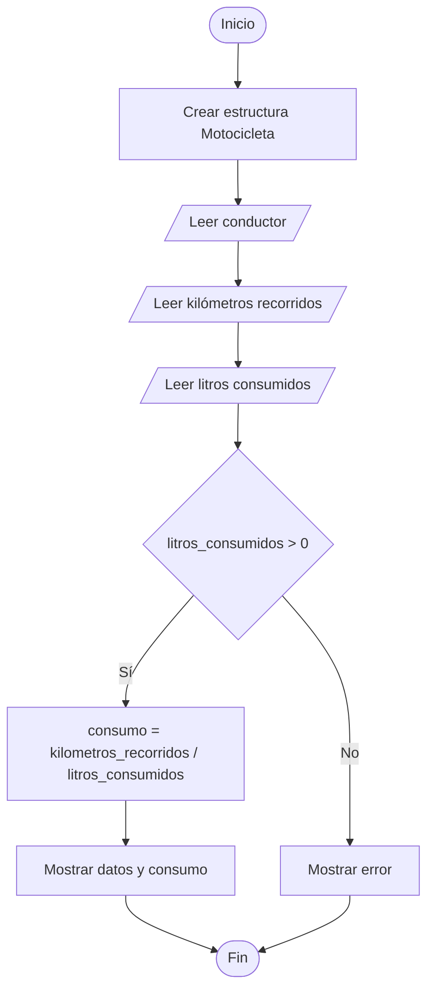

# Consumo de una Motocicleta

## Enunciado

Registrar los datos de una motocicleta (construir una estructura):

* Nombre del conductor.
* Kilómetros recorridos.
* Litros consumidos.

Mostrar el consumo de la motocicleta.

---

# Análisis

## Entradas

| Dato                  | Tipo   |
| --------------------- | ------ |
| nombre_conductor      | Cadena |
| kilometros_recorridos | Real   |
| litros_consumidos     | Real   |

---

## Proceso

1. Registrar los datos de la motocicleta.
2. Verificar que los litros consumidos sean mayores que cero.
3. Calcular el consumo.
4. Mostrar los resultados.

---

## Salidas

| Salida                                       |
| -------------------------------------------- |
| Datos de la motocicleta                      |
| Consumo en km/L                              |
| Mensaje de error si los litros son inválidos |

---

## Restricciones

* Los litros consumidos deben ser mayores que cero.
* Los kilómetros recorridos deben ser mayores o iguales a cero.

---

# Casos de Prueba

| Entrada         | Salida Esperada              |
| --------------- | ---------------------------- |
| Carlos, 240, 12 | Consumo = 20 km/L            |
| María, 180, 6   | Consumo = 30 km/L            |
| José, 100, 0    | Error: litros no puede ser 0 |

---

# Estrategia de Solución

Se construirá una estructura para almacenar los datos de la motocicleta.

Posteriormente se verificará que los litros consumidos sean mayores que cero antes de realizar el cálculo.

Si los litros son válidos, se calculará el consumo mediante la fórmula:

```text
consumo = kilometros_recorridos / litros_consumidos
```

---

# Variables

| Variable | Tipo        | Descripción                          |
| -------- | ----------- | ------------------------------------ |
| moto     | Motocicleta | Almacena los datos de la motocicleta |
| consumo  | Real        | Consumo calculado en km/L            |

---

# Estructuras de Datos

## Motocicleta

| Campo                 | Tipo   | Descripción                       |
| --------------------- | ------ | --------------------------------- |
| nombre_conductor      | Cadena | Nombre del conductor              |
| kilometros_recorridos | Real   | Distancia recorrida               |
| litros_consumidos     | Real   | Cantidad de combustible consumido |

---

# Operadores

| Operador | Tipo       | Uso              |
| -------- | ---------- | ---------------- |
| =        | Asignación | Asignar valores  |
| /        | Aritmético | Calcular consumo |
| >        | Relacional | Validar litros   |

---

# Estructuras Utilizadas

```text
If Else
```

---

# Fórmulas

```text
consumo = kilometros_recorridos / litros_consumidos
```

---

# Secuencia Lógica

1. Inicio.
2. Crear la estructura `Motocicleta`.
3. Solicitar el nombre del conductor.
4. Leer el nombre del conductor.
5. Solicitar los kilómetros recorridos.
6. Leer los kilómetros recorridos.
7. Solicitar los litros consumidos.
8. Leer los litros consumidos.
9. Verificar si los litros consumidos son mayores que cero.
10. Si la condición es verdadera:

    * Calcular el consumo.
    * Mostrar los datos de la motocicleta.
    * Mostrar el consumo calculado.
11. Caso contrario:

    * Mostrar mensaje de error.
12. Fin.

---

# Pseudocódigo

```text
Inicio

    Estructura Motocicleta

        nombre_conductor : Cadena
        kilometros_recorridos : Real
        litros_consumidos : Real

    FinEstructura

    Definir moto Como Motocicleta
    Definir consumo Como Real

    Escribir "Ingrese nombre del conductor: "
    Leer moto.nombre_conductor

    Escribir "Ingrese kilometros recorridos: "
    Leer moto.kilometros_recorridos

    Escribir "Ingrese litros consumidos: "
    Leer moto.litros_consumidos

    if (moto.litros_consumidos > 0) then

        consumo = moto.kilometros_recorridos / moto.litros_consumidos

        Escribir "Conductor: ", moto.nombre_conductor
        Escribir "Kilometros: ", moto.kilometros_recorridos
        Escribir "Litros: ", moto.litros_consumidos
        Escribir "Consumo: ", consumo, " km/L"

    else

        Escribir "Error: litros no puede ser 0"

    endif

Fin
```

---

# Diagrama de Flujo



---

# Prueba de Escritorio

## Caso 1

### Entrada

```text
nombre_conductor = Carlos
kilometros_recorridos = 240
litros_consumidos = 12
```

| Paso       | kilometros_recorridos | litros_consumidos | consumo |
| ---------- | --------------------- | ----------------- | ------- |
| Leer datos | 240                   | 12                | -       |
| 240 / 12   | 240                   | 12                | 20      |

### Salida

```text
Conductor: Carlos
Consumo: 20 km/L
```

---

## Caso 2

### Entrada

```text
nombre_conductor = José
kilometros_recorridos = 100
litros_consumidos = 0
```

| Paso                  | kilometros_recorridos | litros_consumidos |
| --------------------- | --------------------- | ----------------- |
| Leer datos            | 100                   | 0                 |
| litros_consumidos > 0 | Falso                 |                   |

### Salida

```text
Error: litros no puede ser 0
```

---

# Implementación

```cpp
#include <iostream>
#include <string>

using namespace std;

struct Motocicleta {

    string nombre_conductor;
    double kilometros_recorridos;
    double litros_consumidos;

};

int main() {

    Motocicleta moto;
    double consumo;

    cout << "Ingrese nombre del conductor: ";
    getline(cin, moto.nombre_conductor);

    cout << "Ingrese kilometros recorridos: ";
    cin >> moto.kilometros_recorridos;

    cout << "Ingrese litros consumidos: ";
    cin >> moto.litros_consumidos;

    if (moto.litros_consumidos > 0) {

        consumo = moto.kilometros_recorridos / moto.litros_consumidos;

        cout << "\nConductor: " << moto.nombre_conductor << endl;

        cout << "Kilometros: " << moto.kilometros_recorridos << endl;

        cout << "Litros: " << moto.litros_consumidos << endl;

        cout << "Consumo: " << consumo << " km/L" << endl;

    } else {

        cout << "Error: litros no puede ser 0" << endl;

    }

    return 0;
}
```
