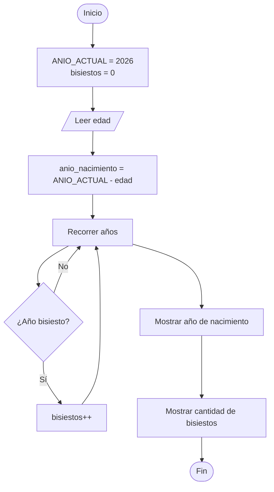

# Año de Nacimiento y Cantidad de Años Bisiestos

## Enunciado

Solicitar la edad del usuario y calcular su año de nacimiento utilizando como referencia el año 2026.

Posteriormente, determinar cuántos años bisiestos han ocurrido desde su año de nacimiento hasta el año 2026.

---

# Análisis

## Entradas

| Dato | Tipo   |
| ---- | ------ |
| edad | Entero |

---

## Proceso

1. Leer la edad del usuario.
2. Calcular el año de nacimiento.
3. Inicializar un contador de años bisiestos.
4. Recorrer los años desde el año de nacimiento hasta 2026.
5. Verificar si cada año es bisiesto.
6. Incrementar el contador cuando corresponda.
7. Mostrar los resultados.

---

## Salidas

| Salida                     |
| -------------------------- |
| Año de nacimiento          |
| Cantidad de años bisiestos |

---

## Restricciones

* La edad debe ser mayor o igual a 0.
* La edad debe ser menor o igual a 120.
* El cálculo del año de nacimiento se realizará mediante:

```text
anio_nacimiento = 2026 - edad
```

---

# Casos de Prueba

| Entrada | Salida Esperada                        |
| ------- | -------------------------------------- |
| 20      | Año de nacimiento: 2006, Bisiestos: 5  |
| 30      | Año de nacimiento: 1996, Bisiestos: 8  |
| 40      | Año de nacimiento: 1986, Bisiestos: 10 |

---

# Estrategia de Solución

Se calculará el año de nacimiento restando la edad al año de referencia.

Posteriormente se recorrerán todos los años comprendidos entre el año de nacimiento y el año 2026 utilizando un ciclo `for`.

Durante el recorrido se verificará cuáles años son bisiestos y se incrementará un contador para obtener la cantidad total.

---

# Variables

| Variable        | Tipo   | Descripción                   |
| --------------- | ------ | ----------------------------- |
| edad            | Entero | Edad ingresada por el usuario |
| anio_nacimiento | Entero | Año calculado de nacimiento   |
| anio            | Entero | Variable de control del ciclo |
| bisiestos       | Entero | Cantidad de años bisiestos    |

---

# Operadores

| Operador | Tipo       | Uso                        |
| -------- | ---------- | -------------------------- |
| =        | Asignación | Asignar valores            |
| -        | Aritmético | Calcular año de nacimiento |
| %        | Aritmético | Obtener residuos           |
| ==       | Relacional | Comparar igualdad          |
| !=       | Relacional | Comparar diferencia        |
| &&       | Lógico     | Combinar condiciones       |
| ||       | Lógico     | Combinar condiciones       |
| ++       | Incremento | Incrementar contador       |

---

# Estructuras Utilizadas

```text
If

For
```

---

# Fórmulas

## Año de Nacimiento

```text
anio_nacimiento = 2026 - edad
```

## Año Bisiesto

```text
(anio % 4 == 0 && anio % 100 != 0)
||
(anio % 400 == 0)
```

---

# Secuencia Lógica

1. Inicio.
2. Definir la constante `ANIO_ACTUAL = 2026`.
3. Definir las variables:

   * edad
   * anio_nacimiento
   * anio
   * bisiestos
4. Inicializar `bisiestos` en 0.
5. Solicitar la edad del usuario.
6. Leer la edad.
7. Calcular el año de nacimiento.
8. Recorrer los años desde `anio_nacimiento` hasta `ANIO_ACTUAL`.
9. Verificar si el año es bisiesto.
10. Si el año es bisiesto, incrementar el contador.
11. Mostrar el año de nacimiento.
12. Mostrar la cantidad de años bisiestos.
13. Fin.

---

# Pseudocódigo

```text
Inicio

    Constante ANIO_ACTUAL = 2026

    Definir edad Como Entero
    Definir anio_nacimiento Como Entero
    Definir anio Como Entero
    Definir bisiestos Como Entero

    bisiestos = 0

    Escribir "Ingrese su edad: "
    Leer edad

    anio_nacimiento = ANIO_ACTUAL - edad

    for (anio = anio_nacimiento; anio <= ANIO_ACTUAL; anio++)
        if ((anio % 4 == 0 && anio % 100 != 0) || (anio % 400 == 0)) then
            bisiestos = bisiestos + 1
        endif

    endfor

    Escribir "Año de nacimiento: ", anio_nacimiento

    Escribir "Cantidad de años bisiestos: ", bisiestos

Fin
```

---

# Diagrama de Flujo



---

# Prueba de Escritorio

## Caso 1

### Entrada

```text
edad = 20
```

| Paso            | Valor |
| --------------- | ----- |
| ANIO_ACTUAL     | 2026  |
| anio_nacimiento | 2006  |
| bisiestos       | 5     |

### Salida

```text
Año de nacimiento: 2006

Cantidad de años bisiestos: 5
```

---

## Caso 2

### Entrada

```text
edad = 30
```

| Paso            | Valor |
| --------------- | ----- |
| ANIO_ACTUAL     | 2026  |
| anio_nacimiento | 1996  |
| bisiestos       | 8     |

### Salida

```text
Año de nacimiento: 1996

Cantidad de años bisiestos: 8
```

---

# Implementación

```cpp
#include <iostream>

using namespace std;

int main() {

    const int ANIO_ACTUAL = 2026;

    int edad;
    int anio_nacimiento;
    int anio;
    int bisiestos = 0;

    cout << "Ingrese su edad: ";
    cin >> edad;

    anio_nacimiento = ANIO_ACTUAL - edad;

    for (anio = anio_nacimiento; anio <= ANIO_ACTUAL; anio++) {
        if ((anio % 4 == 0 && anio % 100 != 0) || (anio % 400 == 0)) {
            bisiestos++;
        }

    }

    cout << "\nAño de nacimiento: " << anio_nacimiento << endl;
    cout << "Cantidad de años bisiestos: " << bisiestos << endl;

    return 0;
}
```
