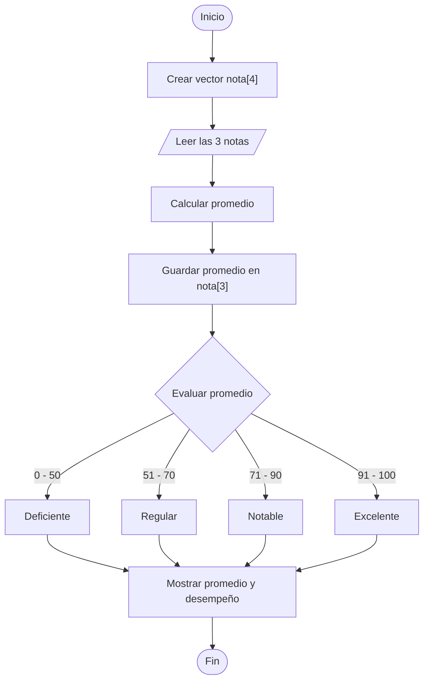

# Promedio y Desempeño del Alumno

## Enunciado

Crear el vector `nota` de tamaño 4.

Leer las calificaciones de 3 materias del alumno y almacenarlas en el vector.

Calcular el promedio y almacenarlo en la cuarta posición del vector.

Mostrar el desempeño según la siguiente escala:

* 0 a 50 → Deficiente
* 51 a 70 → Regular
* 71 a 90 → Notable
* 91 a 100 → Excelente

---

# Análisis

## Entradas

| Dato    | Tipo |
| ------- | ---- |
| nota[0] | Real |
| nota[1] | Real |
| nota[2] | Real |

---

## Proceso

1. Crear un vector de tamaño 4.
2. Leer las tres calificaciones.
3. Almacenar las calificaciones en el vector.
4. Calcular el promedio.
5. Guardar el promedio en la cuarta posición del vector.
6. Determinar el desempeño según el promedio obtenido.
7. Mostrar los resultados.

---

## Salidas

| Salida            |
| ----------------- |
| Notas registradas |
| Promedio          |
| Desempeño         |

---

## Restricciones

* Las notas deben estar entre 0 y 100.
* El vector tiene tamaño fijo de 4 posiciones.
* Las tres primeras posiciones almacenan notas.
* La cuarta posición almacena el promedio.

---

# Casos de Prueba

| Entrada     | Salida Esperada              |
| ----------- | ---------------------------- |
| 60, 80, 90  | Promedio: 76.67 - Notable    |
| 50, 60, 40  | Promedio: 50.00 - Deficiente |
| 70, 75, 65  | Promedio: 70.00 - Regular    |
| 95, 90, 100 | Promedio: 95.00 - Excelente  |

---

# Estrategia de Solución

Se utilizará un vector para almacenar las tres calificaciones y el promedio.

Posteriormente se calculará el promedio de las tres notas y se almacenará en la última posición del vector.

Finalmente se utilizará una estructura condicional múltiple para determinar el desempeño del alumno.

---

# Variables

| Variable  | Tipo   | Descripción                          |
| --------- | ------ | ------------------------------------ |
| i         | Entero | Variable de control del ciclo        |
| desempeno | Cadena | Categoría obtenida según el promedio |

---

# Estructuras de Datos

## nota

| Elemento | Tipo | Descripción          |
| -------- | ---- | -------------------- |
| nota[0]  | Real | Primera calificación |
| nota[1]  | Real | Segunda calificación |
| nota[2]  | Real | Tercera calificación |
| nota[3]  | Real | Promedio calculado   |

---

# Operadores

| Operador | Tipo       | Uso                         |
| -------- | ---------- | --------------------------- |
| =        | Asignación | Asignar valores             |
| +        | Aritmético | Sumar notas                 |
| /        | Aritmético | Calcular promedio           |
| <        | Relacional | Controlar ciclo             |
| >=       | Relacional | Comparar límites inferiores |
| <=       | Relacional | Comparar límites superiores |
| &&       | Lógico     | Combinar condiciones        |
| ++       | Incremento | Incrementar contador        |

---

# Estructuras Utilizadas

```text
For

If Else If
```

---

# Fórmulas

```text
nota[3] = (nota[0] + nota[1] + nota[2]) / 3
```

---

# Secuencia Lógica

1. Inicio.
2. Definir el vector `nota` de tamaño 4.
3. Definir las variables:

   * i
   * desempeno
4. Leer las tres calificaciones.
5. Almacenar las calificaciones en el vector.
6. Calcular el promedio.
7. Guardar el promedio en `nota[3]`.
8. Evaluar el promedio obtenido.
9. Determinar el desempeño correspondiente.
10. Mostrar las notas registradas.
11. Mostrar el promedio.
12. Mostrar el desempeño.
13. Fin.

---

# Pseudocódigo

```text
Inicio

    Definir nota[4] Como Real
    Definir i Como Entero
    Definir desempeno Como Cadena

    for (i = 0; i < 3; i++) do
        Escribir "Ingrese nota ", i + 1, ": "
        Leer nota[i]
    endfor

    nota[3] = (nota[0] + nota[1] + nota[2]) / 3

    if (nota[3] >= 0 && nota[3] <= 50) then
        desempeno = "Deficiente"
    else if (nota[3] >= 51 && nota[3] <= 70) then
        desempeno = "Regular"
    else if (nota[3] >= 71 && nota[3] <= 90) then
        desempeno = "Notable"
    else
        desempeno = "Excelente"
    endif

    Escribir "Promedio: ", nota[3]

    Escribir "Desempeño: ", desempeno

Fin
```

---

# Diagrama de Flujo



---

# Prueba de Escritorio

## Caso 1

### Entrada

```text
nota[0] = 60
nota[1] = 80
nota[2] = 90
```

| Paso      | Valor   |
| --------- | ------- |
| Promedio  | 76.67   |
| Desempeño | Notable |

### Salida

```text
Promedio: 76.67

Desempeño: Notable
```

---

## Caso 2

### Entrada

```text
nota[0] = 95
nota[1] = 90
nota[2] = 100
```

| Paso      | Valor     |
| --------- | --------- |
| Promedio  | 95.00     |
| Desempeño | Excelente |

### Salida

```text
Promedio: 95.00

Desempeño: Excelente
```

---

# Implementación

```cpp
#include <iostream>
#include <string>

using namespace std;

int main() {

    float nota[4];
    string desempeno;

    for (int i = 0; i < 3; i++) {
        cout << "Ingrese nota " << i + 1 << ": ";
        cin >> nota[i];
    }

    nota[3] = (nota[0] + nota[1] + nota[2]) / 3;

    if (nota[3] >= 0 && nota[3] <= 50) {
        desempeno = "Deficiente";
    } else if (nota[3] >= 51 && nota[3] <= 70) {
        desempeno = "Regular";
    } else if (nota[3] >= 71 && nota[3] <= 90) {
        desempeno = "Notable";
    } else {
        desempeno = "Excelente";
    }

    cout << "\nPromedio: " << nota[3] << endl;
    cout << "Desempeno: " << desempeno << endl;

    return 0;
}
```
