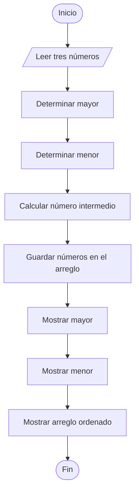

# Mayor, Menor y Arreglo Ordenado

## Enunciado

Leer tres números enteros distintos e identificar:

- El número mayor.
- El número menor.

Almacenar los tres números de manera ordenada en un arreglo.

Mostrar el contenido del arreglo.

---

# Análisis

## Entradas

| Dato | Tipo |
|------|------|
| numero_1 | Entero |
| numero_2 | Entero |
| numero_3 | Entero |

---

## Proceso

1. Leer tres números enteros distintos.
2. Determinar el número mayor.
3. Determinar el número menor.
4. Calcular el número intermedio.
5. Guardar los números ordenados en un arreglo.
6. Mostrar el número mayor.
7. Mostrar el número menor.
8. Mostrar el arreglo ordenado.

---

## Salidas

| Salida |
|---------|
| Número mayor |
| Número menor |
| Arreglo ordenado |

---

## Restricciones

- Los tres números deben ser distintos.
- Los datos ingresados deben ser enteros.
- El arreglo tiene tamaño fijo de 3 posiciones.

---

# Casos de Prueba

| Entrada | Salida Esperada |
|----------|----------------|
| 8, 3, 5 | Mayor: 8, Menor: 3, Arreglo: 3 5 8 |
| 10, 1, 7 | Mayor: 10, Menor: 1, Arreglo: 1 7 10 |
| 15, 20, 12 | Mayor: 20, Menor: 12, Arreglo: 12 15 20 |

---

# Estrategia de Solución

Se compararán los tres números para identificar el mayor y el menor.

Posteriormente se calculará el valor intermedio utilizando la suma de los tres números menos el mayor y el menor.

Finalmente se almacenarán los números ordenados dentro de un arreglo y se mostrarán los resultados.

---

# Variables

| Variable | Tipo | Descripción |
|-----------|-----------|-----------|
| numero_1 | Entero | Primer número |
| numero_2 | Entero | Segundo número |
| numero_3 | Entero | Tercer número |
| mayor | Entero | Número mayor |
| menor | Entero | Número menor |
| medio | Entero | Número intermedio |
| i | Entero | Control del ciclo |

---

# Estructuras de Datos

## numeros

| Elemento | Tipo | Descripción |
|-----------|-----------|-----------|
| numeros[0] | Entero | Número menor |
| numeros[1] | Entero | Número intermedio |
| numeros[2] | Entero | Número mayor |

---

# Operadores

| Operador | Tipo | Uso |
|-----------|-----------|-----------|
| = | Asignación | Asignar valores |
| + | Aritmético | Sumar números |
| - | Aritmético | Calcular el número intermedio |
| > | Relacional | Comparar números |
| < | Relacional | Comparar números |
| ++ | Incremento | Incrementar índice |

---

# Estructuras Utilizadas

```text
If

For

Arreglo
```

---

# Fórmulas

## Número Intermedio

```text
medio = (numero_1 + numero_2 + numero_3) - mayor - menor
```

---

# Secuencia Lógica

1. Inicio.
2. Definir las variables:
   - numero_1
   - numero_2
   - numero_3
   - mayor
   - menor
   - medio
   - i
3. Definir el arreglo `numeros` de tamaño 3.
4. Solicitar el primer número.
5. Leer el primer número.
6. Solicitar el segundo número.
7. Leer el segundo número.
8. Solicitar el tercer número.
9. Leer el tercer número.
10. Inicializar mayor y menor con el primer número.
11. Comparar para encontrar el mayor.
12. Comparar para encontrar el menor.
13. Calcular el número intermedio.
14. Guardar los valores ordenados en el arreglo.
15. Mostrar el número mayor.
16. Mostrar el número menor.
17. Mostrar el contenido del arreglo.
18. Fin.

---

# Pseudocódigo

```text
Inicio

    Definir numero_1 Como Entero
    Definir numero_2 Como Entero
    Definir numero_3 Como Entero

    Definir mayor Como Entero
    Definir menor Como Entero
    Definir medio Como Entero

    Definir i Como Entero

    Definir numeros[3] Como Entero

    Escribir "Ingrese el primer numero: "
    Leer numero_1

    Escribir "Ingrese el segundo numero: "
    Leer numero_2

    Escribir "Ingrese el tercer numero: "
    Leer numero_3

    mayor = numero_1
    menor = numero_1

    if (numero_2 > mayor) then
        mayor = numero_2
    endif

    if (numero_3 > mayor) then
        mayor = numero_3
    endif

    if (numero_2 < menor) then
        menor = numero_2
    endif

    if (numero_3 < menor) then
        menor = numero_3
    endif

    medio = (numero_1 + numero_2 + numero_3) - mayor - menor

    numeros[0] = menor
    numeros[1] = medio
    numeros[2] = mayor

    Escribir "Mayor: ", mayor

    Escribir "Menor: ", menor

    Escribir "Arreglo ordenado: "

    for (i = 0; i < 3; i++) do
        Escribir numeros[i]
    endfor

Fin
```

---

# Diagrama de Flujo



---

# Prueba de Escritorio

## Caso 1

### Entrada

```text
numero_1 = 8
numero_2 = 3
numero_3 = 5
```

| Paso | Valor |
|-------|-------|
| Menor | 3 |
| Medio | 5 |
| Mayor | 8 |

### Salida

```text
Mayor: 8

Menor: 3

Arreglo ordenado:
3 5 8
```

---

## Caso 2

### Entrada

```text
numero_1 = 10
numero_2 = 1
numero_3 = 7
```

| Paso | Valor |
|-------|-------|
| Menor | 1 |
| Medio | 7 |
| Mayor | 10 |

### Salida

```text
Mayor: 10

Menor: 1

Arreglo ordenado:
1 7 10
```

---

# Implementación

```cpp
#include <iostream>

using namespace std;

int main() {

    int numero_1;
    int numero_2;
    int numero_3;

    int mayor;
    int menor;
    int medio;

    int numeros[3];

    cout << "Ingrese el primer numero: ";
    cin >> numero_1;

    cout << "Ingrese el segundo numero: ";
    cin >> numero_2;

    cout << "Ingrese el tercer numero: ";
    cin >> numero_3;

    mayor = numero_1;
    menor = numero_1;

    if (numero_2 > mayor) {
        mayor = numero_2;
    }

    if (numero_3 > mayor) {
        mayor = numero_3;
    }

    if (numero_2 < menor) {
        menor = numero_2;
    }

    if (numero_3 < menor) {
        menor = numero_3;
    }

    medio = (numero_1 + numero_2 + numero_3) - mayor - menor;

    numeros[0] = menor;
    numeros[1] = medio;
    numeros[2] = mayor;

    cout << "\nMayor: " << mayor << endl;
    cout << "Menor: " << menor << endl;
    cout << "Arreglo ordenado: ";
    for (int i = 0; i < 3; i++) {
        cout << numeros[i] << " ";
    }
    cout << endl;

    return 0;
}
```
