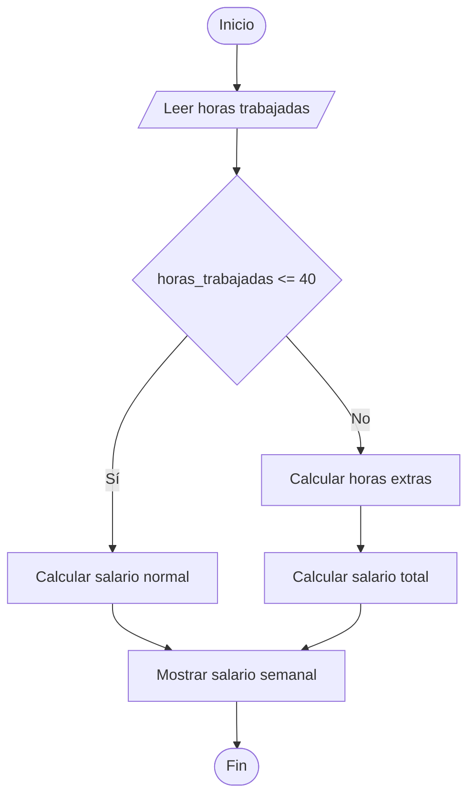

# Salario Semanal de un Obrero

## Enunciado

Leer la cantidad de horas trabajadas por un obrero y calcular su salario semanal:

- Hasta 40 horas → 20 Bs por hora.
- Más de 40 horas → las primeras 40 horas se pagan a 20 Bs por hora y las horas extras a 25 Bs por hora.

Mostrar el salario total.

---

# Análisis

## Entradas

| Dato | Tipo |
|------|------|
| horas_trabajadas | Entero |

---

## Proceso

1. Leer la cantidad de horas trabajadas.
2. Verificar si las horas trabajadas son menores o iguales a 40.
3. Si son menores o iguales a 40, calcular el salario normal.
4. Si son mayores a 40, calcular las horas extras.
5. Calcular el salario total.
6. Mostrar el salario semanal.

---

## Salidas

| Salida |
|---------|
| Salario semanal |

---

## Restricciones

- Las horas trabajadas deben ser mayores o iguales a 0.
- El salario se calcula en bolivianos (Bs).
- Solo las horas que exceden las 40 se consideran horas extras.

---

# Casos de Prueba

| Entrada | Salida Esperada |
|----------|----------------|
| 30 | Salario semanal: 600 Bs |
| 40 | Salario semanal: 800 Bs |
| 45 | Salario semanal: 925 Bs |
| 50 | Salario semanal: 1050 Bs |

---

# Estrategia de Solución

Se verificará si las horas trabajadas son menores o iguales a 40.

Si se cumple esta condición, todas las horas se pagarán a una tarifa de 20 Bs por hora.

Caso contrario, se calcularán las horas extras y se aplicará una tarifa de 25 Bs por cada hora adicional.

Finalmente se mostrará el salario semanal obtenido.

---

# Variables

| Variable | Tipo | Descripción |
|-----------|-----------|-----------|
| horas_trabajadas | Entero | Horas trabajadas por el obrero |
| horas_extra | Entero | Horas que exceden las 40 horas |
| salario | Real | Salario semanal calculado |

---

# Operadores

| Operador | Tipo | Uso |
|-----------|-----------|-----------|
| = | Asignación | Asignar valores |
| * | Aritmético | Calcular pagos |
| + | Aritmético | Sumar pagos |
| - | Aritmético | Calcular horas extras |
| <= | Relacional | Comparar límite de horas |
| > | Relacional | Comparar límite de horas |

---

# Estructuras Utilizadas

```text
If Else
```

---

# Fórmulas

## Salario Normal

```text
salario = horas_trabajadas * 20
```

## Horas Extras

```text
horas_extra = horas_trabajadas - 40
```

## Salario con Horas Extras

```text
salario = (40 * 20) + (horas_extra * 25)
```

---

# Secuencia Lógica

1. Inicio.
2. Definir las variables:
   - horas_trabajadas
   - horas_extra
   - salario
3. Solicitar las horas trabajadas.
4. Leer las horas trabajadas.
5. Verificar si las horas trabajadas son menores o iguales a 40.
6. Si la condición es verdadera, calcular el salario normal.
7. Caso contrario:
   - Calcular las horas extras.
   - Calcular el salario total.
8. Mostrar el salario semanal.
9. Fin.

---

# Pseudocódigo

```text
Inicio

    Definir horas_trabajadas Como Entero
    Definir horas_extra Como Entero
    Definir salario Como Real

    Escribir "Ingrese horas trabajadas: "
    Leer horas_trabajadas

    if (horas_trabajadas <= 40) then
        salario = horas_trabajadas * 20
    else
        horas_extra = horas_trabajadas - 40
        salario = (40 * 20) + (horas_extra * 25)
    endif

    Escribir "Salario semanal: ", salario, " Bs"

Fin
```

---

# Diagrama de Flujo



---

# Prueba de Escritorio

## Caso 1

### Entrada

```text
horas_trabajadas = 30
```

| Paso | Valor |
|-------|-------|
| Salario | 600 |

### Salida

```text
Salario semanal: 600 Bs
```

---

## Caso 2

### Entrada

```text
horas_trabajadas = 45
```

| Paso | Valor |
|-------|-------|
| Horas extra | 5 |
| Salario | 925 |

### Salida

```text
Salario semanal: 925 Bs
```

---

# Implementación

```cpp
#include <iostream>

using namespace std;

int main() {

    int horas_trabajadas;
    int horas_extra;

    float salario;

    cout << "Ingrese horas trabajadas: ";
    cin >> horas_trabajadas;

    if (horas_trabajadas <= 40) {
        salario = horas_trabajadas * 20;
    } else {
        horas_extra = horas_trabajadas - 40;
        salario = (40 * 20) + (horas_extra * 25);
    }

    cout << "\nSalario semanal: " << salario << " Bs" << endl;

    return 0;
}
```
