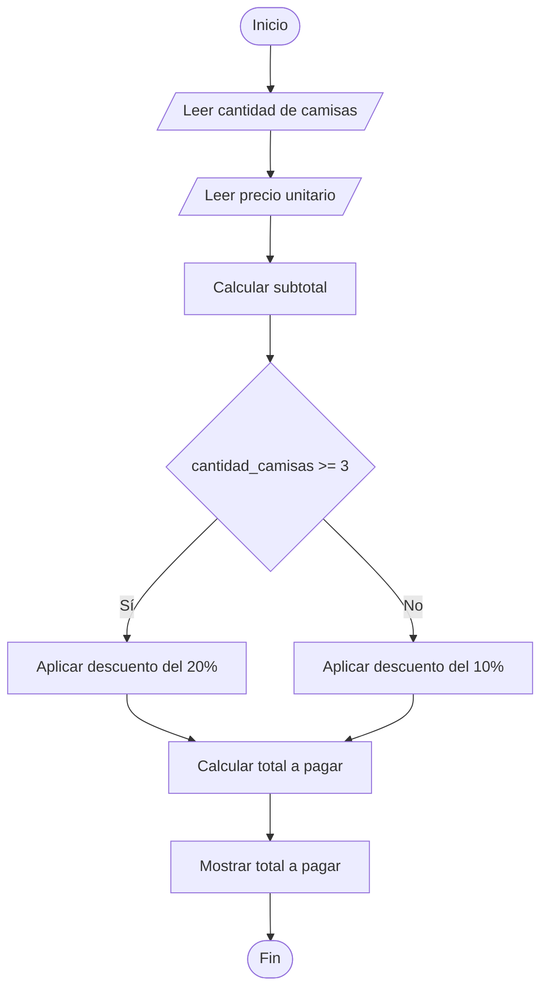

# Descuento en la Compra de Camisas

## Enunciado

Leer la cantidad de camisas compradas y el precio unitario.

Calcular el total a pagar aplicando:

- 20% de descuento si compra 3 o más camisas.
- 10% de descuento si compra menos de 3 camisas.

Mostrar el total final.

---

# Análisis

## Entradas

| Dato | Tipo |
|------|------|
| cantidad_camisas | Entero |
| precio_unitario | Real |

---

## Proceso

1. Leer la cantidad de camisas compradas.
2. Leer el precio unitario de cada camisa.
3. Calcular el subtotal de la compra.
4. Verificar la cantidad de camisas compradas.
5. Aplicar el descuento correspondiente.
6. Calcular el total final.
7. Mostrar el total a pagar.

---

## Salidas

| Salida |
|---------|
| Total a pagar |

---

## Restricciones

- La cantidad de camisas debe ser mayor a 0.
- El precio unitario debe ser mayor a 0.
- El descuento depende únicamente de la cantidad de camisas compradas.

---

# Casos de Prueba

| Entrada | Salida Esperada |
|----------|----------------|
| 2 camisas, 50 Bs | Total a pagar: 90 Bs |
| 3 camisas, 50 Bs | Total a pagar: 120 Bs |
| 5 camisas, 80 Bs | Total a pagar: 320 Bs |
| 1 camisa, 100 Bs | Total a pagar: 90 Bs |

---

# Estrategia de Solución

Primero se calculará el subtotal multiplicando la cantidad de camisas por el precio unitario.

Posteriormente se verificará la cantidad de camisas compradas para determinar el porcentaje de descuento correspondiente.

Finalmente se calculará el total a pagar restando el descuento al subtotal.

---

# Variables

| Variable | Tipo | Descripción |
|-----------|-----------|-----------|
| cantidad_camisas | Entero | Número de camisas compradas |
| precio_unitario | Real | Precio de una camisa |
| subtotal | Real | Total antes del descuento |
| descuento | Real | Descuento aplicado |
| total_pagar | Real | Total final de la compra |

---

# Operadores

| Operador | Tipo | Uso |
|-----------|-----------|-----------|
| = | Asignación | Guardar valores |
| * | Aritmético | Calcular subtotal y descuento |
| - | Aritmético | Calcular total final |
| >= | Relacional | Verificar cantidad de camisas |

---

# Estructuras Utilizadas

```text
If Else
```

---

# Fórmulas

## Subtotal

```text
subtotal = cantidad_camisas * precio_unitario
```

## Descuento del 20%

```text
descuento = subtotal * 0.20
```

## Descuento del 10%

```text
descuento = subtotal * 0.10
```

## Total Final

```text
total_pagar = subtotal - descuento
```

---

# Secuencia Lógica

1. Inicio.
2. Definir las variables:
   - cantidad_camisas
   - precio_unitario
   - subtotal
   - descuento
   - total_pagar
3. Solicitar la cantidad de camisas.
4. Leer la cantidad de camisas.
5. Solicitar el precio unitario.
6. Leer el precio unitario.
7. Calcular el subtotal.
8. Verificar si la cantidad de camisas es mayor o igual a 3.
9. Si la condición es verdadera, aplicar un descuento del 20%.
10. Caso contrario, aplicar un descuento del 10%.
11. Calcular el total a pagar.
12. Mostrar el total a pagar.
13. Fin.

---

# Pseudocódigo

```text
Inicio

    Definir cantidad_camisas Como Entero
    Definir precio_unitario Como Real

    Definir subtotal Como Real
    Definir descuento Como Real
    Definir total_pagar Como Real

    Escribir "Ingrese cantidad de camisas: "
    Leer cantidad_camisas

    Escribir "Ingrese precio unitario: "
    Leer precio_unitario

    subtotal = cantidad_camisas * precio_unitario

    if (cantidad_camisas >= 3) then
        descuento = subtotal * 0.20
    else
        descuento = subtotal * 0.10
    endif

    total_pagar = subtotal - descuento
    Escribir "Total a pagar: ", total_pagar, " Bs"

Fin
```

---

# Diagrama de Flujo



---

# Prueba de Escritorio

## Caso 1

### Entrada

```text
cantidad_camisas = 2
precio_unitario = 50
```

| Paso | Valor |
|-------|-------|
| Subtotal | 100 |
| Descuento | 10 |
| Total | 90 |

### Salida

```text
Total a pagar: 90 Bs
```

---

## Caso 2

### Entrada

```text
cantidad_camisas = 5
precio_unitario = 80
```

| Paso | Valor |
|-------|-------|
| Subtotal | 400 |
| Descuento | 80 |
| Total | 320 |

### Salida

```text
Total a pagar: 320 Bs
```

---

# Implementación

```cpp
#include <iostream>

using namespace std;

int main() {

    int cantidad_camisas;

    float precio_unitario;
    float subtotal;
    float descuento;
    float total_pagar;

    cout << "Ingrese cantidad de camisas: ";
    cin >> cantidad_camisas;

    cout << "Ingrese precio unitario: ";
    cin >> precio_unitario;

    subtotal = cantidad_camisas * precio_unitario;

    if (cantidad_camisas >= 3) {
        descuento = subtotal * 0.20;
    } else {
        descuento = subtotal * 0.10;
    }

    total_pagar = subtotal - descuento;

    cout << "\nTotal a pagar: " << total_pagar << " Bs" << endl;

    return 0;
}
```
