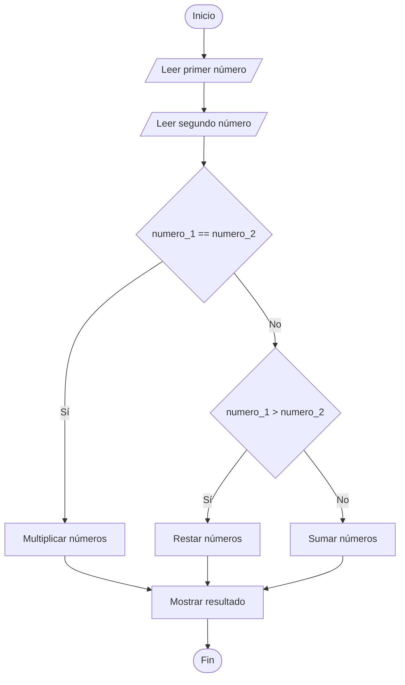

# Operación Según la Relación entre Dos Números

## Enunciado

Leer dos números enteros y realizar:

- Si son iguales → multiplicar.
- Si el primero es mayor → restar.
- Si el segundo es mayor → sumar.

Mostrar el resultado.

---

# Análisis

## Entradas

| Dato | Tipo |
|------|------|
| numero_1 | Entero |
| numero_2 | Entero |

---

## Proceso

1. Leer dos números enteros.
2. Comparar ambos números.
3. Si son iguales, multiplicarlos.
4. Si el primero es mayor que el segundo, restarlos.
5. Si el segundo es mayor que el primero, sumarlos.
6. Mostrar el resultado obtenido.

---

## Salidas

| Salida |
|---------|
| Resultado de la operación |

---

## Restricciones

- Los datos ingresados deben ser números enteros.
- Solo se realiza una operación por ejecución.
- La operación depende de la relación entre ambos números.

---

# Casos de Prueba

| Entrada | Salida Esperada |
|----------|----------------|
| 5, 5 | Resultado: 25 |
| 10, 4 | Resultado: 6 |
| 3, 8 | Resultado: 11 |
| 20, 7 | Resultado: 13 |

---

# Estrategia de Solución

Se compararán los dos números ingresados.

Si ambos son iguales, se realizará una multiplicación.

Si el primer número es mayor que el segundo, se realizará una resta.

Caso contrario, se realizará una suma.

Finalmente se mostrará el resultado obtenido.

---

# Variables

| Variable | Tipo | Descripción |
|-----------|-----------|-----------|
| numero_1 | Entero | Primer número |
| numero_2 | Entero | Segundo número |
| resultado | Entero | Resultado de la operación |

---

# Operadores

| Operador | Tipo | Uso |
|-----------|-----------|-----------|
| = | Asignación | Guardar resultados |
| + | Aritmético | Sumar números |
| - | Aritmético | Restar números |
| * | Aritmético | Multiplicar números |
| == | Relacional | Verificar igualdad |
| > | Relacional | Comparar si un número es mayor |

---

# Estructuras Utilizadas

```text
If Else If Else
```

---

# Secuencia Lógica

1. Inicio.
2. Definir las variables:
   - numero_1
   - numero_2
   - resultado
3. Solicitar el primer número.
4. Leer el primer número.
5. Solicitar el segundo número.
6. Leer el segundo número.
7. Comparar ambos números.
8. Si son iguales, multiplicarlos.
9. Si el primero es mayor que el segundo, restarlos.
10. Caso contrario, sumarlos.
11. Mostrar el resultado.
12. Fin.

---

# Pseudocódigo

```text
Inicio

    Definir numero_1 Como Entero
    Definir numero_2 Como Entero
    Definir resultado Como Entero

    Escribir "Ingrese el primer numero: "
    Leer numero_1

    Escribir "Ingrese el segundo numero: "
    Leer numero_2

    if (numero_1 == numero_2) then
        resultado = numero_1 * numero_2
    else if (numero_1 > numero_2) then
        resultado = numero_1 - numero_2
    else
        resultado = numero_1 + numero_2
    endif

    Escribir "Resultado: ", resultado

Fin
```

---

# Diagrama de Flujo



---

# Prueba de Escritorio

## Caso 1

### Entrada

```text
numero_1 = 5
numero_2 = 5
```

| Paso | Valor |
|-------|-------|
| Operación | 5 * 5 |
| Resultado | 25 |

### Salida

```text
Resultado: 25
```

---

## Caso 2

### Entrada

```text
numero_1 = 10
numero_2 = 4
```

| Paso | Valor |
|-------|-------|
| Operación | 10 - 4 |
| Resultado | 6 |

### Salida

```text
Resultado: 6
```

---

## Caso 3

### Entrada

```text
numero_1 = 3
numero_2 = 8
```

| Paso | Valor |
|-------|-------|
| Operación | 3 + 8 |
| Resultado | 11 |

### Salida

```text
Resultado: 11
```

---

# Implementación

```cpp
#include <iostream>

using namespace std;

int main() {

    int numero_1;
    int numero_2;
    int resultado;

    cout << "Ingrese el primer numero: ";
    cin >> numero_1;

    cout << "Ingrese el segundo numero: ";
    cin >> numero_2;

    if (numero_1 == numero_2) {
        resultado = numero_1 * numero_2;
    } else if (numero_1 > numero_2) {
        resultado = numero_1 - numero_2;
    } else {
        resultado = numero_1 + numero_2;
    }

    cout << "\nResultado: " << resultado << endl;

    return 0;
}
```
