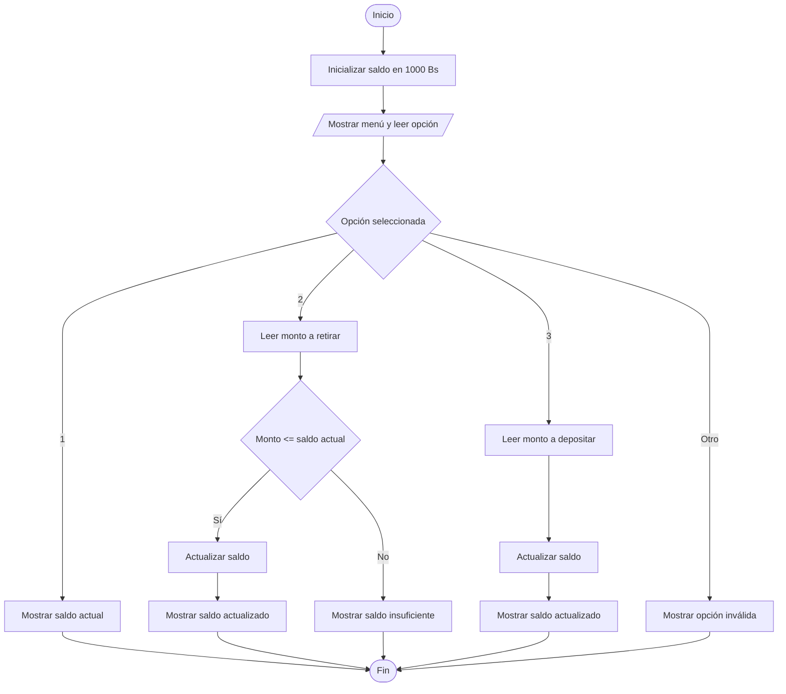

# Simulación de un Cajero Automático

## Enunciado

Simular un cajero automático con un saldo inicial de 1000 Bs.

Permitir al usuario elegir una opción:

1. Ver saldo.
2. Retirar dinero (validar saldo suficiente).
3. Depositar dinero.

Mostrar el saldo actualizado después de cada operación.

---

# Análisis

## Entradas

| Dato | Tipo |
|------|------|
| opcion | Entero |
| monto | Real |

---

## Proceso

1. Inicializar el saldo en 1000 Bs.
2. Mostrar un menú de opciones.
3. Leer la opción seleccionada.
4. Ejecutar la operación correspondiente.
5. Actualizar el saldo cuando sea necesario.
6. Mostrar el resultado de la operación.

---

## Salidas

| Salida |
|---------|
| Saldo actual |
| Saldo actualizado |
| Mensajes de operación |

---

## Restricciones

- El saldo inicial es 1000 Bs.
- El monto a retirar debe ser menor o igual al saldo disponible.
- El monto a depositar debe ser mayor a 0.
- Las opciones válidas son 1, 2 y 3.

---

# Casos de Prueba

| Entrada | Salida Esperada |
|----------|----------------|
| Opción 1 | Saldo actual: 1000 Bs |
| Opción 2, Monto 300 | Saldo actual: 700 Bs |
| Opción 2, Monto 1500 | Saldo insuficiente |
| Opción 3, Monto 500 | Saldo actual: 1500 Bs |

---

# Estrategia de Solución

Se utilizará un menú para que el usuario seleccione una operación.

La selección se realizará mediante una estructura `switch`.

Para la opción de retiro se verificará que exista saldo suficiente antes de descontar el monto solicitado.

Finalmente se mostrará el resultado correspondiente a la operación seleccionada.

---

# Variables

| Variable | Tipo | Descripción |
|-----------|-----------|-----------|
| saldo_inicial | Real | Saldo inicial de la cuenta |
| saldo_actual | Real | Saldo disponible en la cuenta |
| monto | Real | Cantidad a retirar o depositar |
| opcion | Entero | Opción seleccionada por el usuario |

---

# Operadores

| Operador | Tipo | Uso |
|-----------|-----------|-----------|
| = | Asignación | Asignar valores |
| + | Aritmético | Depositar dinero |
| - | Aritmético | Retirar dinero |
| <= | Relacional | Verificar saldo suficiente |

---

# Estructuras Utilizadas

```text
Switch

If
```

---

# Fórmulas

## Retiro

```text
saldo_actual = saldo_actual - monto
```

## Depósito

```text
saldo_actual = saldo_actual + monto
```

---

# Secuencia Lógica

1. Inicio.
2. Definir las variables:
   - saldo_inicial
   - saldo_actual
   - monto
   - opcion
3. Inicializar saldo_inicial en 1000.
4. Asignar saldo_actual = saldo_inicial.
5. Mostrar el menú de opciones.
6. Leer la opción seleccionada.
7. Evaluar la opción mediante un switch.
8. Si la opción es 1, mostrar el saldo actual.
9. Si la opción es 2:
   - Solicitar el monto a retirar.
   - Verificar saldo suficiente.
   - Actualizar saldo.
10. Si la opción es 3:
    - Solicitar el monto a depositar.
    - Actualizar saldo.
11. Si la opción es inválida, mostrar mensaje de error.
12. Fin.

---

# Pseudocódigo

```text
Inicio

    Definir saldo_inicial Como Real
    Definir saldo_actual Como Real
    Definir monto Como Real
    Definir opcion Como Entero

    saldo_inicial = 1000
    saldo_actual = saldo_inicial

    Escribir "===== CAJERO ====="
    Escribir "1. Ver saldo"
    Escribir "2. Retirar dinero"
    Escribir "3. Depositar dinero"

    Leer opcion

    switch (opcion)

        case 1:
            Escribir "Saldo actual: ", saldo_actual

        case 2:
            Escribir "Monto a retirar: "
            Leer monto

            if (monto <= saldo_actual) then
                saldo_actual = saldo_actual - monto
                Escribir "Retiro realizado"
                Escribir "Saldo actual: ", saldo_actual
            else
                Escribir "Saldo insuficiente"
            endif

        case 3:
            Escribir "Monto a depositar: "
            Leer monto

            saldo_actual = saldo_actual + monto
            Escribir "Deposito realizado"
            Escribir "Saldo actual: ", saldo_actual

        default:
            Escribir "Opcion invalida"

    endswitch

Fin
```

---

# Diagrama de Flujo



---

# Prueba de Escritorio

## Caso 1

### Entrada

```text
opcion = 1
```

| Paso | Valor |
|-------|-------|
| Saldo actual | 1000 |

### Salida

```text
Saldo actual: 1000 Bs
```

---

## Caso 2

### Entrada

```text
opcion = 2
monto = 300
```

| Paso | Valor |
|-------|-------|
| Saldo inicial | 1000 |
| Monto retirado | 300 |
| Saldo final | 700 |

### Salida

```text
Retiro realizado

Saldo actual: 700 Bs
```

---

## Caso 3

### Entrada

```text
opcion = 2
monto = 1500
```

| Paso | Valor |
|-------|-------|
| Saldo actual | 1000 |
| Monto solicitado | 1500 |

### Salida

```text
Saldo insuficiente
```

---

## Caso 4

### Entrada

```text
opcion = 3
monto = 500
```

| Paso | Valor |
|-------|-------|
| Saldo inicial | 1000 |
| Monto depositado | 500 |
| Saldo final | 1500 |

### Salida

```text
Deposito realizado

Saldo actual: 1500 Bs
```

---

# Implementación

```cpp
#include <iostream>

using namespace std;

int main() {

    float saldo_inicial;
    float saldo_actual;
    float monto;

    int opcion;

    saldo_inicial = 1000;
    saldo_actual = saldo_inicial;

    cout << "===== CAJERO =====" << endl;
    cout << "1. Ver saldo" << endl;
    cout << "2. Retirar dinero" << endl;
    cout << "3. Depositar dinero" << endl;

    cout << "\nSeleccione una opcion: ";
    cin >> opcion;

    switch (opcion) {
        case 1:
            cout << "Saldo actual: " << saldo_actual << " Bs" << endl;
            break;

        case 2:
            cout << "Monto a retirar: ";
            cin >> monto;

            if (monto <= saldo_actual) {
                saldo_actual = saldo_actual - monto;
                cout << "Retiro realizado" << endl;
                cout << "Saldo actual: " << saldo_actual << " Bs" << endl;
            } else {
                cout << "Saldo insuficiente" << endl;
            }
            break;

        case 3:
            cout << "Monto a depositar: ";
            cin >> monto;

            saldo_actual = saldo_actual + monto;
            cout << "Deposito realizado" << endl;
            cout << "Saldo actual: " << saldo_actual << " Bs" << endl;
            break;

        default:
            cout << "Opcion invalida" << endl;
    }

    return 0;
}
```
