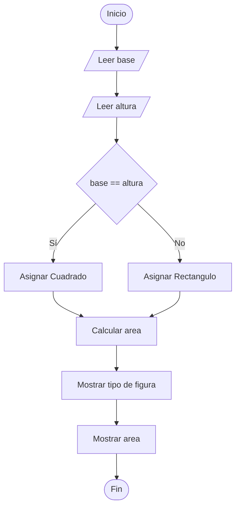

# Área y Tipo de Figura Geométrica

## Enunciado

Solicitar los datos necesarios y calcular el área correspondiente de una figura geométrica (rectángulo o cuadrado).

Determinar el tipo de figura y mostrar el área calculada.

---

# Análisis

## Entradas

| Dato | Tipo |
|------|------|
| base | Real |
| altura | Real |

---

## Proceso

1. Leer la base de la figura.
2. Leer la altura de la figura.
3. Determinar si la figura es un cuadrado o un rectángulo.
4. Calcular el área de la figura.
5. Mostrar el tipo de figura.
6. Mostrar el área calculada.

---

## Salidas

| Salida |
|---------|
| Tipo de figura |
| Área calculada |

---

## Restricciones

- La base debe ser mayor que 0.
- La altura debe ser mayor que 0.
- Si la base y la altura son iguales, la figura es un cuadrado.
- Si la base y la altura son diferentes, la figura es un rectángulo.

---

# Casos de Prueba

| Entrada | Salida Esperada |
|----------|----------------|
| Base = 5, Altura = 5 | Cuadrado, Área = 25 |
| Base = 4, Altura = 6 | Rectángulo, Área = 24 |
| Base = 8, Altura = 8 | Cuadrado, Área = 64 |
| Base = 3, Altura = 10 | Rectángulo, Área = 30 |

---

# Estrategia de Solución

Se leerán la base y la altura de la figura.

Posteriormente se compararán ambos valores para determinar si se trata de un cuadrado o un rectángulo.

Luego se calculará el área multiplicando la base por la altura.

Finalmente se mostrará el tipo de figura y el área calculada.

---

# Variables

| Variable | Tipo | Descripción |
|-----------|-----------|-----------|
| base | Real | Base de la figura |
| altura | Real | Altura de la figura |
| area | Real | Área calculada |
| tipo_figura | Cadena | Tipo de figura geométrica |

---

# Operadores

| Operador | Tipo | Uso |
|-----------|-----------|-----------|
| = | Asignación | Guardar valores |
| * | Aritmético | Calcular el área |
| == | Relacional | Comparar base y altura |

---

# Estructuras Utilizadas

```text
If Else
```

---

# Fórmulas

## Área

```text
area = base * altura
```

---

# Secuencia Lógica

1. Inicio.
2. Definir las variables:
   - base
   - altura
   - area
   - tipo_figura
3. Solicitar la base.
4. Leer la base.
5. Solicitar la altura.
6. Leer la altura.
7. Comparar la base y la altura.
8. Si son iguales, asignar "Cuadrado".
9. Caso contrario, asignar "Rectangulo".
10. Calcular el área.
11. Mostrar el tipo de figura.
12. Mostrar el área calculada.
13. Fin.

---

# Pseudocódigo

```text
Inicio

    Definir base Como Real
    Definir altura Como Real
    Definir area Como Real

    Definir tipo_figura Como Cadena

    Escribir "Ingrese la base: "
    Leer base

    Escribir "Ingrese la altura: "
    Leer altura

    if (base == altura) then
        tipo_figura = "Cuadrado"
    else
        tipo_figura = "Rectangulo"
    endif

    area = base * altura

    Escribir "Tipo de figura: ", tipo_figura
    Escribir "Area: ", area

Fin
```

---

# Diagrama de Flujo



---

# Prueba de Escritorio

## Caso 1

### Entrada

```text
base = 5
altura = 5
```

| Paso | Valor |
|-------|-------|
| Tipo de figura | Cuadrado |
| Área | 25 |

### Salida

```text
Tipo de figura: Cuadrado

Area: 25
```

---

## Caso 2

### Entrada

```text
base = 4
altura = 6
```

| Paso | Valor |
|-------|-------|
| Tipo de figura | Rectangulo |
| Área | 24 |

### Salida

```text
Tipo de figura: Rectangulo

Area: 24
```

---

# Implementación

```cpp
#include <iostream>
#include <string>

using namespace std;

int main() {

    float base;
    float altura;
    float area;

    string tipo_figura;

    cout << "Ingrese la base: ";
    cin >> base;

    cout << "Ingrese la altura: ";
    cin >> altura;

    if (base == altura) {
        tipo_figura = "Cuadrado";
    } else {
        tipo_figura = "Rectangulo";
    }

    area = base * altura;

    cout << "\nTipo de figura: " << tipo_figura << endl;
    cout << "Area: " << area << endl;

    return 0;
}
```
