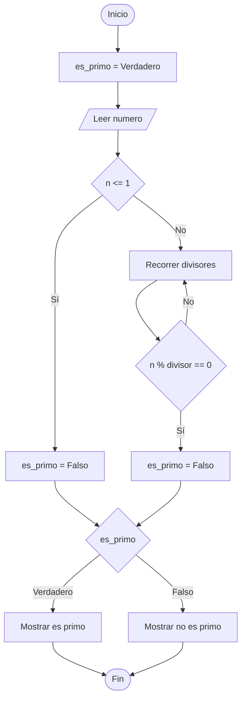

# Determinar si un Número es Primo

## Enunciado

Construir un algoritmo que solicite al usuario un número entero y determine si es primo.

### Ejemplo

Si:

```text
n = 29
```

Mostrar:

```text
El numero 29 es primo
```

Si:

```text
n = 28
```

Mostrar:

```text
El numero 28 no es primo
```

---

# Análisis

## Entradas

| Dato | Tipo |
|------|------|
| n | Entero |

---

## Proceso

1. Leer un número entero.
2. Verificar si el número es mayor que 1.
3. Recorrer los posibles divisores desde 2 hasta n - 1.
4. Verificar si existe algún divisor exacto.
5. Si existe un divisor exacto, el número no es primo.
6. Si no existe ningún divisor exacto, el número es primo.
7. Mostrar el resultado.

---

## Salidas

| Salida |
|---------|
| El número es primo |
| El número no es primo |

---

## Restricciones

- El número debe ser entero.
- Un número primo es mayor que 1.

---

# Casos de Prueba

| Entrada | Salida Esperada |
|----------|----------------|
| 7 | El numero 7 es primo |
| 8 | El numero 8 no es primo |
| 13 | El numero 13 es primo |
| 1 | El numero 1 no es primo |

---

# Estrategia de Solución

Se utilizará un ciclo para recorrer los posibles divisores del número.

Si durante el recorrido se encuentra un divisor exacto, se concluirá que el número no es primo.

En caso contrario, el número será considerado primo.

---

# Variables

| Variable | Tipo | Descripción |
|-----------|-----------|-----------|
| n | Entero | Número ingresado por el usuario |
| divisor | Entero | Posible divisor del número |
| es_primo | Booleano | Indica si el número es primo |

---

# Operadores

| Operador | Tipo | Uso |
|-----------|-----------|-----------|
| = | Asignación | Asignar valores |
| % | Aritmético | Obtener el residuo |
| == | Relacional | Comparar igualdad |
| <= | Relacional | Verificar límite inferior |
| < | Relacional | Controlar el ciclo |
| ++ | Incremento | Avanzar divisores |

---

# Estructuras Utilizadas

```text
If

For
```

---

# Fórmulas

## Verificación de Divisibilidad

```text
n % divisor == 0
```

---

# Secuencia Lógica

1. Inicio.
2. Definir las variables:
   - n
   - divisor
   - es_primo
3. Inicializar es_primo en verdadero.
4. Solicitar un número entero.
5. Leer el número ingresado.
6. Verificar si el número es menor o igual a 1.
7. Si se cumple la condición, asignar falso a es_primo.
8. Recorrer los divisores desde 2 hasta n - 1.
9. Verificar si existe algún divisor exacto.
10. Si existe, asignar falso a es_primo y finalizar el ciclo.
11. Verificar el valor de es_primo.
12. Mostrar si el número es primo o no es primo.
13. Fin.

---

# Pseudocódigo

```text
Inicio

    Definir n Como Entero
    Definir divisor Como Entero

    Definir es_primo Como Booleano

    es_primo = Verdadero

    Escribir "Ingrese un numero entero: "
    Leer n

    if (n <= 1) then
        es_primo = Falso
    endif

    for (divisor = 2; divisor < n; divisor++)
        if (n % divisor == 0) then
            es_primo = Falso
            break
        endif
    endfor

    if (es_primo) then
        Escribir "El numero ", n, " es primo"
    else
        Escribir "El numero ", n, " no es primo"
    endif

Fin
```

---

# Diagrama de Flujo



---

# Prueba de Escritorio

## Caso 1

### Entrada

```text
n = 7
```

| Paso | divisor | n | n % divisor | es_primo |
|------|----------|---|------------|----------|
| Inicial | - | 7 | - | Verdadero |
| Iteración 1 | 2 | 7 | 1 | Verdadero |
| Iteración 2 | 3 | 7 | 1 | Verdadero |
| Iteración 3 | 4 | 7 | 3 | Verdadero |
| Iteración 4 | 5 | 7 | 2 | Verdadero |
| Iteración 5 | 6 | 7 | 1 | Verdadero |

### Salida

```text
El numero 7 es primo
```

---

## Caso 2

### Entrada

```text
n = 8
```

| Paso | divisor | n | n % divisor | es_primo |
|------|----------|---|------------|----------|
| Inicial | - | 8 | - | Verdadero |
| Iteración 1 | 2 | 8 | 0 | Falso |

### Salida

```text
El numero 8 no es primo
```

---

## Caso 3

### Entrada

```text
n = 1
```

| Paso | divisor | n | es_primo |
|------|----------|---|----------|
| Inicial | - | 1 | Verdadero |
| n <= 1 | - | 1 | Falso |

### Salida

```text
El numero 1 no es primo
```

---

# Implementación

```cpp
#include <iostream>

using namespace std;

int main() {

    int n;
    int divisor;

    bool es_primo;

    es_primo = true;

    cout << "Ingrese un numero entero: ";
    cin >> n;

    if (n <= 1) {
        es_primo = false;
    }

    for (divisor = 2; divisor < n; divisor++) {
        if (n % divisor == 0) {
            es_primo = false;
            break;
        }
    }

    if (es_primo) {
        cout << "El numero " << n << " es primo" << endl;
    } else {
        cout << "El numero " << n << " no es primo" << endl;
    }

    return 0;
}
```
