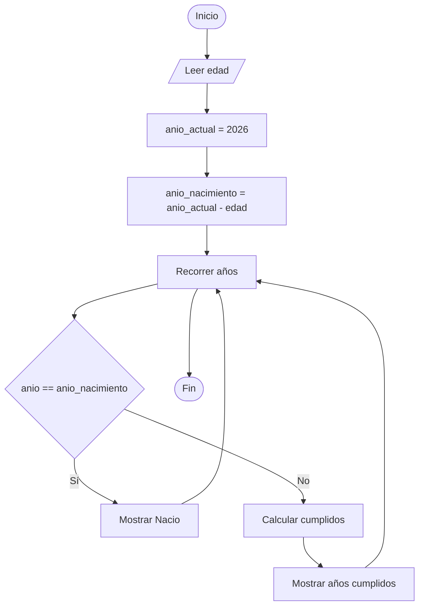

# Calcular el Año de Nacimiento y Mostrar los Años Cumplidos

## Enunciado

Construir un algoritmo que pida al usuario su edad, calcule el año de nacimiento y muestre por pantalla todos los años que ha cumplido.

### Ejemplo

Si:

```text
edad = 4
```

Mostrar:

```text
Anio 2022: Nacio
Anio 2023: Cumplio 1 anio
Anio 2024: Cumplio 2 anios
Anio 2025: Cumplio 3 anios
Anio 2026: Cumplio 4 anios
```

---

# Análisis

## Entradas

| Dato | Tipo |
|------|------|
| edad | Entero |

---

## Proceso

1. Leer la edad del usuario.
2. Asignar el año actual.
3. Calcular el año de nacimiento.
4. Recorrer los años desde el nacimiento hasta el año actual.
5. Verificar si el año recorrido corresponde al año de nacimiento.
6. Si corresponde al año de nacimiento, mostrar que nació ese año.
7. En caso contrario, calcular los años cumplidos.
8. Mostrar el año y la edad cumplida.

---

## Salidas

| Salida |
|---------|
| Año de nacimiento |
| Años cumplidos |

---

## Restricciones

- La edad debe ser mayor o igual a 0.
- Se tomará como referencia el año 2026.

---

# Casos de Prueba

| Entrada | Salida Esperada |
|----------|----------------|
| Edad = 4 | Mostrar desde 2022 hasta 2026 |
| Edad = 0 | Anio 2026: Nacio |
| Edad = 2 | Mostrar desde 2024 hasta 2026 |

---

# Estrategia de Solución

Se calculará el año de nacimiento restando la edad al año actual.

Posteriormente se utilizará un ciclo para recorrer todos los años desde el nacimiento hasta el año actual.

Si el año recorrido corresponde al año de nacimiento, se mostrará que nació ese año.

En caso contrario, se calcularán los años cumplidos y se mostrarán por pantalla.

---

# Variables

| Variable | Tipo | Descripción |
|-----------|-----------|-----------|
| edad | Entero | Edad ingresada por el usuario |
| anio_actual | Entero | Año de referencia |
| anio_nacimiento | Entero | Año calculado de nacimiento |
| anio | Entero | Variable de control del ciclo |
| cumplidos | Entero | Años cumplidos en cada año recorrido |

---

# Operadores

| Operador | Tipo | Uso |
|-----------|-----------|-----------|
| = | Asignación | Asignar valores |
| - | Aritmético | Calcular diferencias de años |
| == | Relacional | Comparar años |
| <= | Relacional | Controlar el ciclo |
| ++ | Incremento | Avanzar años |

---

# Estructuras Utilizadas

```text
For

If Else
```

---

# Fórmulas

## Año de Nacimiento

```text
anio_nacimiento = anio_actual - edad
```

## Años Cumplidos

```text
cumplidos = anio - anio_nacimiento
```

---

# Secuencia Lógica

1. Inicio.
2. Definir las variables:
   - edad
   - anio_actual
   - anio_nacimiento
   - anio
   - cumplidos
3. Solicitar la edad.
4. Leer la edad.
5. Asignar el año actual.
6. Calcular el año de nacimiento.
7. Recorrer los años desde el nacimiento hasta el año actual.
8. Verificar si corresponde al año de nacimiento.
9. Si corresponde, mostrar que nació ese año.
10. Caso contrario, calcular los años cumplidos.
11. Mostrar la información correspondiente.
12. Fin.

---

# Pseudocódigo

```text
Inicio

    Definir edad Como Entero
    Definir anio_actual Como Entero
    Definir anio_nacimiento Como Entero
    Definir anio Como Entero
    Definir cumplidos Como Entero

    Escribir "Ingrese su edad: "
    Leer edad

    anio_actual = 2026

    anio_nacimiento = anio_actual - edad

    for (anio = anio_nacimiento; anio <= anio_actual; anio++)
        if (anio == anio_nacimiento) then
            Escribir "Anio ", anio, ": Nacio"
        else
            cumplidos = anio - anio_nacimiento
            Escribir "Anio ", anio, ": Cumplio ", cumplidos, " anios"
        endif
    endfor

Fin
```

---

# Diagrama de Flujo



---

# Prueba de Escritorio

## Caso 1

### Entrada

```text
edad = 7
```

### Cálculos

```text
anio_actual = 2026

anio_nacimiento = 2026 - 7

anio_nacimiento = 2019
```

### Seguimiento

| edad | anio_actual | anio_nacimiento | anio | cumplidos | Salida |
|------|------------|----------------|------|------------|---------|
| 7 | 2026 | 2019 | 2019 | - | Anio 2019: Nacio |
| 7 | 2026 | 2019 | 2020 | 1 | Anio 2020: Cumplio 1 anio |
| 7 | 2026 | 2019 | 2021 | 2 | Anio 2021: Cumplio 2 anios |
| 7 | 2026 | 2019 | 2022 | 3 | Anio 2022: Cumplio 3 anios |
| 7 | 2026 | 2019 | 2023 | 4 | Anio 2023: Cumplio 4 anios |
| 7 | 2026 | 2019 | 2024 | 5 | Anio 2024: Cumplio 5 anios |
| 7 | 2026 | 2019 | 2025 | 6 | Anio 2025: Cumplio 6 anios |
| 7 | 2026 | 2019 | 2026 | 7 | Anio 2026: Cumplio 7 anios |

### Salida

```text
Anio 2019: Nacio
Anio 2020: Cumplio 1 anio
Anio 2021: Cumplio 2 anios
Anio 2022: Cumplio 3 anios
Anio 2023: Cumplio 4 anios
Anio 2024: Cumplio 5 anios
Anio 2025: Cumplio 6 anios
Anio 2026: Cumplio 7 anios
```

---

# Implementación

```cpp
#include <iostream>

using namespace std;

int main() {

    int edad;
    int anio_actual;
    int anio_nacimiento;
    int anio;
    int cumplidos;

    cout << "Ingrese su edad: ";
    cin >> edad;

    anio_actual = 2026;

    anio_nacimiento = anio_actual - edad;

    for (anio = anio_nacimiento; anio <= anio_actual; anio++) {
        if (anio == anio_nacimiento) {
            cout << "Anio " << anio << ": Nacio" << endl;
        } else {
            cumplidos = anio - anio_nacimiento;
            cout << "Anio " << anio << ": Cumplio " << cumplidos << " anios" << endl;
        }
    }

    return 0;
}
```
