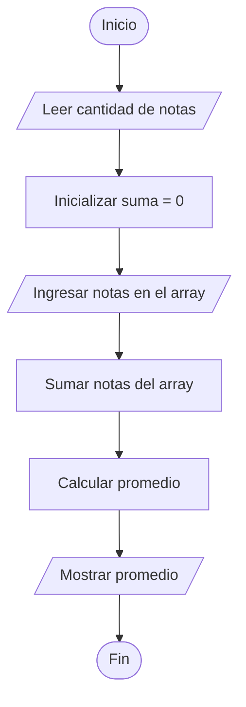

# Calcular el Promedio de n Notas

## Enunciado

Construir un algoritmo que pida al usuario **n** notas de estudiantes, las notas deberán ser guardadas en un arreglo (array), calcular y mostrar el promedio de las mismas.

### Ejemplo

Si:

```text
n = 5
```

Ingresar:

```text
70
90
51
80
30
```

Mostrar:

```text
El promedio es: 64.2
```

---

# Análisis

## Entradas

| Dato | Tipo |
|------|------|
| n | Entero |
| notas[] | Array de Enteros |

---

## Proceso

1. Leer la cantidad de notas.
2. Crear un array para almacenar las notas.
3. Ingresar las notas.
4. Sumar todas las notas almacenadas.
5. Calcular el promedio.
6. Mostrar el promedio obtenido.

---

## Salidas

| Salida |
|---------|
| Promedio de las notas |

---

## Restricciones

- La cantidad de notas debe ser mayor que 0.
- Las notas deben ser valores numéricos.

---

# Casos de Prueba

| Entrada | Salida Esperada |
|----------|----------------|
| n = 3, notas = 60, 70, 80 | Promedio = 70 |
| n = 5, notas = 70, 90, 51, 80, 30 | Promedio = 64.2 |
| n = 4, notas = 100, 100, 100, 100 | Promedio = 100 |

---

# Estrategia de Solución

Se utilizará un array para almacenar todas las notas ingresadas.

Posteriormente se recorrerá el array utilizando un ciclo para sumar sus elementos.

Finalmente se calculará el promedio dividiendo la suma total entre la cantidad de notas ingresadas.

---

# Variables

| Variable | Tipo | Descripción |
|-----------|-----------|-----------|
| n | Entero | Cantidad de notas |
| i | Entero | Control de los ciclos |
| suma | Real | Acumulador de notas |
| promedio | Real | Promedio calculado |
| notas[] | Array de Enteros | Almacena las notas |

---

# Operadores

| Operador | Tipo | Uso |
|-----------|-----------|-----------|
| = | Asignación | Asignar valores |
| + | Aritmético | Sumar notas |
| += | Asignación compuesta | Acumular notas |
| / | Aritmético | Calcular promedio |
| < | Relacional | Controlar ciclos |
| ++ | Incremento | Avanzar posiciones |

---

# Estructuras Utilizadas

```text
Array

For
```

---

# Fórmulas

## Acumulación de Notas

```text
suma += notas[i]
```

## Promedio

```text
promedio = suma / n
```

---

# Secuencia Lógica

1. Inicio.
2. Definir las variables:
   - n
   - i
   - suma
   - promedio
   - notas[]
3. Solicitar la cantidad de notas.
4. Leer el valor de n.
5. Crear el array de tamaño n.
6. Inicializar suma en 0.
7. Recorrer el array para ingresar las notas.
8. Recorrer el array para sumar todas las notas.
9. Calcular el promedio.
10. Mostrar el promedio.
11. Fin.

---

# Pseudocódigo

```text
Inicio

    Definir n Como Entero
    Definir i Como Entero

    Definir suma Como Real
    Definir promedio Como Real

    Definir notas[] Como Array

    Escribir "Ingrese la cantidad de notas: "
    Leer n

    suma = 0

    for (i = 0; i < n; i++)
        Escribir "Ingrese la nota ", i + 1, ": "
        Leer notas[i]
    endfor

    for (i = 0; i < n; i++)
        suma += notas[i]
    endfor

    promedio = suma / n

    Escribir "El promedio es: ", promedio

Fin
```

---

# Diagrama de Flujo



---

# Prueba de Escritorio

## Caso 1

### Entrada

```text
n = 5
```

Notas:

```text
80
70
90
60
100
```

### Primer For (Carga de Datos)

| i | notas[i] | Array |
|---|---|---|
| 0 | 80 | [80] |
| 1 | 70 | [80, 70] |
| 2 | 90 | [80, 70, 90] |
| 3 | 60 | [80, 70, 90, 60] |
| 4 | 100 | [80, 70, 90, 60, 100] |

### Segundo For (Suma de Notas)

| i | notas[i] | suma |
|---|---|---|
| 0 | 80 | 80 |
| 1 | 70 | 150 |
| 2 | 90 | 240 |
| 3 | 60 | 300 |
| 4 | 100 | 400 |

### Cálculo

```text
promedio = suma / n

promedio = 400 / 5

promedio = 80
```

### Salida

```text
El promedio es: 80
```

---

# Implementación

```cpp
#include <iostream>

using namespace std;

int main() {

    int n;
    int i;

    double suma;
    double promedio;

    cout << "Ingrese la cantidad de notas: ";
    cin >> n;

    int notas[n];

    suma = 0;

    for (i = 0; i < n; i++) {
        cout << "Ingrese la nota " << i + 1 << ": ";
        cin >> notas[i];
    }

    for (i = 0; i < n; i++) {
        suma += notas[i];
    }

    promedio = suma / n;

    cout << "El promedio es: " << promedio << endl;

    return 0;
}
```
