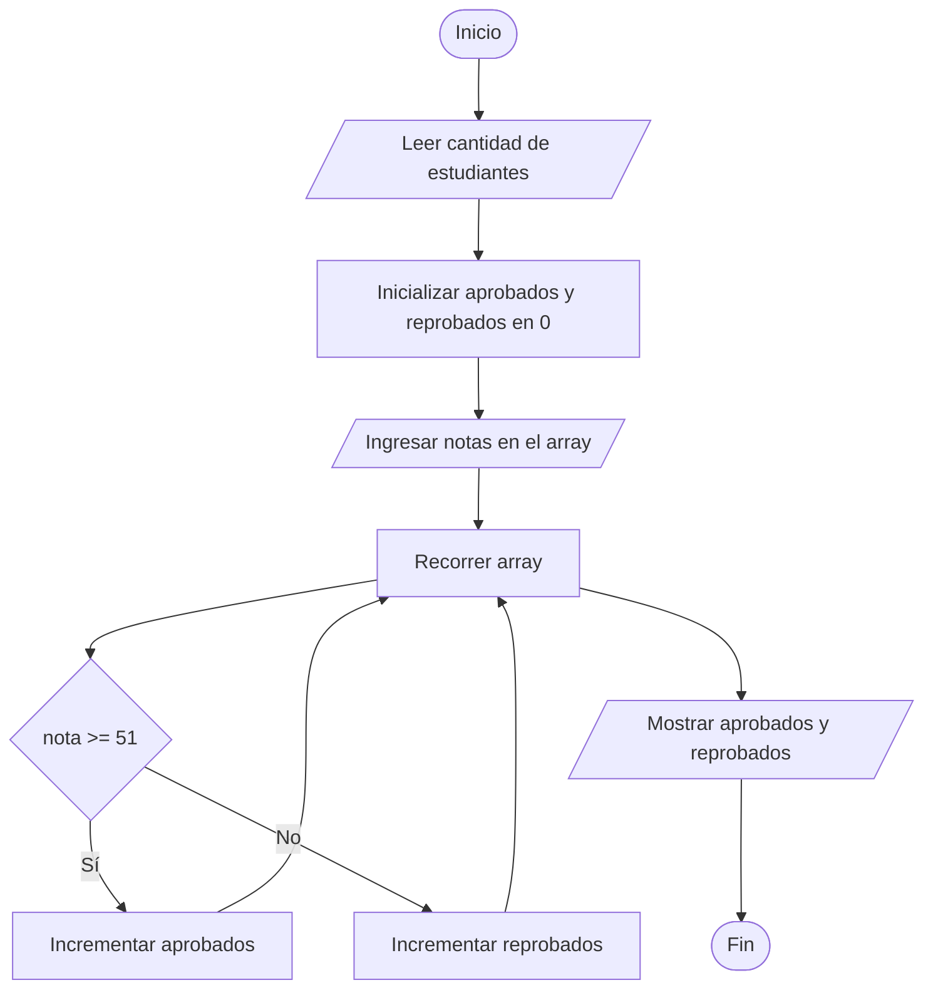

# Contar Estudiantes Aprobados y Reprobados

## Enunciado

Construir un algoritmo que pida al usuario **n** notas de estudiantes, contar y mostrar el número de estudiantes aprobados y el número de estudiantes reprobados.

### Ejemplo

Si:

```text
n = 5
```

Ingresar:

```text
70
90
51
80
30
```

Mostrar:

```text
El numero de estudiantes aprobados es: 4

El numero de estudiantes reprobados es: 1
```

---

# Análisis

## Entradas

| Dato | Tipo |
|------|------|
| n | Entero |
| notas[] | Array de Enteros |

---

## Proceso

1. Leer la cantidad de estudiantes.
2. Crear un array para almacenar las notas.
3. Ingresar las notas.
4. Recorrer el array.
5. Determinar si cada nota está aprobada o reprobada.
6. Contar aprobados y reprobados.
7. Mostrar los resultados.

---

## Salidas

| Salida |
|---------|
| Cantidad de estudiantes aprobados |
| Cantidad de estudiantes reprobados |

---

## Restricciones

- La cantidad de estudiantes debe ser mayor que 0.
- La nota mínima es 0.
- La nota máxima es 100.
- Una nota es aprobada si es mayor o igual a 51.

---

# Casos de Prueba

| Entrada | Salida Esperada |
|----------|----------------|
| 80, 40, 60, 30, 90 | Aprobados = 3, Reprobados = 2 |
| 70, 90, 51, 80, 30 | Aprobados = 4, Reprobados = 1 |
| 20, 30, 40 | Aprobados = 0, Reprobados = 3 |
| 60, 70, 80 | Aprobados = 3, Reprobados = 0 |

---

# Estrategia de Solución

Se utilizará un array para almacenar las notas ingresadas.

Posteriormente se recorrerá el array utilizando un ciclo.

Para cada nota se verificará si es mayor o igual a 51.

Si cumple la condición se incrementará el contador de aprobados.

Caso contrario se incrementará el contador de reprobados.

Finalmente se mostrarán ambos contadores.

---

# Variables

| Variable | Tipo | Descripción |
|-----------|-----------|-----------|
| n | Entero | Cantidad de estudiantes |
| i | Entero | Control del ciclo |
| aprobados | Entero | Cantidad de estudiantes aprobados |
| reprobados | Entero | Cantidad de estudiantes reprobados |
| notas[] | Array de Enteros | Almacena las notas ingresadas |

---

# Operadores

| Operador | Tipo | Uso |
|-----------|-----------|-----------|
| = | Asignación | Asignar valores |
| >= | Relacional | Determinar aprobación |
| < | Relacional | Controlar ciclos |
| += | Asignación compuesta | Incrementar contadores |
| ++ | Incremento | Avanzar posiciones |

---

# Estructuras Utilizadas

```text
Array

For

If Else
```

---

# Fórmulas

## Verificación de Aprobación

```text
notas[i] >= 51
```

## Conteo de Aprobados

```text
aprobados += 1
```

## Conteo de Reprobados

```text
reprobados += 1
```

---

# Secuencia Lógica

1. Inicio.
2. Definir las variables:
   - n
   - i
   - aprobados
   - reprobados
   - notas[]
3. Solicitar la cantidad de estudiantes.
4. Leer el valor de n.
5. Crear el array de tamaño n.
6. Inicializar aprobados y reprobados en 0.
7. Recorrer el array para ingresar las notas.
8. Recorrer el array para evaluar cada nota.
9. Si la nota es mayor o igual a 51, incrementar aprobados.
10. Caso contrario, incrementar reprobados.
11. Mostrar la cantidad de aprobados.
12. Mostrar la cantidad de reprobados.
13. Fin.

---

# Pseudocódigo

```text
Inicio

    Definir n Como Entero
    Definir i Como Entero

    Definir aprobados Como Entero
    Definir reprobados Como Entero

    Definir notas[] Como Array

    Escribir "Ingrese la cantidad de estudiantes: "
    Leer n

    aprobados = 0
    reprobados = 0

    for (i = 0; i < n; i++)
        Escribir "Ingrese la nota ", i + 1, ": "
        Leer notas[i]
    endfor

    for (i = 0; i < n; i++)
        if (notas[i] >= 51) then
            aprobados += 1
        else
            reprobados += 1
        endif
    endfor

    Escribir "El numero de estudiantes aprobados es: ", aprobados
    Escribir "El numero de estudiantes reprobados es: ", reprobados

Fin
```

---

# Diagrama de Flujo



---

# Prueba de Escritorio

## Caso 1

### Entrada

```text
n = 5
```

Notas:

```text
80
40
60
30
90
```

### Primer For (Carga de Datos)

| i | notas[i] | Array |
|---|---|---|
| 0 | 80 | [80] |
| 1 | 40 | [80, 40] |
| 2 | 60 | [80, 40, 60] |
| 3 | 30 | [80, 40, 60, 30] |
| 4 | 90 | [80, 40, 60, 30, 90] |

### Segundo For (Conteo)

| i | notas[i] | ¿Aprobado? | aprobados | reprobados |
|---|---|---|---|---|
| 0 | 80 | Sí | 1 | 0 |
| 1 | 40 | No | 1 | 1 |
| 2 | 60 | Sí | 2 | 1 |
| 3 | 30 | No | 2 | 2 |
| 4 | 90 | Sí | 3 | 2 |

### Salida

```text
El numero de estudiantes aprobados es: 3

El numero de estudiantes reprobados es: 2
```

---

# Implementación

```cpp
#include <iostream>

using namespace std;

int main() {

    int n;
    int i;

    int aprobados;
    int reprobados;

    cout << "Ingrese la cantidad de estudiantes: ";
    cin >> n;

    int notas[n];

    aprobados = 0;
    reprobados = 0;

    for (i = 0; i < n; i++) {
        cout << "Ingrese la nota " << i + 1 << ": ";
        cin >> notas[i];
    }

    for (i = 0; i < n; i++) {
        if (notas[i] >= 51) {
            aprobados += 1;
        } else {
            reprobados += 1;
        }
    }

    cout << "El numero de estudiantes aprobados es: " << aprobados << endl;
    cout << "El numero de estudiantes reprobados es: " << reprobados << endl;

    return 0;
}
```
