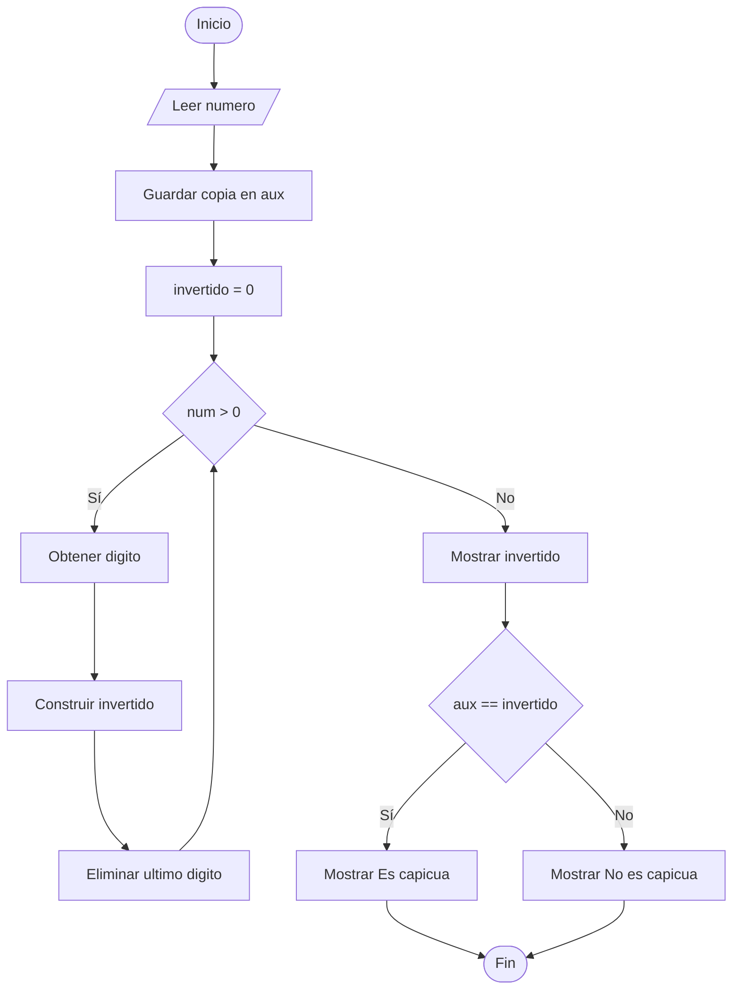

# Invertir un Número y Verificar si es Capicúa

## Enunciado

Construir un algoritmo que pida al usuario un número entero **num**, invertir el número y verificar si es capicúa o no.

### Ejemplo

Si:

```text
num = 256
```

Mostrar:

```text
El numero invertido es: 652
El numero no es capicua
```

---

# Análisis

## Entradas

| Dato | Tipo |
|------|------|
| num | Entero |

---

## Proceso

1. Solicitar un número entero.
2. Guardar una copia del número original.
3. Invertir el número.
4. Comparar el número original con el número invertido.
5. Determinar si es capicúa o no.
6. Mostrar los resultados.

---

## Salidas

| Salida |
|---------|
| Número invertido |
| Indicar si es capicúa o no |

---

## Restricciones

- El número debe ser entero positivo.

---

# Casos de Prueba

| Entrada | Salida Esperada |
|----------|----------------|
| 123 | Invertido = 321, No es capicúa |
| 121 | Invertido = 121, Es capicúa |
| 4554 | Invertido = 4554, Es capicúa |
| 256 | Invertido = 652, No es capicúa |

---

# Estrategia de Solución

Se guardará una copia del número original.

Posteriormente se utilizará un ciclo para extraer cada dígito del número y construir su versión invertida.

Finalmente se comparará el número original con el número invertido.

Si ambos son iguales, el número será capicúa; caso contrario, no lo será.

---

# Variables

| Variable | Tipo | Descripción |
|-----------|-----------|-----------|
| num | Entero | Número ingresado por el usuario |
| aux | Entero | Copia del número original |
| invertido | Entero | Número invertido |
| digito | Entero | Último dígito extraído |

---

# Operadores

| Operador | Tipo | Uso |
|-----------|-----------|-----------|
| = | Asignación | Asignar valores |
| % | Aritmético | Obtener el último dígito |
| * | Aritmético | Desplazar el número invertido |
| + | Aritmético | Construir el número invertido |
| / | Aritmético | Eliminar el último dígito |
| == | Relacional | Verificar si es capicúa |
| > | Relacional | Controlar el ciclo |

---

# Estructuras Utilizadas

```text
While

If Else
```

---

# Fórmulas

## Obtener Último Dígito

```text
digito = num % 10
```

## Construir Número Invertido

```text
invertido = invertido * 10 + digito
```

## Eliminar Último Dígito

```text
num = num / 10
```

## Verificar si es Capicúa

```text
aux == invertido
```

---

# Secuencia Lógica

1. Inicio.
2. Definir las variables:
   - num
   - aux
   - invertido
   - digito
3. Solicitar un número entero.
4. Leer el número.
5. Guardar una copia del número original.
6. Inicializar invertido en 0.
7. Mientras el número sea mayor que 0:
   - Obtener el último dígito.
   - Agregar el dígito al número invertido.
   - Eliminar el último dígito del número.
8. Mostrar el número invertido.
9. Comparar el número original con el número invertido.
10. Si son iguales, indicar que es capicúa.
11. Caso contrario, indicar que no es capicúa.
12. Fin.

---

# Pseudocódigo

```text
Inicio

    Definir num Como Entero
    Definir aux Como Entero
    Definir invertido Como Entero
    Definir digito Como Entero

    Escribir "Ingrese un numero: "
    Leer num

    aux = num

    invertido = 0

    while (num > 0)
        digito = num % 10
        invertido = invertido * 10 + digito
        num = num / 10
    endwhile

    Escribir "El numero invertido es: ", invertido

    if (aux == invertido) then
        Escribir "El numero es capicua"
    else
        Escribir "El numero no es capicua"
    endif

Fin
```

---

# Diagrama de Flujo



---

# Prueba de Escritorio

## Caso 1

### Entrada

```text
num = 123
```

### Valores Iniciales

```text
aux = 123

invertido = 0
```

### Seguimiento

| Vuelta | num | digito | invertido |
|---------|---------|---------|---------|
| 1 | 123 | 3 | 3 |
| 2 | 12 | 2 | 32 |
| 3 | 1 | 1 | 321 |

### Comparación

```text
123 == 321

False
```

### Salida

```text
El numero invertido es: 321

El numero no es capicua
```

---

## Caso 2

### Entrada

```text
num = 121
```

### Valores Iniciales

```text
aux = 121

invertido = 0
```

### Seguimiento

| Vuelta | num | digito | invertido |
|---------|---------|---------|---------|
| 1 | 121 | 1 | 1 |
| 2 | 12 | 2 | 12 |
| 3 | 1 | 1 | 121 |

### Comparación

```text
121 == 121

True
```

### Salida

```text
El numero invertido es: 121

El numero es capicua
```

---

# Implementación

```cpp
#include <iostream>

using namespace std;

int main() {

    int num;
    int aux;
    int invertido;
    int digito;

    cout << "Ingrese un numero: ";
    cin >> num;

    aux = num;

    invertido = 0;

    while (num > 0) {
        digito = num % 10;
        invertido = invertido * 10 + digito;
        num = num / 10;
    }

    cout << "El numero invertido es: " << invertido << endl;

    if (aux == invertido) {
        cout << "El numero es capicua" << endl;
    } else {
        cout << "El numero no es capicua" << endl;
    }

    return 0;
}
```
