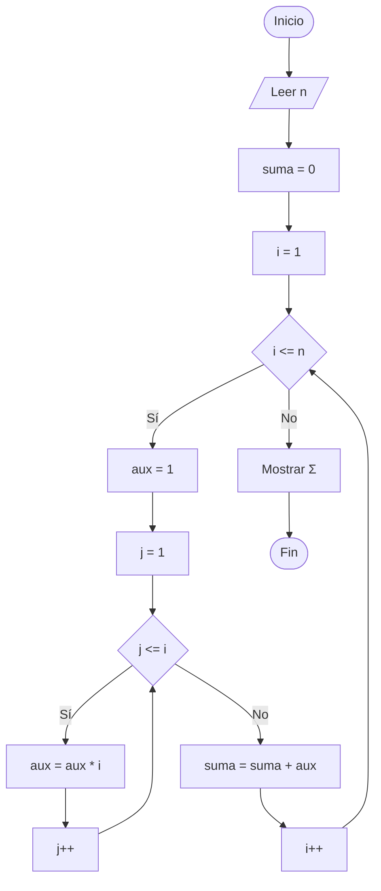

# Sumatoria de n Términos de una Serie

## Enunciado

Construir un algoritmo que realice la siguiente sumatoria de **n** elementos:

```text
Σ = 1 + (2*2) + (3*3*3) + (4*4*4*4) + (5*5*5*5*5) + ...
```

### Ejemplo

Si:

```text
n = 3
```

La sumatoria será:

```text
1 + (2*2) + (3*3*3)

1 + 4 + 27

Σ = 32
```

---

# Análisis

## Entradas

| Dato | Tipo |
|------|------|
| n | Entero |

---

## Proceso

1. Leer la cantidad de términos.
2. Generar cada término de la serie.
3. Calcular el valor de cada término.
4. Acumular los términos en una suma.
5. Mostrar el resultado final.

---

## Salidas

| Salida |
|---------|
| Resultado de la sumatoria |

---

## Restricciones

- La cantidad de términos debe ser mayor que 0.

---

# Casos de Prueba

| Entrada | Salida Esperada |
|----------|----------------|
| 1 | Σ = 1 |
| 2 | Σ = 5 |
| 3 | Σ = 32 |
| 4 | Σ = 288 |

---

# Estrategia de Solución

Se utilizarán dos ciclos `for`.

El primer ciclo recorrerá los términos desde 1 hasta n.

El segundo ciclo calculará cada potencia multiplicando repetidamente el número por sí mismo.

Cada término calculado será acumulado en la variable suma.

---

# Variables

| Variable | Tipo | Descripción |
|-----------|-----------|-----------|
| n | Entero | Cantidad de términos |
| i | Entero | Control del ciclo principal |
| j | Entero | Control del ciclo interno |
| aux | Entero | Almacena el valor de cada término |
| suma | Entero | Acumulador de la sumatoria |

---

# Operadores

| Operador | Tipo | Uso |
|-----------|-----------|-----------|
| = | Asignación | Asignar valores |
| * | Aritmético | Calcular potencias |
| + | Aritmético | Acumular la suma |
| <= | Relacional | Controlar ciclos |
| ++ | Incremento | Avanzar contadores |

---

# Estructuras Utilizadas

```text
For

For Anidado
```

---

# Fórmulas

## Cálculo de Cada Término

```text
aux = aux * i
```

## Acumulación de la Sumatoria

```text
suma = suma + aux
```

---

# Secuencia Lógica

1. Inicio.
2. Definir las variables:
   - n
   - i
   - j
   - aux
   - suma
3. Solicitar la cantidad de términos.
4. Leer el valor de n.
5. Inicializar suma en 0.
6. Recorrer los valores desde 1 hasta n.
7. Inicializar aux en 1.
8. Calcular i elevado a i mediante multiplicaciones sucesivas.
9. Acumular el resultado en suma.
10. Repetir el proceso para todos los términos.
11. Mostrar el resultado de la sumatoria.
12. Fin.

---

# Pseudocódigo

```text
Inicio

    Definir n Como Entero
    Definir i Como Entero
    Definir j Como Entero
    Definir aux Como Entero
    Definir suma Como Entero

    Escribir "Ingrese la cantidad de terminos: "
    Leer n

    suma = 0

    for (i = 1; i <= n; i++)
        aux = 1
        for (j = 1; j <= i; j++)
            aux = aux * i
        endfor
        suma = suma + aux
    endfor

    Escribir "Σ = ", suma

Fin
```

---

# Diagrama de Flujo



---

# Prueba de Escritorio

## Caso 1

### Entrada

```text
n = 3
```

### Seguimiento

| i | j | aux | suma |
|---|---|---|---|
| 1 | 1 | 1 | 1 |
| 2 | 1 | 2 | 1 |
| 2 | 2 | 4 | 5 |
| 3 | 1 | 3 | 5 |
| 3 | 2 | 9 | 5 |
| 3 | 3 | 27 | 32 |

### Salida

```text
Σ = 32
```

---

## Caso 2

### Entrada

```text
n = 4
```

### Cálculo

```text
Σ = 1 + 4 + 27 + 256

Σ = 288
```

### Salida

```text
Σ = 288
```

---

# Implementación

```cpp
#include <iostream>

using namespace std;

int main() {

    int n;
    int i;
    int j;
    int aux;
    int suma;

    cout << "Ingrese la cantidad de terminos: ";
    cin >> n;

    suma = 0;

    for (i = 1; i <= n; i++) {
        aux = 1;
        for (j = 1; j <= i; j++) {
            aux = aux * i;
        }
        suma = suma + aux;
    }

    cout << "Σ = " << suma << endl;

    return 0;
}
```
