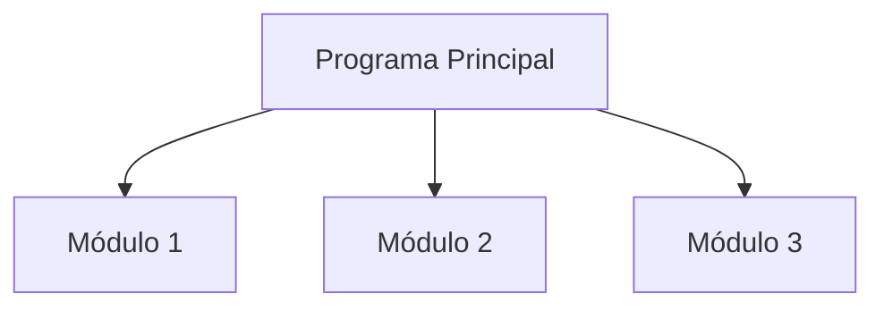

# Diseño Modular

## ¿Qué es el diseño modular?

El diseño modular es una metodología de programación que consiste en dividir un problema o programa en partes más pequeñas e independientes llamadas módulos.

Cada módulo se encarga de realizar una tarea específica y colabora con otros módulos para alcanzar el objetivo general del programa.

En lugar de desarrollar una solución grande y compleja en un solo bloque, el problema se divide en componentes más simples y fáciles de comprender.

---

# ¿Por qué surge el diseño modular?

A medida que los programas crecen, se vuelven más difíciles de:

- Comprender.
- Desarrollar.
- Mantener.
- Corregir.
- Ampliar.

Por esta razón surge el diseño modular, cuyo objetivo es dividir un problema complejo en problemas más pequeños y manejables.

```text
Programa pequeño
↓
Fácil de comprender

Programa grande
↓
Difícil de comprender

Solución
↓
Dividir en módulos
```

---

# Importancia

El diseño modular permite:

- Organizar mejor los programas.
- Reducir la complejidad de los problemas.
- Facilitar el mantenimiento del código.
- Mejorar la reutilización de soluciones.
- Simplificar las pruebas y correcciones.
- Favorecer el trabajo en equipo.

Es una de las metodologías más utilizadas en el desarrollo de software.

---

# Objetivos del diseño modular

| Objetivo | Descripción |
|-----------|------------|
| Organización | Divide el problema en partes más pequeñas. |
| Claridad | Facilita la comprensión del programa. |
| Reutilización | Permite utilizar módulos en diferentes programas. |
| Mantenimiento | Facilita modificaciones futuras. |
| Desarrollo | Permite trabajar sobre partes específicas del sistema. |

---

# Estructura general

Un programa modular suele organizarse alrededor de un módulo principal que coordina la ejecución de otros módulos.

```text
Programa Principal
│
├── Gestión de Datos
├── Procesamiento
└── Resultados
```

Cada módulo realiza una tarea específica y contribuye al funcionamiento general del programa.

---

# Representación gráfica



---

# Funcionamiento

El diseño modular sigue una secuencia de trabajo sencilla:

1. El programa principal inicia la ejecución.
2. Se identifica una tarea específica.
3. Se transfiere el control al módulo correspondiente.
4. El módulo realiza su trabajo.
5. El control retorna al programa principal.
6. El proceso continúa hasta finalizar el programa.

---

# Ejemplo práctico

Supongamos un programa que calcula el promedio de las notas de un estudiante.

```text
Programa Principal
│
├── Leer Notas
├── Calcular Promedio
└── Mostrar Resultado
```

### Responsabilidad de cada módulo

| Módulo | Función |
|---------|----------|
| Leer Notas | Obtiene las calificaciones del estudiante. |
| Calcular Promedio | Realiza el cálculo matemático. |
| Mostrar Resultado | Presenta el promedio obtenido. |

El programa principal coordina la ejecución de estos módulos.

---

# Conceptos importantes

## Módulo

Unidad independiente que realiza una tarea específica dentro de un programa.

---

## Programa principal

Es el punto de inicio del programa y coordina la ejecución de los demás módulos.

---

## Subprograma

Bloque de instrucciones diseñado para realizar una tarea concreta.

---

## Llamada a módulo

Proceso mediante el cual un módulo transfiere el control de ejecución a otro módulo.

---

## Retorno de control

Una vez finalizada la ejecución de un módulo, el control regresa al módulo que realizó la llamada.

---

# Relación con funciones y procedimientos

El diseño modular es una metodología para organizar programas.

Las funciones y los procedimientos son herramientas que permiten implementar esa metodología.

```text
Diseño Modular
        │
        ▼
Funciones y Procedimientos
        │
        ▼
Módulos
```

Por esta razón, el estudio de funciones y procedimientos forma parte del diseño modular.

---

# Ventajas generales

- Reduce la complejidad de los programas.
- Facilita la detección de errores.
- Permite reutilizar soluciones.
- Mejora la organización del código.
- Facilita el trabajo colaborativo.
- Simplifica el mantenimiento de software.

---

# Conclusión

El diseño modular es una metodología que divide un programa en módulos independientes para reducir la complejidad y mejorar la organización del software. Esta forma de desarrollo facilita la comprensión, mantenimiento y reutilización de las soluciones, convirtiéndose en una práctica fundamental dentro de la programación moderna.

---

# Resumen

| Concepto | Idea principal |
|-----------|---------------|
| Diseño modular | Divide un programa en módulos independientes. |
| Módulo | Unidad que realiza una tarea específica. |
| Programa principal | Coordina la ejecución de los módulos. |
| Objetivo | Reducir la complejidad de los programas. |
| Beneficio principal | Mejor organización y mantenimiento. |
| Implementación | Mediante funciones y procedimientos. |
