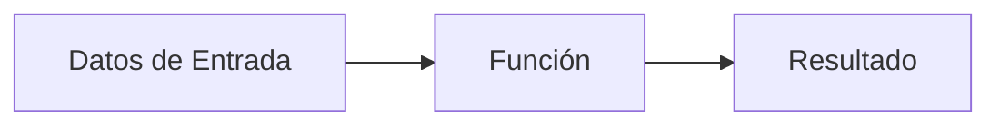

# Funciones

## ¿Qué es una función?

Una función es un módulo o subprograma que realiza una tarea específica dentro de un programa.

Puede recibir datos, procesarlos y devolver un resultado al módulo que la invocó.

Las funciones permiten dividir problemas complejos en tareas más pequeñas y organizadas, facilitando el desarrollo y mantenimiento de los programas.

---

# Relación con el diseño modular

Las funciones son una de las principales herramientas utilizadas para implementar el diseño modular.

```text
Diseño Modular
        │
        ▼
     Funciones
        │
        ▼
 Módulos independientes
```

Gracias a las funciones, un programa puede dividirse en partes más pequeñas y fáciles de comprender.

---

# Importancia

Las funciones permiten:

- Reutilizar código.
- Reducir la complejidad de los programas.
- Evitar la duplicación de instrucciones.
- Mejorar la organización del software.
- Facilitar el mantenimiento y corrección de errores.

---

# Características

Las funciones poseen las siguientes características:

- Tienen un nombre único.
- Realizan una tarea específica.
- Pueden recibir parámetros.
- Ejecutan un conjunto de instrucciones.
- Devuelven un valor como resultado.
- Pueden utilizarse varias veces dentro del programa.

---

# Estructura general

## Pseudocódigo

```text
Funcion nombreFuncion(parametros)

    instrucciones

    Retornar resultado

FinFuncion
```

---

# Elementos de una función

## Nombre

Identifica a la función dentro del programa.

### Ejemplo

```text
Funcion sumar()
```

---

## Parámetros

Son los datos que recibe la función para realizar su tarea.

### Ejemplo

```text
Funcion sumar(a, b)
```

---

## Cuerpo

Conjunto de instrucciones que ejecuta la función.

### Ejemplo

```text
resultado = a + b
```

---

## Valor de retorno

Es el resultado que la función devuelve al finalizar su ejecución.

### Ejemplo

```text
Retornar resultado
```

---

# Funcionamiento

El uso de una función sigue generalmente estos pasos:

1. Un módulo invoca la función.
2. Se envían los datos necesarios.
3. La función ejecuta sus instrucciones.
4. Se obtiene un resultado.
5. El control retorna al módulo que realizó la llamada.

```text
Llamada
    ↓
Procesamiento
    ↓
Retorno
```

---

# Ejemplo conceptual

Supongamos una función encargada de sumar dos números.

### Pseudocódigo

```text
Funcion sumar(a, b)

    resultado = a + b

    Retornar resultado

FinFuncion
```

### Datos de entrada

```text
a = 6
b = 8
```

### Procesamiento

```text
resultado = 6 + 8
```

### Resultado

```text
14
```

---

# Representación gráfica



---

# Ejemplos de funciones comunes

| Función | Propósito |
|----------|-----------|
| Sumar() | Realiza una suma. |
| CalcularPromedio() | Calcula un promedio. |
| ObtenerEdad() | Calcula una edad. |
| ConvertirMoneda() | Realiza conversiones monetarias. |
| CalcularArea() | Calcula áreas geométricas. |

---

# Diferencia entre función y procedimiento

La principal diferencia es que una función devuelve un valor al finalizar su ejecución.

### Función

```text
promedio = calcularPromedio()
```

Devuelve un resultado.

### Procedimiento

```text
mostrarPromedio()
```

Realiza una acción, pero no devuelve un valor.

Más adelante se estudiarán los procedimientos con mayor detalle.

---

# Ventajas

- Favorecen la reutilización del código.
- Mejoran la organización de los programas.
- Facilitan las pruebas y correcciones.
- Permiten dividir problemas complejos.
- Incrementan la legibilidad del software.

---

# Buenas prácticas

- Utilizar nombres descriptivos.
- Asignar una única responsabilidad a cada función.
- Evitar funciones demasiado extensas.
- Reutilizar funciones cuando sea posible.
- Mantener una estructura clara y organizada.

---

# Conclusión

Las funciones son módulos especializados que permiten recibir datos, procesarlos y devolver resultados. Constituyen una herramienta fundamental del diseño modular y facilitan la construcción de programas organizados, reutilizables y fáciles de mantener.

---

# Resumen

| Concepto | Idea principal |
|-----------|---------------|
| Función | Subprograma que realiza una tarea específica. |
| Parámetros | Datos que recibe la función. |
| Procesamiento | Operaciones realizadas por la función. |
| Retorno | Valor devuelto al finalizar. |
| Ventaja principal | Reutilización y organización del código. |
