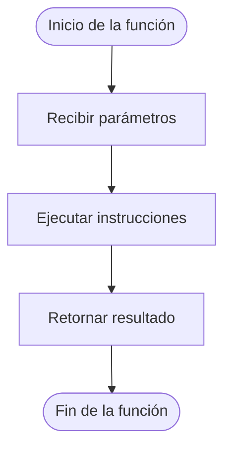

# Declaración de Funciones

## ¿Qué es la declaración de una función?

La declaración de una función es el proceso mediante el cual se define una función dentro de un programa.

Durante esta etapa se establece su nombre, los datos que puede recibir y las instrucciones que ejecutará cuando sea utilizada.

Una función debe estar definida antes de poder ser invocada desde otras partes del programa.

---

# Importancia

La declaración de funciones permite:

- Organizar el programa en módulos.
- Reutilizar código.
- Facilitar el mantenimiento.
- Mejorar la legibilidad.
- Preparar funciones para ser utilizadas posteriormente.

---

# Estructura general

## Pseudocódigo

```text
Funcion nombreFuncion(parametros)

    instrucciones

    Retornar resultado

FinFuncion
```

---

# Componentes de una declaración

## 1. Palabra reservada

Indica el inicio de la definición de una función.

### Ejemplo

```text
Funcion
```

---

## 2. Nombre de la función

Identifica la función dentro del programa.

### Ejemplo

```text
Funcion sumar()
```

Se recomienda utilizar nombres descriptivos.

### Correcto

```text
Funcion calcularPromedio()
```

### Incorrecto

```text
Funcion F1()
```

---

## 3. Parámetros

Son los datos que la función puede recibir para realizar una tarea.

### Ejemplo

```text
Funcion sumar(a, b)
```

Los parámetros se estudiarán con mayor detalle posteriormente.

---

## 4. Cuerpo

Conjunto de instrucciones que ejecuta la función.

### Ejemplo

```text
resultado = a + b
```

Aquí se realiza el procesamiento de los datos.

---

## 5. Retorno

Permite devolver un resultado al módulo que realizó la llamada.

### Ejemplo

```text
Retornar resultado
```

El retorno será estudiado con mayor detalle en un tema posterior.

---

## 6. Fin de función

Indica el final de la definición.

### Ejemplo

```text
FinFuncion
```

---

# Ejemplo completo

```text
Funcion sumar(a, b)

    resultado = a + b

    Retornar resultado

FinFuncion
```

---

# Funcionamiento

Supongamos los siguientes valores:

```text
a = 6
b = 8
```

La función realiza:

```text
resultado = 6 + 8
```

y devuelve:

```text
14
```

---

# Representación gráfica



---

# Reglas de nomenclatura

Se recomienda que los nombres de las funciones:

- Sean descriptivos.
- Representen claramente la tarea realizada.
- Utilicen verbos de acción.

### Ejemplos

```text
calcularPromedio()
obtenerEdad()
mostrarMenu()
validarUsuario()
```

---

# Buenas prácticas

- Utilizar nombres claros y descriptivos.
- Crear funciones con una única responsabilidad.
- Evitar funciones demasiado extensas.
- Mantener una estructura ordenada.
- Documentar adecuadamente las funciones cuando sea necesario.

---

# Relación con otros elementos

Una función declarada puede:

```text
Declaración
        ↓
Llamada
        ↓
Ejecución
        ↓
Retorno
```

Por esta razón, la declaración constituye el primer paso para utilizar funciones dentro de un programa.

---

# Conclusión

La declaración de funciones consiste en definir la estructura necesaria para que una función pueda ser utilizada dentro de un programa. Una declaración adecuada mejora la organización del código y facilita la construcción de soluciones modulares.

---

# Resumen

| Elemento | Función |
|-----------|---------|
| Nombre | Identifica la función. |
| Parámetros | Reciben datos de entrada. |
| Cuerpo | Contiene las instrucciones. |
| Retorno | Devuelve un resultado. |
| FinFuncion | Marca el final de la función. |
