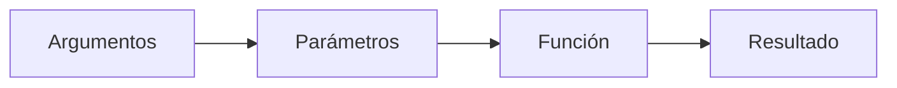

# Parámetros en las Funciones

## ¿Qué son los parámetros?

Los parámetros son datos que una función recibe para poder realizar una tarea específica.

Permiten que una misma función pueda trabajar con diferentes valores sin necesidad de modificar su código.

Gracias a los parámetros, las funciones se vuelven más flexibles y reutilizables.

---

# Importancia

Los parámetros permiten:

- Enviar información a una función.
- Reutilizar una función con distintos datos.
- Evitar la repetición de código.
- Hacer que los programas sean más flexibles.
- Adaptar una misma función a diferentes situaciones.

---

# Sintaxis general

```text
Funcion nombreFuncion(parametro1, parametro2, ...)

    instrucciones

    Retornar resultado

FinFuncion
```

Los parámetros se escriben entre paréntesis después del nombre de la función.

---

# ¿Cómo funcionan?

Cuando una función es invocada, recibe valores que son asignados a sus parámetros.

```text
Llamada
        ↓
Parámetros
        ↓
Procesamiento
        ↓
Resultado
```

---

# Función sin parámetros

Una función no está obligada a recibir parámetros.

### Ejemplo

```text
Funcion mostrarMensaje()

    Retornar "Bienvenido"

FinFuncion
```

### Resultado

```text
Bienvenido
```

En este caso, la función siempre devolverá el mismo resultado.

---

# Función con un parámetro

Una función puede recibir un único dato.

### Ejemplo

```text
Funcion cuadrado(numero)

    Retornar numero * numero

FinFuncion
```

### Llamada

```text
cuadrado(4)
```

### Resultado

```text
16
```

---

# Función con varios parámetros

Una función puede recibir varios datos.

### Ejemplo

```text
Funcion sumar(a, b)

    Retornar a + b

FinFuncion
```

### Llamada

```text
sumar(5, 3)
```

### Resultado

```text
8
```

---

# Correspondencia de parámetros

Cuando se invoca una función, los valores enviados deben respetar el orden definido en la declaración.

### Declaración

```text
Funcion restar(a, b)

    Retornar a - b

FinFuncion
```

### Llamada

```text
restar(10, 4)
```

### Correspondencia

| Valor enviado | Parámetro |
|---------------|------------|
| 10 | a |
| 4 | b |

### Resultado

```text
6
```

---

# Parámetros y argumentos

Aunque suelen confundirse, no son exactamente lo mismo.

## Parámetros

Son las variables definidas en la función.

### Ejemplo

```text
Funcion sumar(a, b)
```

`a` y `b` son parámetros.

---

## Argumentos

Son los valores reales enviados durante la llamada.

### Ejemplo

```text
sumar(5, 3)
```

`5` y `3` son argumentos.

---

# Representación gráfica



---

# Ejemplo práctico

## Problema

Calcular el área de un rectángulo.

### Función

```text
Funcion calcularArea(base, altura)

    Retornar base * altura

FinFuncion
```

### Llamada

```text
calcularArea(5, 4)
```

### Proceso

```text
5 * 4
```

### Resultado

```text
20
```

---

# Ventajas de utilizar parámetros

- Permiten reutilizar funciones.
- Reducen la duplicación de código.
- Facilitan el mantenimiento.
- Mejoran la flexibilidad de los programas.
- Favorecen el diseño modular.

---

# Buenas prácticas

- Utilizar nombres descriptivos para los parámetros.
- Mantener únicamente los parámetros necesarios.
- Respetar el orden de los parámetros.
- Evitar parámetros innecesarios.
- Documentar claramente el propósito de cada parámetro.

---

# Relación con otros conceptos

Los parámetros forman parte de la estructura de una función.

```text
Función
│
├── Nombre
├── Parámetros
├── Instrucciones
└── Retorno
```

---

# Conclusión

Los parámetros permiten que una función reciba información para realizar una tarea específica. Gracias a ellos, las funciones pueden reutilizarse con diferentes valores, haciendo que los programas sean más flexibles, organizados y fáciles de mantener.

---

# Resumen

| Concepto | Descripción |
|-----------|------------|
| Parámetro | Variable definida en la función. |
| Argumento | Valor enviado durante la llamada. |
| Función sin parámetros | No recibe datos externos. |
| Función con parámetros | Recibe información para trabajar. |
| Beneficio principal | Reutilización y flexibilidad. |
