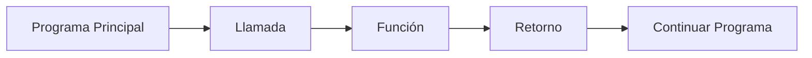

# Llamada de Funciones

## ¿Qué es una llamada a función?

Una llamada a función es el proceso mediante el cual se ejecuta una función previamente declarada.

Cuando una función es llamada:

1. Se transfiere el control de ejecución a la función.
2. La función recibe los parámetros enviados.
3. Se ejecutan sus instrucciones.
4. Se obtiene un resultado mediante el retorno.
5. El control regresa al punto donde fue invocada.

---

# Importancia

La llamada permite:

- Ejecutar funciones cuando sean necesarias.
- Reutilizar código.
- Evitar duplicar instrucciones.
- Organizar mejor los programas.
- Aprovechar el diseño modular.

Sin una llamada, una función existe dentro del programa, pero nunca se ejecuta.

---

# Declarar y llamar no son lo mismo

Es importante distinguir estos conceptos.

### Declaración

Define la función.

```text
Funcion sumar(a, b)

    Retornar a + b

FinFuncion
```

---

### Llamada

Ejecuta la función.

```text
resultado = sumar(6, 8)
```

---

# Sintaxis general

```text
variable = nombreFuncion(parametros)
```

---

# Componentes de una llamada

## Variable receptora

Almacena el valor retornado.

```text
resultado =
```

---

## Nombre de la función

Indica qué función será ejecutada.

```text
sumar()
```

---

## Argumentos

Son los valores enviados a la función.

```text
sumar(6, 8)
```

---

# Funcionamiento

```text
Llamada
    ↓
Recepción de parámetros
    ↓
Procesamiento
    ↓
Retorno
    ↓
Continuación del programa
```

---

# Ejemplo básico

## Declaración

```text
Funcion sumar(a, b)

    resultado = a + b

    Retornar resultado

FinFuncion
```

---

## Llamada

```text
r = sumar(6, 8)
```

---

## Resultado

```text
r = 14
```

---

# Prueba de escritorio

### Datos de entrada

```text
a = 6
b = 8
```

### Seguimiento

| Paso | a | b | resultado |
|-------|---|---|------------|
| Recibe parámetros | 6 | 8 | - |
| resultado = a + b | 6 | 8 | 14 |
| Retornar resultado | 6 | 8 | 14 |

### Resultado final

```text
14
```

---

# Llamada sin parámetros

No todas las funciones reciben datos.

## Declaración

```text
Funcion obtenerPI()

    Retornar 3.1416

FinFuncion
```

## Llamada

```text
valor = obtenerPI()
```

## Resultado

```text
valor = 3.1416
```

---

# Uso directo del retorno

No siempre es necesario almacenar el resultado en una variable.

### Ejemplo

```text
Escribir sumar(6, 8)
```

### Resultado

```text
14
```

---

# Múltiples llamadas

Una misma función puede ejecutarse muchas veces con diferentes datos.

### Ejemplo

```text
r1 = sumar(5, 3)
r2 = sumar(10, 7)
r3 = sumar(20, 15)
```

### Resultados

```text
r1 = 8
r2 = 17
r3 = 35
```

La función es la misma, pero trabaja con distintos valores.

---

# Representación gráfica



---

# Consideraciones importantes

- La función debe estar declarada antes de utilizarse.
- Los argumentos deben coincidir con los parámetros definidos.
- Una función puede llamarse múltiples veces.
- El valor retornado puede almacenarse o utilizarse directamente.
- La ejecución siempre regresa al punto donde se realizó la llamada.

---

# Buenas prácticas

- Utilizar nombres descriptivos para las funciones.
- Enviar únicamente los argumentos necesarios.
- Aprovechar el valor retornado.
- Evitar llamadas innecesarias.
- Verificar que los datos enviados sean correctos.

---

# Relación con otros conceptos

```text
Declaración
        ↓
Parámetros
        ↓
Llamada
        ↓
Procesamiento
        ↓
Retorno
```

La llamada es el mecanismo que pone en funcionamiento una función previamente declarada.

---

# Conclusión

La llamada de funciones permite ejecutar una función previamente definida, enviarle datos y obtener el resultado de su procesamiento. Es el mecanismo que conecta los distintos módulos de un programa y permite aprovechar las ventajas del diseño modular.

---

# Resumen

| Concepto | Descripción |
|-----------|------------|
| Llamada | Ejecución de una función. |
| Argumentos | Valores enviados a la función. |
| Parámetros | Variables que reciben los datos. |
| Retorno | Resultado devuelto por la función. |
| Beneficio principal | Reutilización y modularización del código. |
