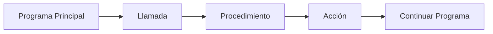

# Procedimientos

## ¿Qué es un procedimiento?

Un procedimiento es un módulo o subprograma que realiza una tarea específica dentro de un programa.

Al igual que las funciones, los procedimientos permiten dividir un problema en partes más pequeñas, organizadas y reutilizables.

La principal diferencia es que un procedimiento no devuelve un valor mediante una instrucción de retorno. Su propósito principal es ejecutar acciones o procesos dentro del programa.

---

# Relación con el diseño modular

Los procedimientos son una de las herramientas utilizadas para implementar el diseño modular.

```text
Diseño Modular
        │
        ▼
   Procedimientos
        │
        ▼
Módulos especializados
```

Gracias a los procedimientos es posible dividir un programa en tareas independientes y fáciles de mantener.

---

# Importancia

Los procedimientos permiten:

- Organizar mejor los programas.
- Evitar la repetición de código.
- Facilitar el mantenimiento.
- Mejorar la legibilidad.
- Dividir problemas complejos en tareas simples.
- Favorecer la reutilización de soluciones.

---

# Características

Los procedimientos poseen las siguientes características:

- Tienen un nombre único.
- Ejecutan una tarea específica.
- Pueden recibir parámetros.
- No devuelven valores mediante `Retornar`.
- Pueden modificar datos recibidos.
- Pueden llamarse múltiples veces.
- Facilitan la organización del código.

---

# ¿Cuándo utilizar un procedimiento?

Los procedimientos son útiles cuando se desea realizar una acción sin necesidad de obtener un valor de retorno.

### Ejemplos

- Mostrar un menú.
- Imprimir información.
- Leer datos.
- Actualizar registros.
- Generar reportes.
- Mostrar resultados.

---

# Diferencia entre función y procedimiento

| Función | Procedimiento |
|----------|-------------|
| Devuelve un valor mediante `Retornar`. | No devuelve valores. |
| Puede utilizarse en expresiones. | Se ejecuta como una instrucción independiente. |
| Generalmente realiza cálculos. | Generalmente realiza acciones. |
| Produce un resultado. | Ejecuta un proceso. |

---

## Función

```text
resultado = sumar(5, 3)
```

Devuelve un valor.

---

## Procedimiento

```text
mostrarMenu()
```

Ejecuta una acción y continúa la ejecución del programa.

---

# Estructura general

## Pseudocódigo

```text
Procedimiento nombreProcedimiento(parametros)

    instrucciones

FinProcedimiento
```

---

# Componentes de un procedimiento

## Nombre

Identifica al procedimiento dentro del programa.

### Ejemplo

```text
Procedimiento mostrarMenu()
```

---

## Parámetros

Son los datos que el procedimiento puede recibir.

### Ejemplo

```text
Procedimiento mostrarNombre(nombre)
```

---

## Cuerpo

Contiene las instrucciones que ejecutará el procedimiento.

### Ejemplo

```text
Escribir nombre
```

---

## Fin del procedimiento

Indica el final de la definición.

### Ejemplo

```text
FinProcedimiento
```

---

# Funcionamiento

El uso de un procedimiento sigue generalmente estos pasos:

1. Se realiza una llamada.
2. El procedimiento recibe el control.
3. Ejecuta sus instrucciones.
4. Finaliza la tarea.
5. El control regresa al programa principal.

```text
Llamada
    ↓
Ejecución
    ↓
Fin del procedimiento
    ↓
Continuación del programa
```

---

# Ejemplo conceptual

## Procedimiento

```text
Procedimiento saludar()

    Escribir "Hola Mundo"

FinProcedimiento
```

---

## Llamada

```text
saludar()
```

---

## Resultado

```text
Hola Mundo
```

---

# Procedimiento con parámetros

## Declaración

```text
Procedimiento mostrarNombre(nombre)

    Escribir nombre

FinProcedimiento
```

---

## Llamada

```text
mostrarNombre("Carlos")
```

---

## Resultado

```text
Carlos
```

---

# Representación gráfica



---

# Ventajas

- Favorecen la reutilización del código.
- Facilitan el mantenimiento.
- Mejoran la organización del programa.
- Incrementan la legibilidad.
- Permiten dividir tareas complejas.
- Facilitan el trabajo en equipo.

---

# Buenas prácticas

- Utilizar nombres descriptivos.
- Asignar una única responsabilidad a cada procedimiento.
- Evitar procedimientos excesivamente largos.
- Reutilizar procedimientos cuando sea posible.
- Mantener una estructura clara y organizada.

---

# Relación con funciones

```text
Subprogramas
│
├── Funciones
│   └── Devuelven un valor
│
└── Procedimientos
    └── Ejecutan acciones
```

Ambos forman parte del diseño modular y permiten construir programas más organizados.

---

# Conclusión

Los procedimientos son módulos especializados en ejecutar acciones o procesos dentro de un programa. Aunque no devuelven valores como las funciones, constituyen una herramienta fundamental para organizar, reutilizar y simplificar el desarrollo de software.

---

# Resumen

| Concepto | Idea principal |
|-----------|---------------|
| Procedimiento | Subprograma que ejecuta una tarea específica. |
| Parámetros | Datos que puede recibir. |
| Retorno | No devuelve valores. |
| Uso principal | Ejecutar acciones o procesos. |
| Beneficio principal | Organización y reutilización del código. |
