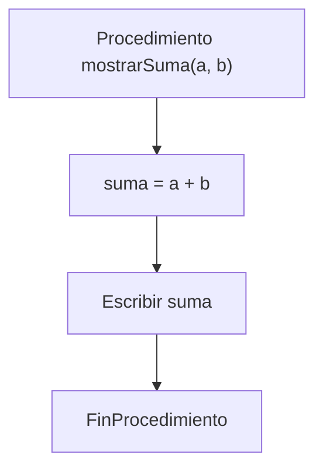

# Declaración de Procedimientos

## ¿Qué es la declaración de un procedimiento?

La declaración de un procedimiento es el proceso mediante el cual se define formalmente un procedimiento dentro de un programa.

Durante esta etapa se establece su nombre, los parámetros que puede recibir y las instrucciones que ejecutará cuando sea invocado.

Un procedimiento debe estar declarado antes de poder ser utilizado desde otras partes del programa.

---

# Importancia

La declaración de procedimientos permite:

- Organizar el programa en módulos.
- Reutilizar código.
- Facilitar el mantenimiento.
- Mejorar la legibilidad.
- Dividir problemas complejos en tareas más pequeñas.

---

# Estructura general

## Pseudocódigo

```text
Procedimiento nombreProcedimiento(parametros)

    instrucciones

FinProcedimiento
```

---

# Componentes de una declaración

## 1. Palabra reservada

Indica el inicio de la definición del procedimiento.

### Ejemplo

```text
Procedimiento
```

---

## 2. Nombre del procedimiento

Permite identificar al procedimiento dentro del programa.

### Ejemplo

```text
Procedimiento mostrarMenu()
```

Se recomienda utilizar nombres descriptivos.

### Correcto

```text
Procedimiento mostrarMenu()
```

### Incorrecto

```text
Procedimiento P1()
```

---

## 3. Parámetros

Son los datos que el procedimiento puede recibir para realizar una tarea determinada.

### Ejemplo

```text
Procedimiento mostrarSuma(a, b)
```

En este caso:

- `a` es un parámetro.
- `b` es un parámetro.

---

## 4. Cuerpo del procedimiento

Contiene las instrucciones que ejecutará el procedimiento.

### Ejemplo

```text
suma = a + b

Escribir suma
```

Aquí se realiza el procesamiento de los datos.

---

## 5. Fin del procedimiento

Indica el final de la definición.

### Ejemplo

```text
FinProcedimiento
```

---

# Funcionamiento

Cuando un procedimiento es invocado:

1. Recibe el control de ejecución.
2. Recibe los parámetros enviados.
3. Ejecuta sus instrucciones.
4. Finaliza su tarea.
5. Devuelve el control al programa que realizó la llamada.

```text
Llamada
    ↓
Recepción de parámetros
    ↓
Ejecución
    ↓
Fin del procedimiento
    ↓
Continuación del programa
```

---

# Ejemplo 1

## Declaración

```text
Procedimiento saludar()

    Escribir "Hola Mundo"

FinProcedimiento
```

## Resultado

```text
Hola Mundo
```

---

# Ejemplo 2

## Declaración

```text
Procedimiento mostrarSuma(a, b)

    suma = a + b

    Escribir suma

FinProcedimiento
```

### Datos

```text
a = 6
b = 8
```

### Proceso

```text
suma = 6 + 8
```

### Salida

```text
14
```

---

# Representación gráfica



---

# Reglas de nomenclatura

Se recomienda que los nombres de los procedimientos:

- Sean descriptivos.
- Representen claramente la acción realizada.
- Utilicen verbos.

### Ejemplos

```text
mostrarMenu()
registrarUsuario()
generarReporte()
actualizarDatos()
```

---

# Buenas prácticas

- Utilizar nombres claros.
- Asignar una única responsabilidad a cada procedimiento.
- Evitar procedimientos excesivamente largos.
- Mantener una estructura ordenada.
- Reutilizar procedimientos cuando sea posible.

---

# Relación con la llamada

La declaración es el primer paso para utilizar un procedimiento.

```text
Declaración
        ↓
Llamada
        ↓
Ejecución
        ↓
Continuación del programa
```

Sin declaración, un procedimiento no puede ser invocado.

---

# Conclusión

La declaración de procedimientos consiste en definir formalmente un bloque independiente de instrucciones que podrá ser reutilizado dentro del programa. Una correcta declaración favorece la modularidad, organización y mantenimiento del software.

---

# Resumen

| Elemento | Función |
|-----------|---------|
| Nombre | Identifica al procedimiento. |
| Parámetros | Reciben datos de entrada. |
| Cuerpo | Contiene las instrucciones. |
| FinProcedimiento | Marca el final de la definición. |
| Beneficio principal | Organización y reutilización del código. |
