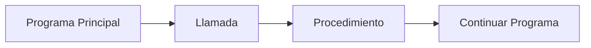

# Llamada de Procedimientos

## ¿Qué es una llamada a procedimiento?

Una llamada a procedimiento es el proceso mediante el cual se ejecuta un procedimiento previamente declarado.

Cuando un procedimiento es llamado:

1. Se transfiere el control de ejecución al procedimiento.
2. Se reciben los parámetros enviados.
3. Se ejecutan sus instrucciones.
4. Finalizada la tarea, el control regresa al punto desde donde fue invocado.

A diferencia de las funciones, los procedimientos no devuelven un valor mediante una instrucción de retorno.

---

# Importancia

La llamada permite:

- Ejecutar procedimientos cuando sean necesarios.
- Reutilizar código.
- Evitar la duplicación de instrucciones.
- Organizar mejor los programas.
- Aprovechar las ventajas del diseño modular.

Sin una llamada, un procedimiento existe dentro del programa, pero nunca se ejecuta.

---

# Declarar y llamar no son lo mismo

Es importante diferenciar estos conceptos.

## Declaración

Define el procedimiento.

```text
Procedimiento saludar()

    Escribir "Hola Mundo"

FinProcedimiento
```

---

## Llamada

Ejecuta el procedimiento.

```text
saludar()
```

---

# Sintaxis general

```text
nombreProcedimiento(parametros)
```

---

# Componentes de una llamada

## Nombre del procedimiento

Indica qué procedimiento será ejecutado.

### Ejemplo

```text
mostrarMenu()
```

---

## Argumentos

Son los valores enviados al procedimiento.

### Ejemplo

```text
mostrarSuma(6, 8)
```

---

# Funcionamiento

```text
Llamada
    ↓
Recepción de parámetros
    ↓
Ejecución
    ↓
Fin del procedimiento
    ↓
Continuación del programa
```

---

# Ejemplo 1

## Declaración

```text
Procedimiento saludar()

    Escribir "Hola Mundo"

FinProcedimiento
```

---

## Llamada

```text
saludar()
```

---

## Salida

```text
Hola Mundo
```

---

# Ejemplo 2

## Declaración

```text
Procedimiento mostrarSuma(a, b)

    suma = a + b

    Escribir suma

FinProcedimiento
```

---

## Llamada

```text
mostrarSuma(6, 8)
```

---

## Salida

```text
14
```

---

# Prueba de escritorio

### Datos de entrada

```text
a = 6
b = 8
```

### Seguimiento

| Paso | a | b | suma |
|-------|---|---|------|
| Recibe parámetros | 6 | 8 | - |
| suma = a + b | 6 | 8 | 14 |
| Escribir suma | 6 | 8 | 14 |

### Salida

```text
14
```

---

# Transferencia de control



---

# Ejecución paso a paso

```text
Programa Principal
        │
        ▼
mostrarSuma(6, 8)
        │
        ▼
suma = 6 + 8
        │
        ▼
Escribir 14
        │
        ▼
Finalizar procedimiento
        │
        ▼
Continuar ejecución
```

---

# Múltiples llamadas

Un procedimiento puede ejecutarse tantas veces como sea necesario.

### Ejemplo

```text
saludar()

saludar()

saludar()
```

### Salida

```text
Hola Mundo
Hola Mundo
Hola Mundo
```

---

# Consideraciones importantes

- El procedimiento debe estar declarado antes de ser utilizado.
- Los argumentos enviados deben coincidir con los parámetros definidos.
- Un procedimiento puede llamarse múltiples veces.
- Al finalizar, el control regresa al programa principal.
- Los procedimientos no devuelven valores mediante `Retornar`.

---

# Buenas prácticas

- Utilizar nombres descriptivos.
- Enviar únicamente los argumentos necesarios.
- Reutilizar procedimientos cuando sea posible.
- Evitar procedimientos demasiado extensos.
- Mantener una estructura clara y organizada.

---

# Relación con otros conceptos

```text
Declaración
        ↓
Parámetros
        ↓
Llamada
        ↓
Ejecución
        ↓
Continuación del programa
```

La llamada es el mecanismo que pone en funcionamiento un procedimiento previamente declarado.

---

# Conclusión

La llamada de procedimientos permite ejecutar tareas previamente definidas dentro de módulos independientes. Gracias a ella es posible reutilizar código, organizar programas de forma modular y simplificar el desarrollo de soluciones más grandes y complejas.

---

# Resumen

| Concepto | Descripción |
|-----------|------------|
| Llamada | Ejecución de un procedimiento. |
| Argumentos | Valores enviados al procedimiento. |
| Parámetros | Variables que reciben los datos. |
| Ejecución | Realización de las instrucciones del procedimiento. |
| Beneficio principal | Reutilización y modularización del código. |
