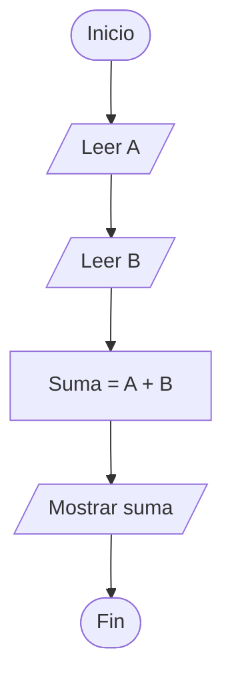
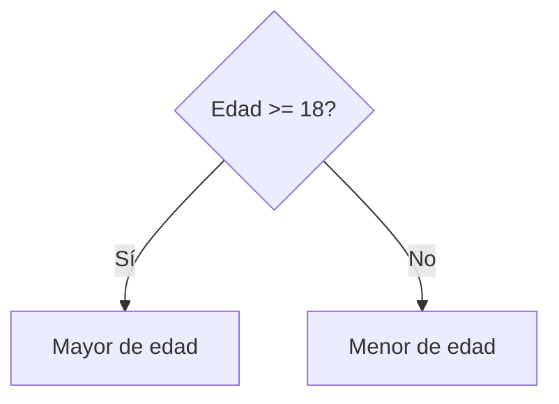
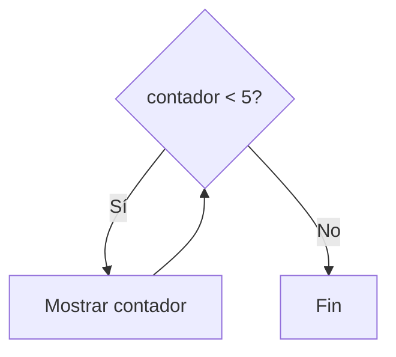

# Instrucciones de Control

## ¿Qué son las instrucciones de control?

Las **instrucciones de control** son estructuras que permiten controlar el flujo de ejecución de un algoritmo o programa.

Determinan el orden en que se ejecutan las instrucciones y permiten tomar decisiones o repetir acciones cuando sea necesario.

---

# Importancia

Las instrucciones de control permiten:

* Organizar la ejecución de programas.
* Tomar decisiones.
* Repetir procesos.
* Resolver problemas complejos.
* Construir algoritmos más eficientes.

Sin instrucciones de control, los programas solo podrían ejecutar acciones de forma lineal.

---

# Flujo de ejecución

Por defecto, las instrucciones se ejecutan de arriba hacia abajo.

```text
Instrucción 1
      ↓
Instrucción 2
      ↓
Instrucción 3
      ↓
Instrucción 4
```

Este comportamiento se conoce como flujo secuencial.

---

# Clasificación

Las instrucciones de control se clasifican en tres grandes grupos:

| Tipo          | Función                          |
| ------------- | -------------------------------- |
| Secuenciales  | Ejecutan instrucciones en orden. |
| Condicionales | Permiten tomar decisiones.       |
| Repetitivas   | Permiten repetir instrucciones.  |

---

# 1. Estructuras Secuenciales

Las instrucciones se ejecutan una después de otra siguiendo el orden establecido.

### Ejemplo

```text
Leer A
Leer B
Suma ← A + B
Mostrar Suma
```

Representación:



---

# 2. Estructuras Condicionales

Permiten tomar decisiones según una condición.

### Ejemplo conceptual

```text
Si edad >= 18
    Mostrar "Mayor de edad"
Sino
    Mostrar "Menor de edad"
Fin Si
```

Representación:



---

# 3. Estructuras Repetitivas

Permiten ejecutar instrucciones varias veces.

### Ejemplo conceptual

```text
Mientras contador < 5

    Mostrar contador

Fin Mientras
```

Representación:



---

# Relación con los algoritmos

Las instrucciones de control forman parte de los algoritmos y permiten representar comportamientos más complejos.

```text
Algoritmo
    │
    ├── Secuencial
    ├── Condicional
    └── Repetitivo
```

---

# Aplicaciones

Las instrucciones de control se utilizan en:

* Sistemas bancarios.
* Videojuegos.
* Aplicaciones móviles.
* Sistemas empresariales.
* Automatización de procesos.
* Programas científicos.

Prácticamente cualquier programa utiliza instrucciones de control.

---

# Ventajas

| Ventaja        | Descripción                                   |
| -------------- | --------------------------------------------- |
| Flexibilidad   | Permiten crear soluciones complejas.          |
| Organización   | Mejoran la estructura del programa.           |
| Reutilización  | Facilitan la repetición de tareas.            |
| Automatización | Permiten ejecutar acciones según condiciones. |

---

# Errores comunes

| Error                              | Descripción                          |
| ---------------------------------- | ------------------------------------ |
| Utilizar una estructura incorrecta | Puede complicar la solución.         |
| Condiciones mal planteadas         | Generan resultados erróneos.         |
| Repeticiones infinitas             | Impiden finalizar el programa.       |
| Omitir casos posibles              | Produce comportamientos inesperados. |

---

# Información complementaria

Para comprender las herramientas utilizadas antes de programar consulte:

* [Etapas de resolución](../Tema04_resolucion_problemas/1-etapas_resolucion.md)
* [Pseudocódigo](../Tema04_resolucion_problemas/2-pseudocodigo.md)
* [Diagramas de flujo](../Tema04_resolucion_problemas/3-diagramas_flujo.md)
* [Pruebas de escritorio](../Tema04_resolucion_problemas/4-pruebas_escritorio.md)

---

# Conclusión

Las instrucciones de control permiten dirigir el flujo de ejecución de un programa. Gracias a ellas es posible tomar decisiones, repetir acciones y construir algoritmos capaces de resolver problemas reales de manera eficiente.

---

# Resumen

| Concepto                 | Idea principal                     |
| ------------------------ | ---------------------------------- |
| Instrucciones de control | Controlan el flujo de ejecución.   |
| Secuenciales             | Ejecutan acciones en orden.        |
| Condicionales            | Permiten tomar decisiones.         |
| Repetitivas              | Permiten repetir acciones.         |
| Importancia              | Base de la lógica de programación. |
