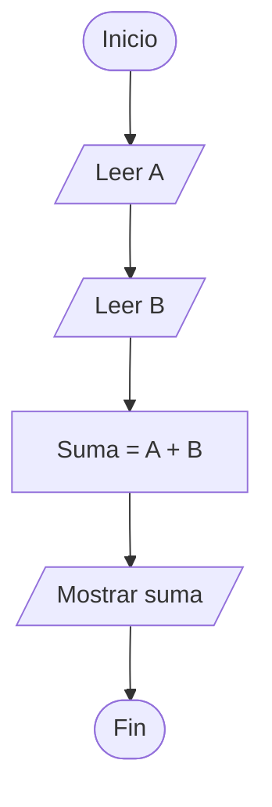
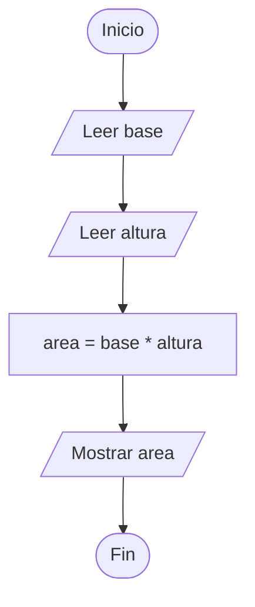

# Estructuras Secuenciales

## ¿Qué es una estructura secuencial?

Una **estructura secuencial** es aquella en la que las instrucciones se ejecutan una tras otra en el orden en que aparecen.

Es la forma más simple de control de flujo y constituye la base de todos los algoritmos.

---

# Importancia

Las estructuras secuenciales permiten:

* Organizar acciones paso a paso.
* Resolver problemas simples.
* Construir algoritmos básicos.
* Servir como base para estructuras más complejas.

---

# Características

| Característica | Descripción                                    |
| -------------- | ---------------------------------------------- |
| Ordenada       | Las instrucciones siguen una secuencia lógica. |
| Lineal         | No existen bifurcaciones ni repeticiones.      |
| Simple         | Cada instrucción se ejecuta una sola vez.      |
| Predecible     | El flujo siempre sigue el mismo camino.        |

---

# Flujo de ejecución

Las instrucciones se ejecutan de arriba hacia abajo.

```text
Instrucción 1
      ↓
Instrucción 2
      ↓
Instrucción 3
      ↓
Instrucción 4
```

---

# Modelo Entrada → Proceso → Salida

La mayoría de algoritmos secuenciales siguen esta estructura.

```text
Entrada
   ↓
Proceso
   ↓
Salida
```

---

# Ejemplo conceptual

## Problema

Leer dos números y mostrar su suma.

### Pseudocódigo

```text
Inicio

    Leer A
    Leer B

    suma ← A + B

    Escribir suma

Fin
```

### Diagrama de flujo



---

# Ejemplo en C++

```cpp
#include <iostream>

using namespace std;

int main() {

    int a;
    int b;
    int suma;

    cin >> a;
    cin >> b;

    suma = a + b;

    cout << suma << endl;

    return 0;
}
```

---

# Otro ejemplo

## Problema

Calcular el área de un rectángulo.

### Pseudocódigo

```text
Inicio

    Leer base
    Leer altura

    area ← base * altura

    Escribir area

Fin
```

### Diagrama de flujo



---

# Aplicaciones

Las estructuras secuenciales se utilizan en:

* Operaciones matemáticas.
* Conversión de unidades.
* Cálculo de áreas.
* Cálculo de promedios.
* Procesamiento simple de datos.

---

# Ventajas

| Ventaja                     | Descripción                            |
| --------------------------- | -------------------------------------- |
| Simplicidad                 | Fácil de comprender.                   |
| Claridad                    | El flujo es único y predecible.        |
| Facilidad de implementación | Requiere poca lógica.                  |
| Base de aprendizaje         | Introduce los conceptos fundamentales. |

---

# Limitaciones

| Limitación         | Descripción                         |
| ------------------ | ----------------------------------- |
| No toma decisiones | No puede elegir entre alternativas. |
| No repite acciones | No permite ciclos.                  |
| Poca flexibilidad  | Siempre sigue el mismo camino.      |

---

# Relación con otras estructuras

Las estructuras secuenciales constituyen la base para:

```text
Instrucciones de Control
│
├── Secuenciales
├── Condicionales
└── Repetitivas
```

Tanto las estructuras condicionales como las repetitivas están formadas internamente por bloques secuenciales.

---

# Errores comunes

| Error                           | Descripción                     |
| ------------------------------- | ------------------------------- |
| Alterar el orden lógico         | Produce resultados incorrectos. |
| Omitir instrucciones            | El algoritmo queda incompleto.  |
| No definir variables necesarias | Genera errores de compilación.  |
| Confundir entrada y salida      | Dificulta la comprensión.       |

---

# Información complementaria

Para comprender cómo se diseñan los algoritmos secuenciales consulte:

* [Algoritmos](../Tema01_fundamentos/1-algoritmos.md)
* [Pseudocódigo](../Tema04_resolucion_problemas/2-pseudocodigo.md)
* [Diagramas de flujo](../Tema04_resolucion_problemas/3-diagramas_flujo.md)
* [Pruebas de escritorio](../Tema04_resolucion_problemas/4-pruebas_escritorio.md)

---

# Conclusión

Las estructuras secuenciales representan la forma más básica de control de flujo en programación. Permiten ejecutar instrucciones en un orden determinado y constituyen la base sobre la cual se construyen las estructuras condicionales y repetitivas.

---

# Resumen

| Concepto              | Idea principal                  |
| --------------------- | ------------------------------- |
| Estructura secuencial | Ejecuta instrucciones en orden. |
| Flujo                 | Sigue un único camino.          |
| Entrada               | Datos recibidos.                |
| Proceso               | Operaciones realizadas.         |
| Salida                | Resultados obtenidos.           |
| Importancia           | Base de toda la programación.   |
