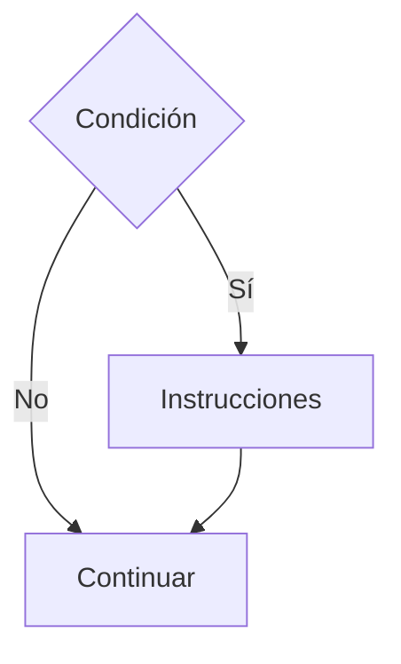
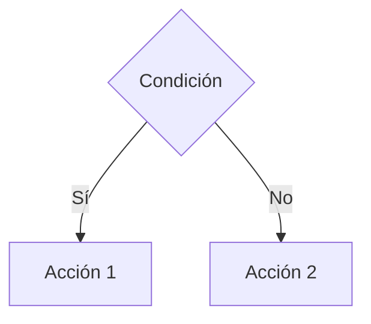
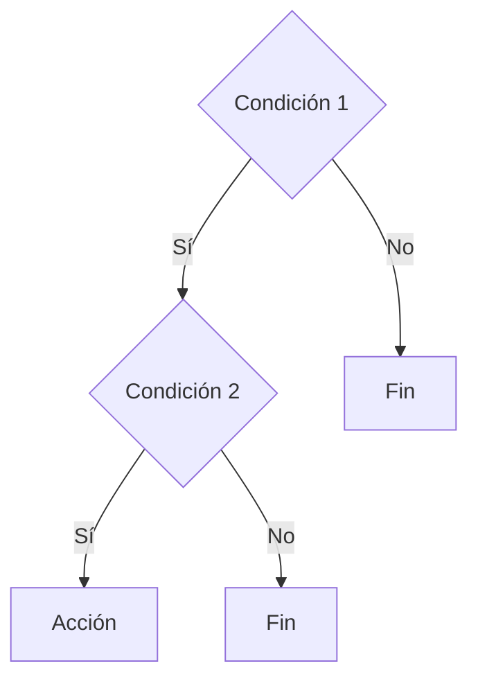
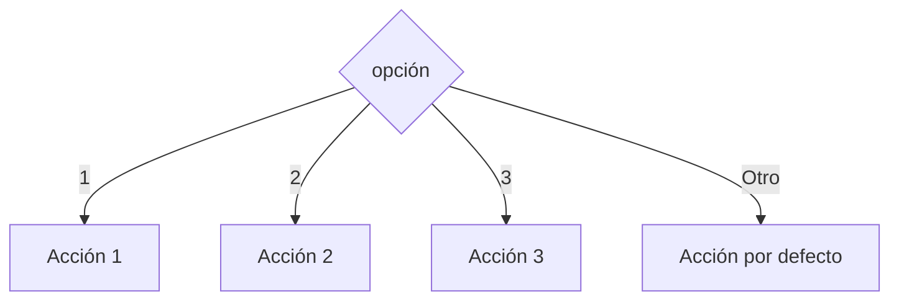

# Estructuras Condicionales

## ¿Qué es una estructura condicional?

Una **estructura condicional** permite tomar decisiones dentro de un algoritmo o programa.

Su funcionamiento se basa en la evaluación de una condición. Dependiendo del resultado obtenido, se ejecutarán determinadas instrucciones.

---

# Importancia

Las estructuras condicionales permiten:

* Tomar decisiones.
* Ejecutar acciones específicas.
* Resolver problemas con múltiples escenarios.
* Adaptar el comportamiento de un programa.

Sin ellas, todos los programas seguirían siempre el mismo flujo de ejecución.

---

# Concepto de condición

Una condición es una expresión que puede producir dos resultados:

| Resultado | Significado                |
| --------- | -------------------------- |
| Verdadero | La condición se cumple.    |
| Falso     | La condición no se cumple. |

### Ejemplos

```text
edad >= 18
nota >= 51
saldo > 0
```

---

# Operadores utilizados

Las condiciones suelen construirse mediante operadores relacionales.

| Operador | Significado       |
| -------- | ----------------- |
| ==       | Igual que         |
| !=       | Distinto que      |
| >        | Mayor que         |
| <        | Menor que         |
| >=       | Mayor o igual que |
| <=       | Menor o igual que |

---

# Clasificación

Las estructuras condicionales más utilizadas son:

| Tipo       | Descripción                                           |
| ---------- | ----------------------------------------------------- |
| If simple  | Ejecuta acciones cuando la condición es verdadera.    |
| If - Else  | Permite elegir entre dos caminos.                     |
| If anidado | Contiene condicionales dentro de otros condicionales. |
| Switch     | Permite seleccionar entre múltiples opciones.         |

---

# 1. If Simple

Ejecuta instrucciones únicamente cuando la condición es verdadera.

### Pseudocódigo

```text
Si condición Entonces

    Instrucciones

Fin Si
```

### Diagrama de flujo



### Ejemplo

```text
Si edad >= 18 Entonces

    Mostrar "Mayor de edad"

Fin Si
```

---

# 2. If - Else

Permite ejecutar un bloque cuando la condición es verdadera y otro cuando es falsa.

### Pseudocódigo

```text
Si condición Entonces

    Instrucciones 1

Sino

    Instrucciones 2

Fin Si
```

### Diagrama de flujo



### Ejemplo

```text
Si nota >= 51 Entonces

    Mostrar "Aprobado"

Sino

    Mostrar "Reprobado"

Fin Si
```

---

# 3. If Anidado

Permite colocar estructuras condicionales dentro de otras estructuras condicionales.

### Pseudocódigo

```text
Si condición1 Entonces

    Si condición2 Entonces

        Instrucciones

    Fin Si

Fin Si
```

### Diagrama de flujo



### Ejemplo

```text
Si edad >= 18 Entonces

    Si tieneLicencia Entonces

        Mostrar "Puede conducir"

    Fin Si

Fin Si
```

---

# 4. Switch

Permite seleccionar una acción entre varias alternativas.

### Pseudocódigo

```text
Segun opcion Hacer

    Caso 1:
        Acción 1

    Caso 2:
        Acción 2

    Otro Caso:
        Acción por defecto

Fin Segun
```

### Diagrama de flujo



### Ejemplo

```text
Segun dia Hacer

    Caso 1:
        Mostrar "Lunes"

    Caso 2:
        Mostrar "Martes"

Fin Segun
```

---

# Relación con C++

Las estructuras condicionales se implementan mediante:

| Estructura | Palabra clave   |
| ---------- | --------------- |
| If simple  | if              |
| If - Else  | if / else       |
| If anidado | if dentro de if |
| Switch     | switch          |

---

# Aplicaciones

Las estructuras condicionales se utilizan en:

* Validación de datos.
* Sistemas de acceso.
* Cálculo de descuentos.
* Menús interactivos.
* Videojuegos.
* Sistemas bancarios.

---

# Ventajas

| Ventaja       | Descripción                                   |
| ------------- | --------------------------------------------- |
| Flexibilidad  | Permite diferentes caminos de ejecución.      |
| Adaptabilidad | El programa responde a distintas situaciones. |
| Organización  | Facilita la toma de decisiones.               |
| Escalabilidad | Permite resolver problemas complejos.         |

---

# Errores comunes

| Error                            | Descripción                                |
| -------------------------------- | ------------------------------------------ |
| Utilizar condiciones incorrectas | Produce resultados erróneos.               |
| Confundir = con ==               | Asignación y comparación son diferentes.   |
| Anidar demasiadas condiciones    | Reduce la legibilidad.                     |
| Omitir casos posibles            | Puede generar comportamientos inesperados. |

---

# Información complementaria

Para comprender los operadores utilizados en las condiciones consulte:

* [Operadores básicos](../Tema02_Datos/3-operadores_basicos.md)

Para conocer la representación gráfica de estas estructuras consulte:

* [Diagramas de flujo](../Tema04_resolucion_problemas/3-diagramas_flujo.md)

---

# Conclusión

Las estructuras condicionales permiten tomar decisiones dentro de un algoritmo o programa. Constituyen una herramienta fundamental para adaptar el comportamiento de una solución según distintas situaciones y necesidades.

---

# Resumen

| Concepto    | Idea principal                                   |
| ----------- | ------------------------------------------------ |
| Condición   | Expresión que puede ser verdadera o falsa.       |
| If simple   | Ejecuta acciones cuando se cumple una condición. |
| If - Else   | Permite elegir entre dos caminos.                |
| If anidado  | Permite decisiones más complejas.                |
| Switch      | Permite seleccionar entre múltiples opciones.    |
| Importancia | Base para la toma de decisiones.                 |
