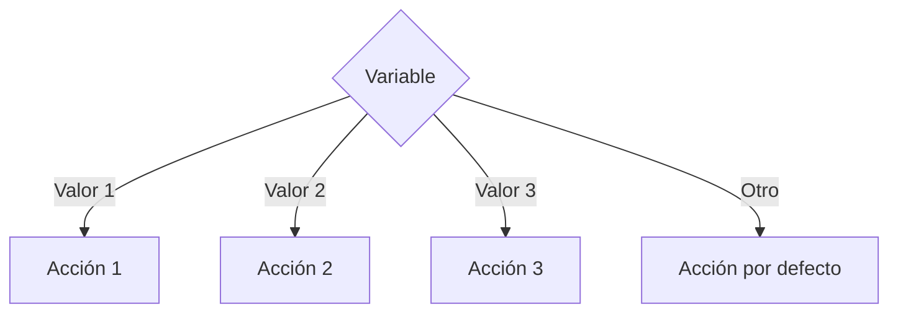

# Switch

## ¿Qué es Switch?

La estructura **Switch** permite seleccionar una acción entre múltiples alternativas a partir del valor de una expresión.

Es una alternativa más organizada y legible que utilizar múltiples estructuras `if else` cuando se evalúa una misma variable.

---

# Importancia

La estructura Switch permite:

* Simplificar decisiones múltiples.
* Mejorar la legibilidad del código.
* Facilitar la construcción de menús.
* Reducir el uso excesivo de if anidados.

---

# Funcionamiento

El proceso sigue la siguiente lógica:

1. Evaluar una expresión.
2. Comparar el resultado con diferentes casos.
3. Ejecutar las instrucciones del caso coincidente.
4. Si ningún caso coincide, ejecutar el caso por defecto (opcional).

---

# Estructura general

## Pseudocódigo

```text
Segun variable Hacer

    Caso valor_1:
        Instrucciones

    Caso valor_2:
        Instrucciones

    Caso valor_3:
        Instrucciones

    Otro Caso:
        Instrucciones

Fin Segun
```

---

# Diagrama de flujo



---

# Ejemplo conceptual

## Problema

Mostrar el día de la semana según un número.

### Pseudocódigo

```text
Inicio

    Leer dia

    Segun dia Hacer

        Caso 1:
            Mostrar "Lunes"

        Caso 2:
            Mostrar "Martes"

        Caso 3:
            Mostrar "Miércoles"

        Otro Caso:
            Mostrar "Día inválido"

    Fin Segun

Fin
```

---

# Prueba de escritorio

## Caso 1

```text
dia = 2
```

| Paso                | Resultado        |
| ------------------- | ---------------- |
| Evaluar dia         | 2                |
| Coincide con Caso 2 | Sí               |
| Acción              | Mostrar "Martes" |

### Resultado

```text
Martes
```

---

## Caso 2

```text
dia = 8
```

| Paso                    | Resultado        |
| ----------------------- | ---------------- |
| Evaluar dia             | 8                |
| Coincide con algún caso | No               |
| Acción                  | Caso por defecto |

### Resultado

```text
Día inválido
```

---

# Implementación en C++

## Sintaxis

```cpp
switch (variable) {

    case valor_1:
        instrucciones;
        break;

    case valor_2:
        instrucciones;
        break;

    default:
        instrucciones;
}
```

---

# Ejemplo

```cpp
#include <iostream>

using namespace std;

int main() {

    int dia;

    cout << "Ingrese un numero: ";
    cin >> dia;

    switch (dia) {

        case 1:
            cout << "Lunes" << endl;
            break;

        case 2:
            cout << "Martes" << endl;
            break;

        case 3:
            cout << "Miercoles" << endl;
            break;

        default:
            cout << "Dia invalido" << endl;
    }

    return 0;
}
```

---

# La instrucción break

La instrucción `break` finaliza la ejecución del caso actual.

### Ejemplo

```cpp
case 1:
    cout << "Lunes";
    break;
```

Sin `break`, la ejecución continúa con el siguiente caso.

---

# Ejemplo sin break

```cpp
switch (opcion) {

    case 1:
        cout << "Uno";

    case 2:
        cout << "Dos";
}
```

### Entrada

```text
1
```

### Salida

```text
Uno
Dos
```

Esto ocurre porque la ejecución continúa hacia el siguiente caso.

---

# Caso default

El bloque `default` se ejecuta cuando ningún caso coincide.

### Ejemplo

```cpp
default:
    cout << "Opcion invalida";
```

Su uso es recomendado para controlar situaciones inesperadas.

---

# Comparación con If Else

| Característica                     | If Else       | Switch      |
| ---------------------------------- | ------------- | ----------- |
| Dos alternativas                   | Excelente     | Posible     |
| Muchas alternativas                | Menos legible | Más legible |
| Comparaciones complejas            | Sí            | No          |
| Comparación de valores específicos | Sí            | Excelente   |

---

# Cuándo utilizar Switch

Se recomienda cuando:

* Existen muchas opciones posibles.
* Se evalúa una misma variable.
* Se construyen menús.
* Se seleccionan acciones según valores concretos.

### Ejemplos

* Menús de sistemas.
* Selección de operaciones.
* Días de la semana.
* Meses del año.
* Calculadoras.

---

# Ventajas

| Ventaja       | Descripción                         |
| ------------- | ----------------------------------- |
| Legibilidad   | Facilita la comprensión del código. |
| Organización  | Agrupa múltiples alternativas.      |
| Mantenimiento | Simplifica futuras modificaciones.  |
| Claridad      | Reduce cadenas largas de if else.   |

---

# Limitaciones

| Limitación                        | Descripción |
| --------------------------------- | ----------- |
| Solo compara valores específicos. |             |
| No permite condiciones complejas. |             |
| Menos flexible que if else.       |             |

---

# Errores comunes

| Error                          | Descripción                     |
| ------------------------------ | ------------------------------- |
| Olvidar break                  | Ejecuta casos no deseados.      |
| Omitir default                 | Reduce el control de errores.   |
| Utilizar condiciones complejas | No es el propósito de Switch.   |
| Duplicar valores de casos      | Produce errores de compilación. |

---

# Información complementaria

Para comprender las estructuras condicionales relacionadas consulte:

* [If Simple](../condicionales/1-if_simple.md)
* [If Else](../condicionales/2-if_else.md)
* [If Anidado](../condicionales/3-if_anidado.md)

Para conocer la teoría general consulte:

* [Condicionales](../3-condicionales.md)

---

# Conclusión

La estructura Switch permite seleccionar una acción entre múltiples alternativas de forma clara y organizada. Es especialmente útil cuando se trabaja con menús o con valores discretos que requieren diferentes comportamientos.

---

# Resumen

| Concepto          | Idea principal                             |
| ----------------- | ------------------------------------------ |
| Switch            | Selección múltiple basada en una variable. |
| Case              | Representa una alternativa posible.        |
| Break             | Finaliza la ejecución del caso actual.     |
| Default           | Se ejecuta cuando no existe coincidencia.  |
| Ventaja principal | Mayor claridad en decisiones múltiples.    |
