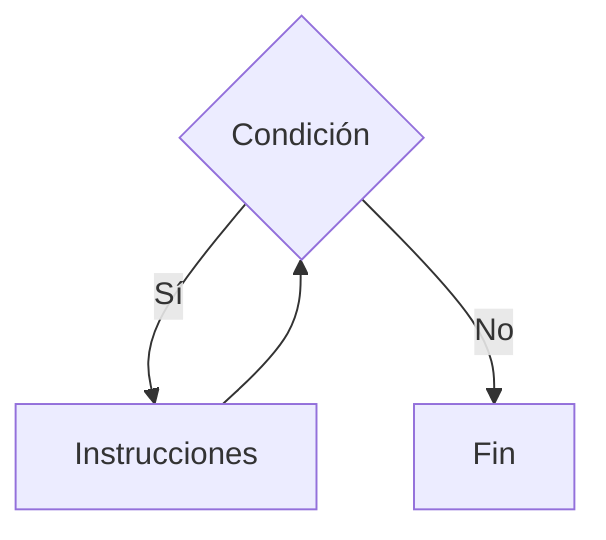
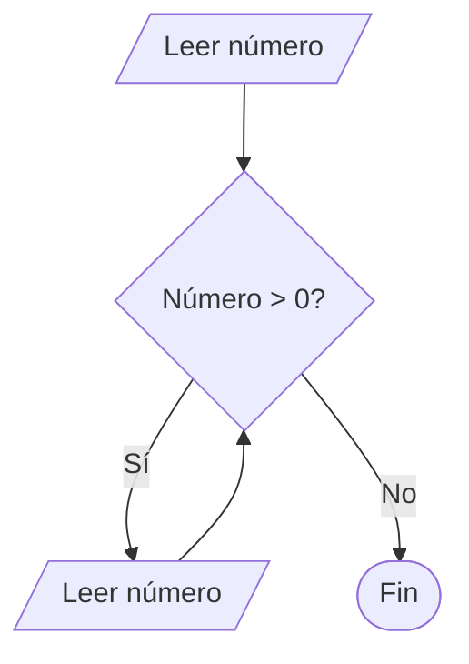

# While

## ¿Qué es While?

La estructura **While** es un ciclo que ejecuta un conjunto de instrucciones mientras una condición sea verdadera.

La condición se evalúa antes de cada iteración.

Si la condición es falsa desde el inicio, el ciclo no se ejecuta ninguna vez.

---

# Importancia

El ciclo While permite:

* Repetir procesos desconocidos.
* Validar datos.
* Construir menús.
* Automatizar tareas repetitivas.
* Controlar iteraciones mediante condiciones.

---

# Funcionamiento

El proceso sigue la siguiente lógica:

1. Evaluar una condición.
2. Si es verdadera, ejecutar las instrucciones.
3. Actualizar los datos necesarios.
4. Volver a evaluar la condición.
5. Repetir hasta que la condición sea falsa.

---

# Estructura general

## Pseudocódigo

```text
Mientras condición Hacer

    Instrucciones

Fin Mientras
```

---

# Diagrama de flujo



---

# Componentes de While

| Elemento       | Función                         |
| -------------- | ------------------------------- |
| Inicialización | Valor inicial de control.       |
| Condición      | Determina si continúa el ciclo. |
| Actualización  | Modifica el valor de control.   |
| Cuerpo         | Instrucciones repetidas.        |

---

# Ejemplo conceptual

## Problema

Mostrar los números del 1 al 5.

### Pseudocódigo

```text
Inicio

    contador ← 1

    Mientras contador <= 5 Hacer

        Mostrar contador

        contador ← contador + 1

    Fin Mientras

Fin
```

---

# Prueba de escritorio

| Iteración | contador | Salida         |
| --------- | -------- | -------------- |
| Inicial   | 1        | -              |
| 1         | 1        | 1              |
| 2         | 2        | 2              |
| 3         | 3        | 3              |
| 4         | 4        | 4              |
| 5         | 5        | 5              |
| Fin       | 6        | Sale del ciclo |

---

# Implementación en C++

## Sintaxis

```cpp
while (condicion) {

    instrucciones;

}
```

---

# Ejemplo

```cpp
#include <iostream>

using namespace std;

int main() {

    int contador = 1;

    while (contador <= 5) {

        cout << contador << endl;

        contador++;

    }

    return 0;
}
```

---

# Salida

```text
1
2
3
4
5
```

---

# Ejemplo con entrada de datos

## Problema

Leer números mientras sean positivos.

### Pseudocódigo

```text
Inicio

    Leer numero

    Mientras numero > 0 Hacer

        Leer numero

    Fin Mientras

Fin
```

---

# Diagrama de flujo



---

# Uso de contadores

Un contador aumenta o disminuye de forma controlada.

### Ejemplo

```cpp
contador++;
```

Equivale a:

```cpp
contador = contador + 1;
```

---

# Uso de acumuladores

Un acumulador almacena resultados parciales.

### Ejemplo

```cpp
suma = suma + numero;
```

Se utiliza frecuentemente junto con ciclos.

---

# Aplicaciones

El ciclo While se utiliza en:

* Menús interactivos.
* Validación de datos.
* Lectura de información.
* Procesamiento de registros.
* Simulaciones.
* Juegos.

---

# Ventajas

| Ventaja       | Descripción                                   |
| ------------- | --------------------------------------------- |
| Flexibilidad  | No requiere conocer el número de iteraciones. |
| Simplicidad   | Fácil de implementar.                         |
| Adaptabilidad | Se ajusta a distintas condiciones.            |

---

# Limitaciones

| Limitación                                                                      | Descripción |
| ------------------------------------------------------------------------------- | ----------- |
| Puede generar ciclos infinitos.                                                 |             |
| Requiere actualizar correctamente las variables de control.                     |             |
| Puede ser menos conveniente que For cuando se conoce el número de repeticiones. |             |

---

# Ciclo infinito

Un ciclo infinito ocurre cuando la condición nunca se vuelve falsa.

### Ejemplo

```cpp
while (true) {

    cout << "Hola";

}
```

Este ciclo nunca termina.

---

# Errores comunes

| Error                        | Descripción                     |
| ---------------------------- | ------------------------------- |
| Olvidar actualizar variables | Produce ciclos infinitos.       |
| Condición incorrecta         | Resultados inesperados.         |
| Inicialización incorrecta    | El ciclo puede no ejecutarse.   |
| Confundir = con ==           | Error frecuente en condiciones. |

---

# Información complementaria

Para comprender los operadores utilizados en las condiciones consulte:

* [Operadores básicos](../../Tema02_Datos/3-operadores_basicos.md)

Para conocer la teoría general de ciclos consulte:

* [Estructuras repetitivas](../4-repetitivas.md)

---

# Conclusión

El ciclo While permite repetir instrucciones mientras una condición sea verdadera. Es una herramienta fundamental para resolver problemas donde no se conoce de antemano la cantidad exacta de repeticiones necesarias.

---

# Resumen

| Concepto         | Idea principal                              |
| ---------------- | ------------------------------------------- |
| While            | Repite mientras la condición sea verdadera. |
| Evaluación       | Se realiza antes de cada iteración.         |
| Contador         | Controla las repeticiones.                  |
| Acumulador       | Almacena resultados parciales.              |
| Riesgo principal | Ciclos infinitos.                           |
| Aplicación       | Procesos con repeticiones desconocidas.     |
