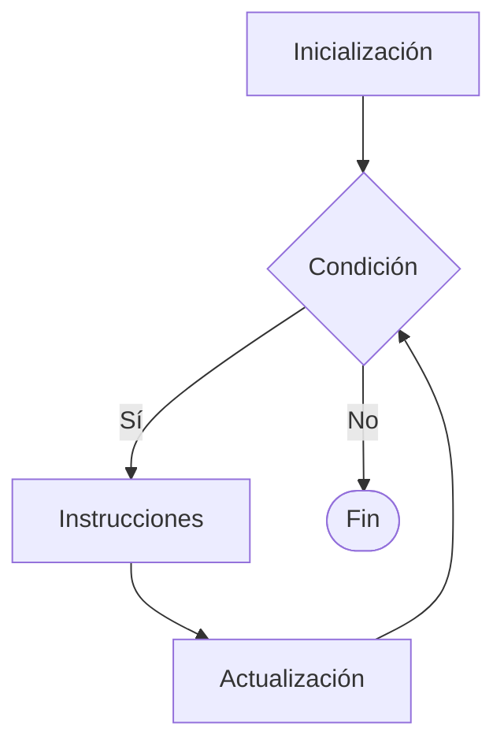

# For

## ¿Qué es For?

La estructura **For** es un ciclo repetitivo que permite ejecutar un conjunto de instrucciones una cantidad determinada de veces.

Se utiliza principalmente cuando se conoce de antemano el número de repeticiones que debe realizar el ciclo.

---

# Importancia

El ciclo For permite:

* Controlar repeticiones mediante un contador.
* Reducir código repetitivo.
* Recorrer secuencias de datos.
* Automatizar procesos iterativos.

Es uno de los ciclos más utilizados en programación.

---

# Funcionamiento

El proceso sigue la siguiente lógica:

1. Inicializar una variable de control.
2. Evaluar una condición.
3. Ejecutar las instrucciones.
4. Actualizar la variable de control.
5. Repetir hasta que la condición sea falsa.

---

# Componentes

| Componente     | Función                                 |
| -------------- | --------------------------------------- |
| Inicialización | Define el valor inicial del contador.   |
| Condición      | Determina si el ciclo continúa.         |
| Actualización  | Modifica el contador en cada iteración. |
| Cuerpo         | Instrucciones que se repiten.           |

---

# Estructura general

## Pseudocódigo

```text
Para contador ← inicio Hasta fin Hacer

    Instrucciones

Fin Para
```

---

# Diagrama de flujo



---

# Ejemplo conceptual

## Problema

Mostrar los números del 1 al 5.

### Pseudocódigo

```text
Inicio

    Para i ← 1 Hasta 5 Hacer

        Mostrar i

    Fin Para

Fin
```

---

# Prueba de escritorio

| Iteración | i | Salida         |
| --------- | - | -------------- |
| 1         | 1 | 1              |
| 2         | 2 | 2              |
| 3         | 3 | 3              |
| 4         | 4 | 4              |
| 5         | 5 | 5              |
| Fin       | 6 | Sale del ciclo |

---

# Implementación en C++

## Sintaxis

```cpp
for (inicializacion; condicion; actualizacion) {

    instrucciones;

}
```

---

# Ejemplo

```cpp
#include <iostream>

using namespace std;

int main() {

    for (int i = 1; i <= 5; i++) {

        cout << i << endl;

    }

    return 0;
}
```

---

# Salida

```text
1
2
3
4
5
```

---

# Conteo descendente

El contador también puede disminuir.

### Ejemplo

```cpp
for (int i = 5; i >= 1; i--) {

    cout << i << endl;

}
```

### Salida

```text
5
4
3
2
1
```

---

# Incrementos personalizados

No es obligatorio incrementar de uno en uno.

### Ejemplo

```cpp
for (int i = 0; i <= 10; i += 2) {

    cout << i << endl;

}
```

### Salida

```text
0
2
4
6
8
10
```

---

# Uso con acumuladores

## Problema

Sumar los números del 1 al 5.

### Pseudocódigo

```text
Inicio

    suma ← 0

    Para i ← 1 Hasta 5 Hacer

        suma ← suma + i

    Fin Para

    Mostrar suma

Fin
```

### Resultado

```text
15
```

---

# Implementación en C++

```cpp
#include <iostream>

using namespace std;

int main() {

    int suma = 0;

    for (int i = 1; i <= 5; i++) {

        suma += i;

    }

    cout << suma << endl;

    return 0;
}
```

---

# Uso con tablas

El ciclo For es especialmente útil para recorrer tablas (arreglos).

### Ejemplo conceptual

```text
Para i ← 0 Hasta tamaño-1 Hacer

    Mostrar tabla[i]

Fin Para
```

> Más adelante se estudiará el uso de For con tablas y otras estructuras de datos.

---

# Comparación con While y Do While

| Característica            | While   | Do While | For         |
| ------------------------- | ------- | -------- | ----------- |
| Evalúa al inicio          | Sí      | No       | Sí          |
| Ejecuta al menos una vez  | No      | Sí       | No          |
| Control por contador      | Manual  | Manual   | Integrado   |
| Repeticiones conocidas    | Posible | Posible  | Ideal       |
| Repeticiones desconocidas | Ideal   | Ideal    | Menos común |

---

# Aplicaciones

El ciclo For se utiliza en:

* Conteos.
* Recorridos de tablas.
* Cálculos repetitivos.
* Generación de series numéricas.
* Procesamiento de datos.
* Algoritmos matemáticos.

---

# Ventajas

| Ventaja      | Descripción                                          |
| ------------ | ---------------------------------------------------- |
| Claridad     | Integra todo el control del ciclo en una sola línea. |
| Organización | Facilita la lectura del código.                      |
| Eficiencia   | Ideal para repeticiones conocidas.                   |
| Versatilidad | Permite distintos tipos de recorridos.               |

---

# Limitaciones

| Limitación                                                       | Descripción |
| ---------------------------------------------------------------- | ----------- |
| Menos conveniente cuando no se conoce el número de repeticiones. |             |
| Puede volverse complejo con múltiples condiciones.               |             |

---

# Errores comunes

| Error                                 | Descripción                         |
| ------------------------------------- | ----------------------------------- |
| Condición incorrecta                  | Puede omitir o agregar iteraciones. |
| Actualización incorrecta              | Puede producir ciclos infinitos.    |
| Confundir < con <=                    | Cambia la cantidad de repeticiones. |
| Modificar el contador incorrectamente | Produce resultados inesperados.     |

---

# Información complementaria

Para comprender la teoría general de ciclos consulte:

* [Estructuras repetitivas](../4-repetitivas.md)

Para conocer otros ciclos consulte:

* [While](../repetitivas/1-while.md)
* [Do While](../repetitivas/2-do_while.md)

---

# Conclusión

El ciclo For es una estructura repetitiva diseñada para controlar iteraciones mediante un contador. Su claridad y facilidad de uso lo convierten en una de las herramientas más importantes para resolver problemas que requieren una cantidad conocida de repeticiones.

---

# Resumen

| Concepto             | Idea principal                      |
| -------------------- | ----------------------------------- |
| For                  | Ciclo controlado por contador.      |
| Inicialización       | Define el punto de partida.         |
| Condición            | Determina la continuidad del ciclo. |
| Actualización        | Modifica el contador.               |
| Aplicación principal | Repeticiones conocidas.             |
| Ventaja principal    | Claridad y organización.            |
