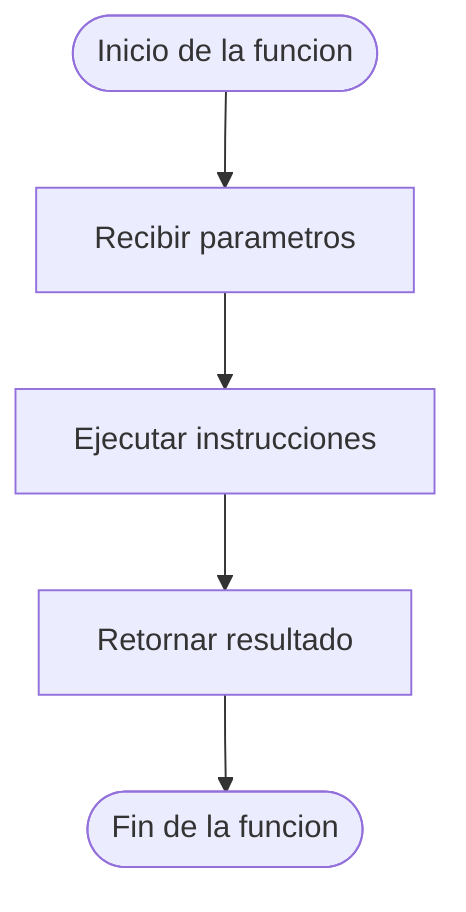

# Declaración de Funciones

## ¿Qué es la declaración de una función?

La declaración de una función es el proceso mediante el cual se define una función dentro de un programa.

Durante su declaración se establece la estructura que tendrá la función para que pueda ser utilizada posteriormente.

Una función debe ser declarada antes de ser invocada.

---

## Estructura general

```text
Funcion NombreFuncion(lista_parametros)

    instrucciones

    Retornar resultado

FinFuncion
```

---

## Partes de la declaración

### Palabra reservada `Funcion`

Indica el inicio de la definición de una función.

```text
Funcion
```

---

### Nombre de la función

Identifica la función dentro del programa.

```text
Funcion Sumar()
```

Se recomienda utilizar nombres descriptivos que indiquen claramente la tarea que realiza la función.

#### Correcto

```text
Funcion CalcularPromedio()
```

#### Incorrecto

```text
Funcion F1()
```

---

### Lista de parámetros

Corresponde a los datos que la función puede recibir para realizar una tarea determinada.

```text
Funcion Sumar(a, b)
```

En este caso:

- `a` es un parámetro.
- `b` es un parámetro.

---

### Cuerpo de la función

Contiene las instrucciones que ejecutará la función.

```text
resultado <- a + b
```

Es la parte donde se realiza el procesamiento de los datos.

---

### Retorno

Permite devolver un resultado al programa que realizó la llamada.

```text
Retornar resultado
```

---

### Fin de la función

Indica que la definición de la función ha finalizado.

```text
FinFuncion
```

---

## Ejemplo completo

```text
Funcion Sumar(a, b)

    resultado <- a + b

    Retornar resultado

FinFuncion
```

### Funcionamiento

Si:

```text
a = 6
b = 8
```

Entonces:

```text
resultado <- 6 + 8
```

La función devolverá:

```text
14
```

---

## Diagrama de la estructura de una función

La siguiente representación muestra las etapas principales durante la ejecución de una función.



### Explicación

1. La función inicia su ejecución.
2. Recibe los parámetros necesarios.
3. Ejecuta las instrucciones definidas en su cuerpo.
4. Devuelve un resultado mediante la instrucción `Retornar`.
5. Finaliza su ejecución.

---

## Resumen

La declaración de una función consiste en definir su estructura mediante un nombre, parámetros, instrucciones y una instrucción de retorno.

Una vez declarada, la función podrá ser utilizada desde otras partes del programa mediante una llamada.
