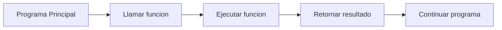

# Llamada de Funciones

## ¿Qué es una llamada a función?

Una llamada es el proceso mediante el cual se ejecuta una función previamente declarada.

Cuando una función es llamada:

1. El control de ejecución se transfiere a la función.
2. Se ejecutan sus instrucciones.
3. Se obtiene un resultado.
4. El control regresa al punto donde fue invocada.

---

## Sintaxis general

```text
variable <- NombreFuncion(parametros)
```

---

## Componentes

### Variable receptora

Almacena el valor devuelto por la función.

```text
resultado <-
```

### Nombre de la función

Identifica qué función será ejecutada.

```text
Sumar()
```

### Parámetros

Son los valores enviados a la función.

```text
Sumar(6, 8)
```

---

## Ejemplo

### Declaración

```text
Funcion Sumar(a, b)

    resultado <- a + b

    Retornar resultado

FinFuncion
```

### Llamada

```text
r <- Sumar(6, 8)
```

### Resultado

```text
r = 14
```

---

## Diagrama de llamada a una función

Cuando una función es invocada, el control de ejecución se transfiere temporalmente a ella. Una vez finalizada su tarea, devuelve un resultado y el programa continúa su ejecución.



### Explicación

1. El programa principal realiza la llamada a la función.
2. La función recibe el control de ejecución.
3. Se ejecutan las instrucciones internas.
4. La función devuelve un resultado.
5. El programa principal continúa con la siguiente instrucción.

---

## Consideraciones

- Una función debe estar declarada antes de ser utilizada.
- Los parámetros enviados deben coincidir con los definidos en la función.
- El valor retornado puede almacenarse en una variable.
- Una misma función puede ser llamada múltiples veces.

### Ejemplo

```text
r1 <- Sumar(5, 3)
r2 <- Sumar(10, 7)
r3 <- Sumar(20, 15)
```

La función es la misma, pero se ejecuta con diferentes datos.

---

## Resumen

La llamada a una función consiste en invocar una función previamente declarada, enviarle los parámetros necesarios y recibir el valor que retorna para continuar la ejecución del programa.
