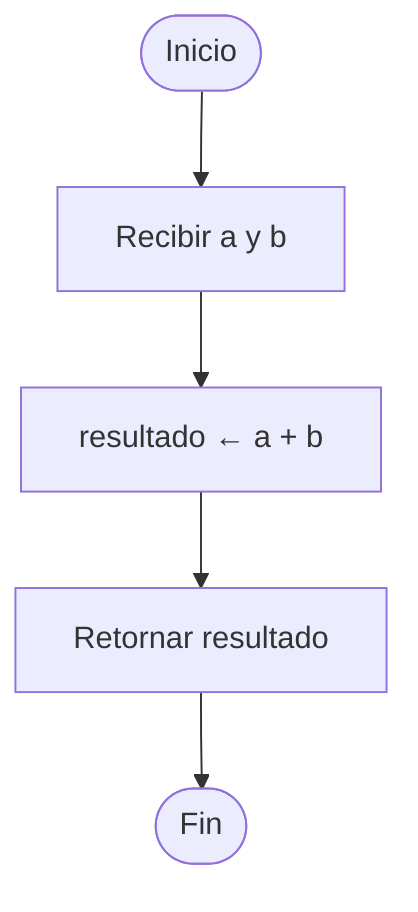
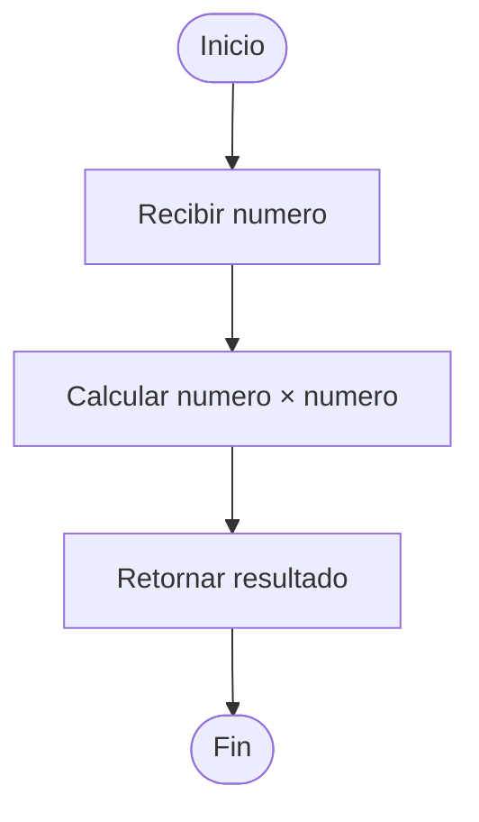
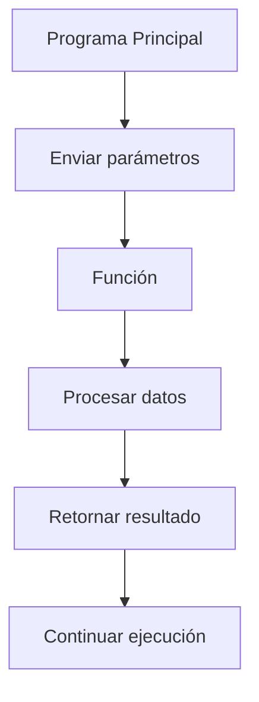

# Diagrama de Flujo de Funciones

## Introducción

Los diagramas de flujo permiten representar gráficamente la lógica de un programa.

En el caso de las funciones, ayudan a visualizar cómo se reciben datos, cómo se procesan y cómo se devuelve un resultado al programa que realizó la llamada.

---

## Función simple

La siguiente función suma dos números y devuelve el resultado.

```text
Funcion Sumar(a, b)

    resultado <- a + b

    Retornar resultado

FinFuncion
```

---

## Flujo de ejecución

Cuando una función es invocada, ocurre el siguiente proceso:

```mermaid
flowchart TD
    A[Programa Principal]
    B[Llamar Sumar(6,8)]
    C[Ejecutar instrucciones]
    D[Calcular resultado]
    E[Retornar valor]
    F[Continuar programa]

    A --> B
    B --> C
    C --> D
    D --> E
    E --> F
```

---

## Diagrama de flujo de una función

La siguiente representación muestra el flujo interno de una función.



---

## Función con parámetros

Los parámetros representan los datos que recibe la función para realizar su tarea.

### Ejemplo

```text
Funcion Cuadrado(numero)

    Retornar numero * numero

FinFuncion
```

### Diagrama



---

## Función con llamada y retorno

La ejecución completa de una función puede representarse de la siguiente manera.

```mermaid
flowchart LR
    A[Programa Principal]
    B[Llamar Sumar()]
    C[Ejecutar función]
    D[Retornar resultado]
    E[Continuar ejecución]

    A --> B
    B --> C
    C --> D
    D --> E
```

---

## Interacción entre programa principal y función



---

## Importancia de los diagramas de flujo

Los diagramas de flujo permiten:

- Comprender mejor el funcionamiento de una función.
- Visualizar el flujo de datos.
- Detectar errores de lógica.
- Facilitar el diseño de programas antes de codificarlos.

---

## Resumen

Los diagramas de flujo representan gráficamente la ejecución de una función.

Permiten visualizar la recepción de parámetros, el procesamiento de datos y el retorno del resultado, facilitando la comprensión y el diseño de programas.
