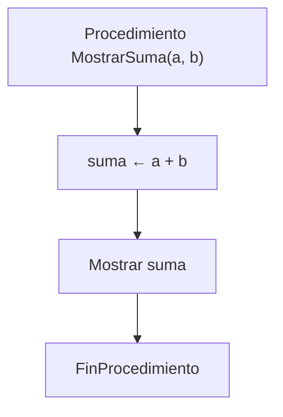

# Declaración de Procedimientos

## ¿Qué es la declaración de un procedimiento?

La declaración es la definición formal de un procedimiento dentro de un programa.

Durante su declaración se establece la estructura que tendrá el procedimiento para que pueda ser utilizado posteriormente.

Un procedimiento debe ser declarado antes de ser invocado.

---

## Estructura general

```text
Procedimiento NombreProcedimiento(lista_parametros)

    instrucciones

FinProcedimiento
```

---

## Partes de la declaración

### Palabra reservada `Procedimiento`

Indica el inicio de la definición del procedimiento.

```text
Procedimiento
```

---

### Nombre del procedimiento

Permite identificar al procedimiento dentro del programa.

```text
Procedimiento MostrarMenu()
```

Se recomienda utilizar nombres descriptivos que indiquen claramente la tarea que realiza.

#### Correcto

```text
Procedimiento MostrarMenu()
```

#### Incorrecto

```text
Procedimiento P1()
```

---

### Lista de parámetros

Corresponde a los datos que el procedimiento puede recibir para realizar una tarea determinada.

```text
Procedimiento MostrarSuma(a, b)
```

En este caso:

* `a` es un parámetro.
* `b` es un parámetro.

---

### Cuerpo del procedimiento

Contiene las instrucciones que ejecutará el procedimiento.

```text
suma <- a + b

Mostrar suma
```

Es la parte donde se realiza el procesamiento de los datos.

---

### Fin del procedimiento

Indica que la definición del procedimiento ha finalizado.

```text
FinProcedimiento
```

---

## Ejemplo 1

```text
Procedimiento Saludar()

    Mostrar "Hola Mundo"

FinProcedimiento
```

### Funcionamiento

Al ejecutarse, el procedimiento muestra un mensaje en pantalla.

### Salida

```text
Hola Mundo
```

---

## Ejemplo 2

```text
Procedimiento MostrarSuma(a, b)

    suma <- a + b

    Mostrar suma

FinProcedimiento
```

### Funcionamiento

Si:

```text
a = 6
b = 8
```

Entonces:

```text
suma <- 6 + 8
```

La salida será:

```text
14
```

---

## Diagrama de la estructura de un procedimiento

```text
┌──────────────────────────────┐
│ Procedimiento MostrarSuma()  │
├──────────────────────────────┤
│ suma <- a + b                │
│ Mostrar suma                 │
└──────────────────────────────┘
```

---

## Representación con Mermaid



---

## Resumen

La declaración de un procedimiento consiste en definir su nombre, parámetros e instrucciones dentro de un bloque independiente.

Una vez declarado, el procedimiento podrá ser invocado desde otras partes del programa para ejecutar una tarea específica.

La correcta declaración de procedimientos favorece la modularidad, reutilización y organización del código.
