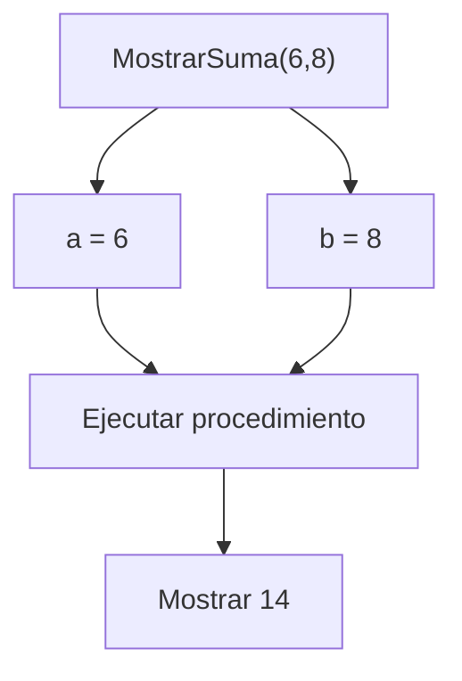

# Parámetros de Procedimientos

## ¿Qué son los parámetros?

Los parámetros son datos que se envían a un procedimiento para que pueda realizar una tarea determinada.

Permiten que un mismo procedimiento trabaje con diferentes valores sin necesidad de modificar su código.

Los parámetros se definen en la cabecera del procedimiento y reciben valores cuando el procedimiento es invocado.

---

## Importancia de los parámetros

Los parámetros permiten:

* Reutilizar procedimientos.
* Evitar la repetición de código.
* Trabajar con datos diferentes.
* Hacer los programas más flexibles.

Sin parámetros, sería necesario crear procedimientos distintos para cada situación.

---

## Sintaxis general

```text
Procedimiento NombreProcedimiento(parametro1, parametro2, ...)

    instrucciones

FinProcedimiento
```

---

## Ejemplo básico

```text
Procedimiento Saludar(nombre)

    Mostrar "Hola ", nombre

FinProcedimiento
```

En este ejemplo:

* `nombre` es un parámetro.
* El procedimiento utilizará el valor recibido para mostrar un mensaje.

---

## Llamada al procedimiento

```text
Saludar("Juan")
```

### Salida

```text
Hola Juan
```

---

## Parámetro único

Un procedimiento puede recibir un solo parámetro.

### Ejemplo

```text
Procedimiento MostrarEdad(edad)

    Mostrar edad

FinProcedimiento
```

### Llamada

```text
MostrarEdad(20)
```

### Salida

```text
20
```

---

## Múltiples parámetros

Un procedimiento puede recibir varios parámetros.

### Ejemplo

```text
Procedimiento MostrarSuma(a, b)

    suma <- a + b

    Mostrar suma

FinProcedimiento
```

### Llamada

```text
MostrarSuma(6, 8)
```

### Salida

```text
14
```

---

## Correspondencia de parámetros

Al invocar un procedimiento, los valores enviados deben coincidir con la cantidad y el orden de los parámetros definidos.

### Procedimiento

```text
Procedimiento MostrarDatos(nombre, edad)

    Mostrar nombre
    Mostrar edad

FinProcedimiento
```

### Llamada correcta

```text
MostrarDatos("Ana", 20)
```

### Resultado

```text
Ana
20
```

### Llamada incorrecta

```text
MostrarDatos(20, "Ana")
```

Los datos llegarán en posiciones incorrectas.

---

## Flujo de los parámetros



---

## Ventajas de utilizar parámetros

* Permiten reutilizar procedimientos.
* Facilitan el mantenimiento del código.
* Reducen la duplicación de instrucciones.
* Mejoran la modularidad de los programas.
* Hacen los procedimientos más flexibles.

---

## Resumen

Los parámetros son datos que recibe un procedimiento para realizar una tarea específica.

Se definen en la cabecera del procedimiento y reciben valores durante la llamada.

Gracias a los parámetros, un mismo procedimiento puede trabajar con diferentes datos sin necesidad de modificar su estructura.
