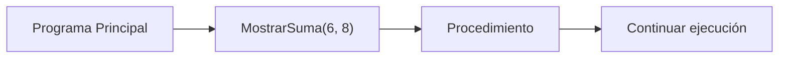
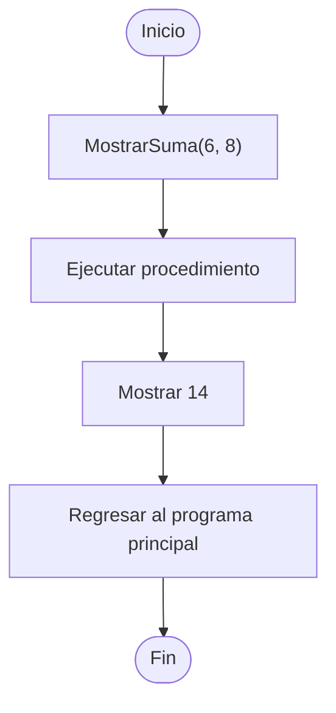

# Llamada de Procedimientos

## ¿Qué es una llamada a procedimiento?

Una llamada es el proceso mediante el cual se ejecuta un procedimiento previamente declarado.

Cuando un procedimiento es llamado:

1. El control de ejecución se transfiere al procedimiento.
2. Se ejecutan sus instrucciones.
3. Finalizada la tarea, el control regresa al punto desde donde fue invocado.

A diferencia de las funciones, los procedimientos generalmente no devuelven un valor para ser almacenado en una variable.

---

## Sintaxis general

```text
NombreProcedimiento(parametros)
```

---

## Componentes

### Nombre del procedimiento

Indica qué procedimiento será ejecutado.

```text
MostrarMenu()
```

---

### Parámetros

Son los datos enviados al procedimiento.

```text
MostrarSuma(6, 8)
```

---

## Ejemplo 1

### Declaración

```text
Procedimiento Saludar()

    Mostrar "Hola Mundo"

FinProcedimiento
```

### Llamada

```text
Saludar()
```

### Salida

```text
Hola Mundo
```

---

## Ejemplo 2

### Declaración

```text
Procedimiento MostrarSuma(a, b)

    suma <- a + b

    Mostrar suma

FinProcedimiento
```

### Llamada

```text
MostrarSuma(6, 8)
```

### Salida

```text
14
```

---

## Flujo de ejecución

```text
Programa Principal
        │
        ▼
MostrarSuma(6, 8)
        │
        ▼
 suma <- 6 + 8
        │
        ▼
 Mostrar 14
        │
        ▼
 Retornar control
        │
        ▼
 Continuar ejecución
```

---

## Transferencia de control



---

## Diagrama de flujo



---

## Consideraciones

* El procedimiento debe estar declarado antes de ser utilizado.
* Los parámetros enviados deben coincidir con los definidos.
* Un procedimiento puede ser llamado varias veces.
* Después de finalizar su ejecución, el control regresa al programa principal.

### Ejemplo

```text
Saludar()
Saludar()
Saludar()
```

El mismo procedimiento puede reutilizarse tantas veces como sea necesario.

---

## Resumen

La llamada a un procedimiento consiste en invocar un procedimiento previamente declarado para ejecutar una tarea específica.

Durante la llamada, el control de ejecución se transfiere temporalmente al procedimiento. Una vez finalizadas sus instrucciones, el control regresa al programa principal para continuar con la ejecución normal.

La llamada de procedimientos es un elemento fundamental de la programación modular porque permite reutilizar tareas sin duplicar código.
