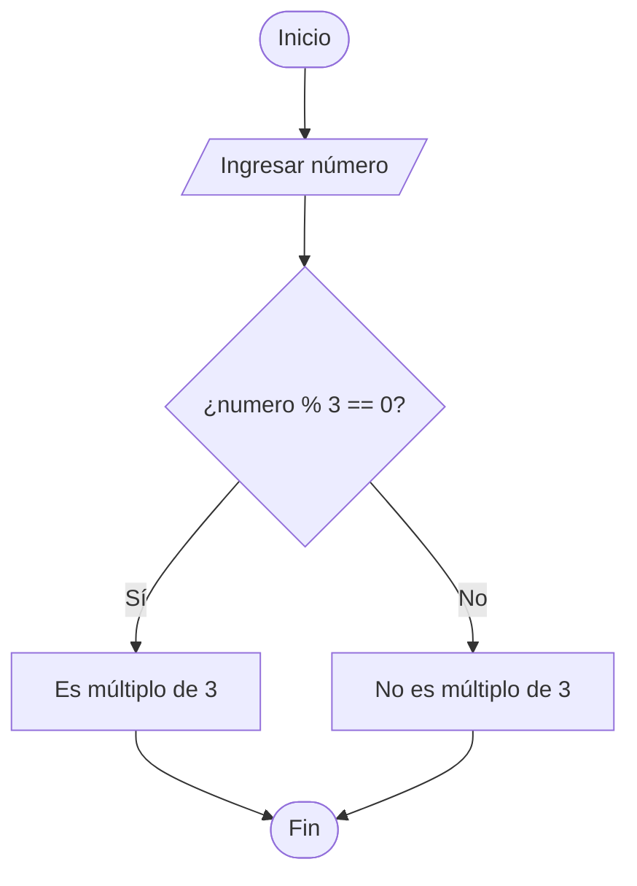

# Ejercicio 01 - Verificar si un Número es Múltiplo de 3

## Enunciado

Construir un algoritmo que permita leer un número entero y verificar si es múltiplo de 3.

---

# Análisis del Problema

## Entradas

| Dato   | Tipo |
| ------ | ---- |
| numero | int  |

---

## Proceso

1. Leer un número entero.
2. Calcular el residuo de dividir el número entre 3.
3. Verificar si el residuo es igual a 0.
4. Mostrar el resultado correspondiente.

---

## Salidas

| Salida                                     |
| ------------------------------------------ |
| Indicar si el número es múltiplo de 3 o no |

---

# Diseño de la Solución

## Secuencia Lógica

1. Inicio.
2. Solicitar un número entero.
3. Leer el número ingresado.
4. Evaluar la condición: numero % 3 == 0.
5. Si la condición es verdadera, mostrar que el número es múltiplo de 3.
6. Si la condición es falsa, mostrar que el número no es múltiplo de 3.
7. Fin.

---

## Variables Utilizadas

| Variable | Tipo | Descripción                     |
| -------- | ---- | ------------------------------- |
| numero   | int  | Número ingresado por el usuario |

---

## Operadores Utilizados

| Operador | Tipo       | Uso                |
| -------- | ---------- | ------------------ |
| %        | Aritmético | Obtener el residuo |
| ==       | Relacional | Comparar igualdad  |

---

## Estructura Utilizada

```text
Condicional (if - else)
```

---

# Pseudocódigo

```text
INICIO

    Definir numero Como Entero

    Escribir "Ingrese un número:"
    Leer numero

    Si numero % 3 == 0 Entonces

        Escribir "El número es múltiplo de 3"

    Sino

        Escribir "El número no es múltiplo de 3"

    FinSi

FIN
```

---

# Diagrama de Flujo



---

# Prueba de Escritorio

| numero | numero % 3 | Resultado           |
| ------ | ---------- | ------------------- |
| 3      | 0          | Es múltiplo de 3    |
| 6      | 0          | Es múltiplo de 3    |
| 10     | 1          | No es múltiplo de 3 |
| 14     | 2          | No es múltiplo de 3 |

---

# Implementación en C++

```cpp
#include <iostream>

using namespace std;

int main() {

    int numero;

    cout << "Ingrese un numero: ";
    cin >> numero;

    if (numero % 3 == 0) {

        cout << "El numero es multiplo de 3" << endl;

    } else {

        cout << "El numero no es multiplo de 3" << endl;

    }

    return 0;
}
```

---

# Ejemplo de Ejecución

```text
Ingrese un numero: 12

El numero es multiplo de 3
```

---

# Observaciones

* El operador `%` devuelve el residuo de una división entera.
* Un número es múltiplo de 3 cuando el residuo de dividirlo entre 3 es igual a 0.
* La solución utiliza una estructura condicional para tomar una decisión.

---

# Temas Relacionados

* Variables y Tipos de Datos
* Operadores Básicos
* Condicionales
* Pseudocódigo
* Diagramas de Flujo
* Pruebas de Escritorio
