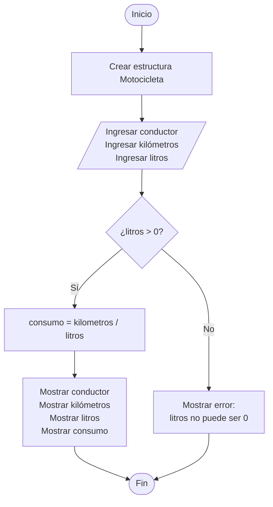

# Ejercicio 02 - Consumo de una Motocicleta

## Enunciado

Registrar los datos de una motocicleta (construir una estructura):

* Nombre del conductor.
* Kilómetros recorridos.
* Litros consumidos.

Mostrar el consumo de la motocicleta.

---

# Análisis del Problema

## Entradas

| Dato       | Tipo   |
| ---------- | ------ |
| conductor  | string |
| kilometros | double |
| litros     | double |

---

## Proceso

1. Registrar los datos de la motocicleta.
2. Verificar que los litros consumidos sean mayores que cero.
3. Calcular el consumo de combustible.
4. Mostrar los resultados.

---

## Salidas

| Salida                                       |
| -------------------------------------------- |
| Datos de la motocicleta                      |
| Consumo en km/L                              |
| Mensaje de error si los litros son inválidos |

---

# Diseño de la Solución

## Secuencia Lógica

1. Inicio.
2. Crear la estructura `Motocicleta`.
3. Solicitar el nombre del conductor.
4. Solicitar los kilómetros recorridos.
5. Solicitar los litros consumidos.
6. Verificar si los litros consumidos son mayores que cero.
7. Si la condición es verdadera:

   * Calcular el consumo.
   * Mostrar los datos de la motocicleta.
   * Mostrar el consumo calculado.
8. Si la condición es falsa:

   * Mostrar mensaje de error.
9. Fin.

---

## Variables Utilizadas

| Variable | Tipo        | Descripción                          |
| -------- | ----------- | ------------------------------------ |
| moto     | Motocicleta | Almacena los datos de la motocicleta |
| consumo  | double      | Consumo calculado en km/L            |

---

## Operadores Utilizados

| Operador | Tipo       | Uso                      |
| -------- | ---------- | ------------------------ |
| /        | Aritmético | Calcular consumo         |
| >        | Relacional | Verificar litros válidos |
| =        | Asignación | Almacenar valores        |

---

## Estructura Utilizada

```text
Condicional (if - else)
```

Permite validar que los litros consumidos sean mayores que cero antes de realizar la división.

---

## Estructura de Datos Utilizada

```cpp
struct Motocicleta
```

Permite agrupar los datos relacionados con una motocicleta.

---

## Fórmula Utilizada

```text
consumo = kilometros / litros
```

### Unidad de Medida

```text
km/L
```

Kilómetros recorridos por cada litro de combustible consumido.

---

# Pseudocódigo

```text
INICIO

    Estructura Motocicleta

        conductor : String
        kilometros : Double
        litros : Double

    FinEstructura

    Definir moto Como Motocicleta
    Definir consumo Como Double

    Escribir "Ingrese nombre del conductor:"
    Leer moto.conductor

    Escribir "Ingrese kilometros recorridos:"
    Leer moto.kilometros

    Escribir "Ingrese litros consumidos:"
    Leer moto.litros

    Si moto.litros > 0 Entonces

        consumo ← moto.kilometros / moto.litros

        Mostrar "Conductor: ", moto.conductor
        Mostrar "Kilometros: ", moto.kilometros
        Mostrar "Litros: ", moto.litros
        Mostrar "Consumo: ", consumo, " km/L"

    Sino

        Mostrar "Error: litros no puede ser 0"

    FinSi

FIN
```

---

# Diagrama de Flujo



---

# Prueba de Escritorio

| Conductor | Kilómetros | Litros | Fórmula  | Consumo               |
| --------- | ---------- | ------ | -------- | --------------------- |
| Carlos    | 240        | 12     | 240 / 12 | 20 km/L               |
| María     | 180        | 6      | 180 / 6  | 30 km/L               |
| José      | 100        | 0      | Error    | Litros no puede ser 0 |

---

# Implementación en C++

```cpp
#include <iostream>
#include <string>

using namespace std;

struct Motocicleta {

    string conductor;
    double kilometros;
    double litros;

};

int main() {

    Motocicleta moto;
    double consumo;

    cout << "Ingrese nombre del conductor: ";
    getline(cin, moto.conductor);

    cout << "Ingrese kilometros recorridos: ";
    cin >> moto.kilometros;

    cout << "Ingrese litros consumidos: ";
    cin >> moto.litros;

    if (moto.litros > 0) {

        consumo = moto.kilometros / moto.litros;

        cout << "\nConductor: "
             << moto.conductor << endl;

        cout << "Kilometros: "
             << moto.kilometros << endl;

        cout << "Litros: "
             << moto.litros << endl;

        cout << "Consumo: "
             << consumo << " km/L" << endl;

    } else {

        cout << "Error: litros no puede ser 0"
             << endl;

    }

    return 0;
}
```

---

# Ejemplo de Ejecución

```text
Ingrese nombre del conductor: Carlos

Ingrese kilometros recorridos: 240

Ingrese litros consumidos: 12

Conductor: Carlos
Kilometros: 240
Litros: 12
Consumo: 20 km/L
```

---

# Observaciones

* El ejercicio introduce el uso de estructuras (`struct`).
* Se utiliza una validación para evitar divisiones entre cero.
* El consumo se expresa en kilómetros por litro (km/L).
* La solución utiliza una estructura condicional para validar los datos antes del cálculo.

---

# Temas Relacionados

* Variables y Tipos de Datos
* Operadores Aritméticos
* Operadores Relacionales
* Estructuras (`struct`)
* Condicionales
* Diagramas de Flujo
* Pruebas de Escritorio
