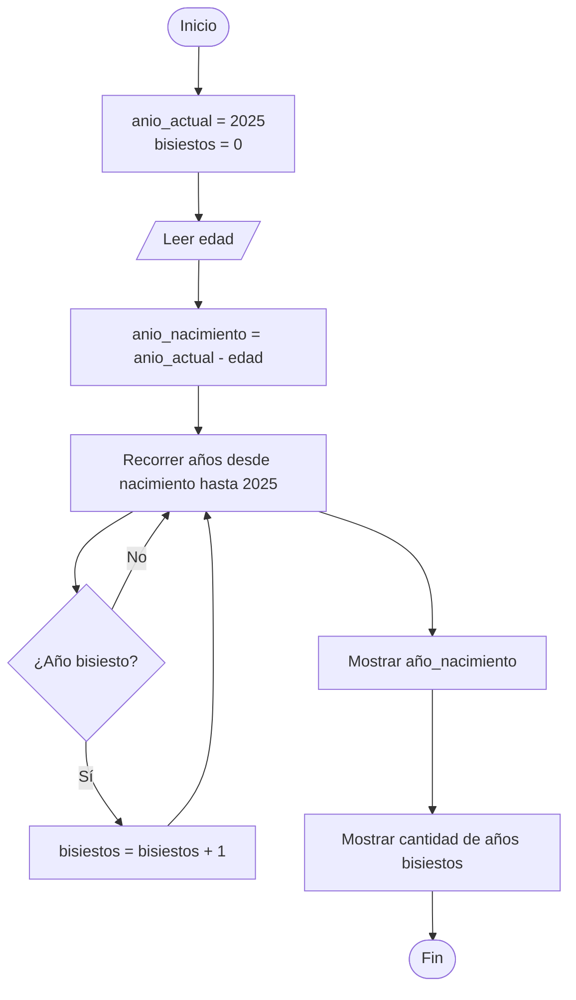

# Ejercicio 03 - Año de Nacimiento y Cantidad de Años Bisiestos

## Enunciado

Solicitar la edad del usuario y calcular su año de nacimiento (considerando el año actual 2025).

Luego, estimar cuántos años bisiestos han ocurrido desde su nacimiento hasta 2025.

---

# Análisis del Problema

## Entradas

| Dato | Tipo |
| ---- | ---- |
| edad | int  |

---

## Proceso

1. Leer la edad del usuario.
2. Calcular el año de nacimiento.
3. Inicializar un contador de años bisiestos.
4. Recorrer los años desde el año de nacimiento hasta 2025.
5. Verificar si cada año es bisiesto.
6. Incrementar el contador cuando corresponda.
7. Mostrar los resultados.

### Fórmula de Año de Nacimiento

```text
anio_nacimiento = anio_actual - edad
```

### Regla para Año Bisiesto

Un año es bisiesto cuando:

```text
(año % 4 == 0 Y año % 100 != 0)
O
(año % 400 == 0)
```

---

## Salidas

| Salida                     |
| -------------------------- |
| Año de nacimiento          |
| Cantidad de años bisiestos |

---

# Diseño de la Solución

## Secuencia Lógica

1. Inicio.
2. Definir `anio_actual = 2025`.
3. Inicializar `bisiestos = 0`.
4. Solicitar la edad del usuario.
5. Verificar que la edad sea válida.
6. Calcular el año de nacimiento.
7. Recorrer los años desde el año de nacimiento hasta el año actual.
8. Verificar si cada año es bisiesto.
9. Si el año es bisiesto, incrementar el contador.
10. Mostrar el año de nacimiento.
11. Mostrar la cantidad de años bisiestos.
12. Fin.

---

## Variables Utilizadas

| Variable        | Tipo | Descripción                   |
| --------------- | ---- | ----------------------------- |
| edad            | int  | Edad ingresada por el usuario |
| anio_actual     | int  | Año de referencia (2025)      |
| anio_nacimiento | int  | Año calculado de nacimiento   |
| anio            | int  | Variable de control del ciclo |
| bisiestos       | int  | Contador de años bisiestos    |

---

## Operadores Utilizados

| Operador | Tipo       | Uso                        |
| -------- | ---------- | -------------------------- |
| -        | Aritmético | Calcular año de nacimiento |
| %        | Aritmético | Obtener residuo            |
| ==       | Relacional | Comparar igualdad          |
| !=       | Relacional | Comparar diferencia        |
| &&       | Lógico     | Combinar condiciones       |
| ||       | Lógico     | Combinar condiciones       |
| ++       | Incremento | Aumentar contador          |
| =        | Asignación | Asignar valores            |

---

## Estructura Utilizada

```text
Condicional (if)
```

Permite verificar si un año es bisiesto.

```text
Ciclo repetitivo (for)
```

Permite recorrer todos los años desde el nacimiento hasta 2025.

---

## Fórmulas Utilizadas

### Año de Nacimiento

```text
anio_nacimiento = 2025 - edad
```

### Año Bisiesto

```text
(año % 4 == 0 && año % 100 != 0)
||
(año % 400 == 0)
```

---

# Pseudocódigo

```text
INICIO

    Definir edad Como Entero
    Definir anio_actual Como Entero
    Definir anio_nacimiento Como Entero
    Definir bisiestos Como Entero
    Definir anio Como Entero

    anio_actual ← 2025
    bisiestos ← 0

    Escribir "Ingrese su edad:"
    Leer edad

    anio_nacimiento ← anio_actual - edad

    Para anio ← anio_nacimiento Hasta anio_actual

        Si (anio % 4 == 0 Y anio % 100 <> 0)
           O (anio % 400 == 0) Entonces

            bisiestos ← bisiestos + 1

        FinSi

    FinPara

    Mostrar "Año de nacimiento: ", anio_nacimiento

    Mostrar "Cantidad de años bisiestos: ",
            bisiestos

FIN
```

---

# Diagrama de Flujo



> Nota: En un diagrama formal, el ciclo `for` suele representarse mediante una condición de repetición y una actualización del contador.

---

# Prueba de Escritorio

| Edad | Año Actual | Año Nacimiento | Años Bisiestos |
| ---- | ---------- | -------------- | -------------- |
| 20   | 2025       | 2005           | 5              |
| 30   | 2025       | 1995           | 8              |
| 40   | 2025       | 1985           | 10             |

### Verificación del primer caso

```text
Edad = 20

Año de nacimiento = 2025 - 20

Año de nacimiento = 2005
```

Años bisiestos:

```text
2008
2012
2016
2020
2024
```

Total:

```text
5 años bisiestos
```

---

# Implementación en C++

```cpp
#include <iostream>

using namespace std;

int main() {

    int edad;
    int anio_actual;
    int anio_nacimiento;
    int bisiestos;
    int anio;

    anio_actual = 2025;
    bisiestos = 0;

    cout << "Ingrese su edad: ";
    cin >> edad;

    anio_nacimiento = anio_actual - edad;

    for (anio = anio_nacimiento;
         anio <= anio_actual;
         anio++) {

        if ((anio % 4 == 0 &&
             anio % 100 != 0) ||
             anio % 400 == 0) {

            bisiestos++;

        }

    }

    cout << "\nAño de nacimiento: "
         << anio_nacimiento << endl;

    cout << "Cantidad de años bisiestos: "
         << bisiestos << endl;

    return 0;
}
```

---

# Ejemplo de Ejecución

```text
Ingrese su edad: 20

Año de nacimiento: 2005

Cantidad de años bisiestos: 5
```

---

# Observaciones

* El ejercicio combina cálculos aritméticos con estructuras repetitivas.
* Se utiliza un contador para registrar los años bisiestos encontrados.
* Se aplica la regla completa para determinar si un año es bisiesto.
* Introduce el uso práctico de ciclos `for`.

---

# Temas Relacionados

* Variables y Tipos de Datos
* Operadores Aritméticos
* Operadores Relacionales
* Operadores Lógicos
* Condicionales (`if`)
* Ciclos (`for`)
* Contadores
* Diagramas de Flujo
* Pruebas de Escritorio
