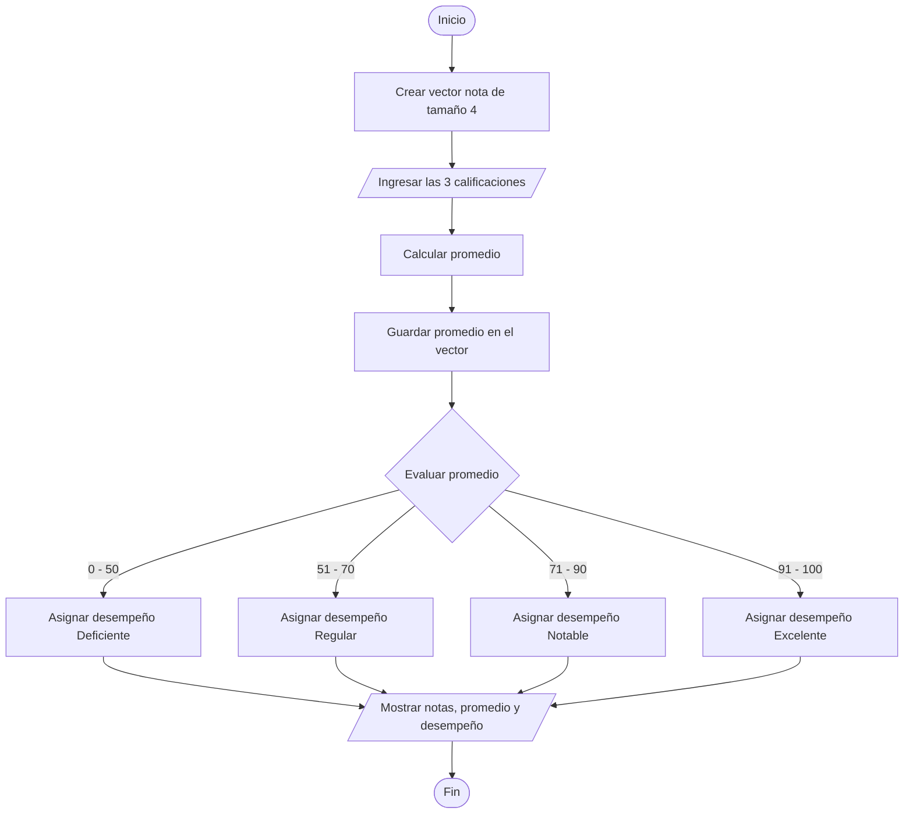

# Ejercicio 04 - Promedio y Desempeño del Alumno

## Enunciado

Crear el vector `nota` (tamaño 4).

Leer las calificaciones de 3 materias del alumno y almacenarlas en el vector.

Calcular el promedio y almacenarlo en el vector.

Mostrar su desempeño según la siguiente escala:

* 0 a 50 → Deficiente
* 51 a 70 → Regular
* 71 a 90 → Notable
* 91 a 100 → Excelente

---

# Análisis del Problema

## Entradas

| Dato    | Tipo  |
| ------- | ----- |
| nota[0] | float |
| nota[1] | float |
| nota[2] | float |

---

## Proceso

1. Crear un vector de tamaño 4.
2. Leer las calificaciones de las tres materias.
3. Guardar las calificaciones en el vector.
4. Calcular el promedio.
5. Guardar el promedio en la cuarta posición del vector.
6. Determinar el desempeño según el promedio obtenido.
7. Mostrar los resultados.

---

## Salidas

| Salida            |
| ----------------- |
| Notas registradas |
| Promedio          |
| Desempeño         |

---

# Diseño de la Solución

## Secuencia Lógica

1. Inicio.
2. Crear el vector `nota[4]`.
3. Leer las tres calificaciones.
4. Almacenar las calificaciones en el vector.
5. Calcular el promedio.
6. Guardar el promedio en la cuarta posición del vector.
7. Evaluar el promedio obtenido.
8. Determinar el desempeño correspondiente.
9. Mostrar las notas registradas.
10. Mostrar el promedio.
11. Mostrar el desempeño.
12. Fin.

---

## Variables Utilizadas

| Variable  | Tipo     | Descripción                                 |
| --------- | -------- | ------------------------------------------- |
| nota      | float[4] | Vector que almacena las notas y el promedio |
| i         | int      | Variable de control del ciclo               |
| desempeno | string   | Categoría obtenida según el promedio        |

---

## Operadores Utilizados

| Operador | Tipo       | Uso                         |
| -------- | ---------- | --------------------------- |
| +        | Aritmético | Sumar las notas             |
| /        | Aritmético | Calcular el promedio        |
| >=       | Relacional | Comparar límites inferiores |
| <=       | Relacional | Comparar límites superiores |
| =        | Asignación | Guardar valores             |

---

## Estructuras Utilizadas

### Vector (Arreglo)

```text
nota[4]
```

Permite almacenar las tres notas y el promedio en una misma estructura de datos.

### Ciclo Repetitivo

```text
for
```

Permite leer las tres calificaciones sin repetir instrucciones.

### Condicional Múltiple

```text
if - else if - else
```

Permite clasificar el desempeño según el promedio obtenido.

---

## Fórmula Utilizada

```text
nota[3] = (nota[0] + nota[1] + nota[2]) / 3
```

---

# Pseudocódigo

```text
INICIO

    Definir nota[4] Como float
    Definir i Como int
    Definir desempeno Como string

    Para i ← 0 Hasta 2

        Escribir "Ingrese nota ", i + 1, ": "
        Leer nota[i]

    FinPara

    nota[3] ← (nota[0] + nota[1] + nota[2]) / 3

    Si nota[3] >= 0 Y nota[3] <= 50 Entonces

        desempeno ← "Deficiente"

    Sino Si nota[3] >= 51 Y nota[3] <= 70 Entonces

        desempeno ← "Regular"

    Sino Si nota[3] >= 71 Y nota[3] <= 90 Entonces

        desempeno ← "Notable"

    Sino

        desempeno ← "Excelente"

    FinSi

    Mostrar "Notas: ",
            nota[0], ", ",
            nota[1], ", ",
            nota[2]

    Mostrar "Promedio: ", nota[3]

    Mostrar "Desempeño: ", desempeno

FIN
```

---

# Diagrama de Flujo



---

# Prueba de Escritorio

| Nota 1 | Nota 2 | Nota 3 | Promedio | Desempeño  |
| ------ | ------ | ------ | -------- | ---------- |
| 60     | 80     | 90     | 76.67    | Notable    |
| 50     | 60     | 40     | 50.00    | Deficiente |
| 70     | 75     | 65     | 70.00    | Regular    |
| 95     | 90     | 100    | 95.00    | Excelente  |

---

# Implementación en C++

```cpp
#include <iostream>
#include <string>

using namespace std;

int main() {

    float nota[4];
    string desempeno;

    for (int i = 0; i < 3; i++) {

        cout << "Ingrese nota "
             << i + 1 << ": ";

        cin >> nota[i];

    }

    nota[3] =
        (nota[0] + nota[1] + nota[2]) / 3;

    if (nota[3] >= 0 &&
        nota[3] <= 50) {

        desempeno = "Deficiente";

    } else if (nota[3] >= 51 &&
               nota[3] <= 70) {

        desempeno = "Regular";

    } else if (nota[3] >= 71 &&
               nota[3] <= 90) {

        desempeno = "Notable";

    } else {

        desempeno = "Excelente";

    }

    cout << "\nNotas: ";

    for (int i = 0; i < 3; i++) {

        cout << nota[i] << " ";

    }

    cout << "\nPromedio: "
         << nota[3] << endl;

    cout << "Desempeño: "
         << desempeno << endl;

    return 0;
}
```

---

# Ejemplo de Ejecución

```text
Ingrese nota 1: 60
Ingrese nota 2: 80
Ingrese nota 3: 90

Notas: 60 80 90

Promedio: 76.67

Desempeño: Notable
```

---

# Observaciones

* Es el primer ejercicio que utiliza un vector.
* El promedio se almacena en la última posición del arreglo.
* Se utiliza un ciclo `for` para leer las calificaciones.
* Se emplea una estructura condicional múltiple para clasificar el desempeño.
* El vector almacena tanto datos de entrada como un dato calculado.

---

# Temas Relacionados

* Variables y Tipos de Datos
* Arreglos (Vectores)
* Operadores Aritméticos
* Operadores Relacionales
* Ciclos (`for`)
* Condicionales Múltiples
* Diagramas de Flujo
* Pruebas de Escritorio
